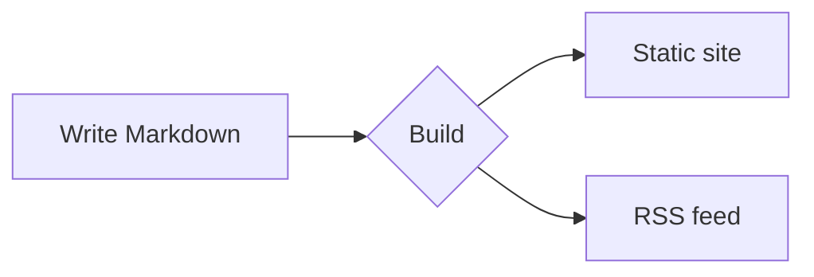

# Contributing to the docs

This page documents the authoring features of the documentation site. Each example renders from the displayed Markdown.

Run `npm ci` to install the locked dependencies. Then run `npm run dev`. Open the local URL that the command prints. Translation directories have the same structure as the canonical English files.

## Callout blocks

Put text in a fenced `:::` container to create a callout with a color and icon:

```md
::: tip
Useful advice.
:::
::: info
Neutral, contextual information.
:::
::: warning
A condition that requires attention.
:::
::: danger
A condition that can cause damage.
:::
```

::: tip
Useful advice.
:::

::: info
Neutral, contextual information.
:::

::: warning
A condition that requires attention.
:::

::: danger
A condition that can cause damage.
:::

Add a specific heading after the type:

::: tip Specific title
Use a custom title when the default label is not specific.
:::

## Code blocks

Fenced code gets syntax highlighting, a language label, and a copy button:

```rust
fn main() {
    println!("Hello, Rapira!");
}
```

Use inline markers to highlight exact lines, focus lines, or show changed lines:

```rust{3}
fn main() {
    let answer = 42;
    println!("The answer is {answer}"); // VitePress highlights this line.
}
```

```rust
fn main() {
    let ready = true;      // [!code focus]
    println!("{ready}");
}
```

```rust
fn setup() {
    let retries = 1;       // [!code --]
    let retries = 3;       // [!code ++]
}
```

Group alternative snippets into tabs:

::: code-group

```bash [npm]
npm install
```

```bash [pnpm]
pnpm install
```

```bash [yarn]
yarn
```

:::

## File tabs

A `<CodeTabs>` block shows one tab for each file. It shows the selected file below the tabs.
List the tabs in a page `<script setup>` block. Put each example in a `<template>` that matches the tab `slot`.

````md
<script setup>
const appTabs = [
  { name: 'index.php', slot: 'classic' },
  { name: 'worker.php', slot: 'worker' },
  { name: 'rapira.toml', slot: 'config' },
]
</script>

<CodeTabs :tabs="appTabs">

<template #classic>

```php
<?php
require __DIR__ . '/vendor/autoload.php';

echo (new App())->handle($_SERVER['REQUEST_URI']);
```

</template>

<template #worker>

```php
<?php
require __DIR__ . '/vendor/autoload.php';

$app = new App(); // The worker creates this object once and reuses it.

$handler = static function () use ($app): void {
    echo $app->handle($_SERVER['REQUEST_URI']);
};

while (\Rapira\handle_request($handler)) {
}
```

</template>

<template #config>

```toml
[pool]
entrypoint = "worker.php"
mode = "worker"
processes = 4
```

</template>

</CodeTabs>
````

The file name extension selects the tab icon. The component supports `.php`, `.rs`, `.toml`, `.yaml`, `.json`, and `.sh`.
Other extensions use a generic file icon. Set `icon` to `php`, `rust`, `toml`, `yaml`, `json`, `shell`, or `file` to override it.

The block renders as follows:

<script setup>
const appTabs = [
  { name: 'index.php', slot: 'classic' },
  { name: 'worker.php', slot: 'worker' },
  { name: 'rapira.toml', slot: 'config' },
]
</script>

<CodeTabs :tabs="appTabs">

<template #classic>

```php
<?php
require __DIR__ . '/vendor/autoload.php';

echo (new App())->handle($_SERVER['REQUEST_URI']);
```

</template>

<template #worker>

```php
<?php
require __DIR__ . '/vendor/autoload.php';

$app = new App(); // The worker creates this object once and reuses it.

$handler = static function () use ($app): void {
    echo $app->handle($_SERVER['REQUEST_URI']);
};

while (\Rapira\handle_request($handler)) {
}
```

</template>

<template #config>

```toml
[pool]
entrypoint = "worker.php"
mode = "worker"
processes = 4
```

</template>

</CodeTabs>

## Diagrams

A fenced `mermaid` block renders as a diagram:



## Tables and badges

Standard Markdown creates tables:

| Feature      | Included |
| ------------ | :------: |
| Callouts     |    ✅    |
| Code groups  |    ✅    |
| Mermaid      |    ✅    |

Inline badges can show status labels:
<Badge type="tip" text="new" /> <Badge type="warning" text="beta" /> <Badge type="danger" text="deprecated" />

## Page frontmatter

Set page options in a YAML block at the very top of the file:

```yaml
---
title: Custom title        # Replaces the H1 in <title> and og:title.
description: Short summary # Sets the meta description and og:description.
outline: [2, 3]            # Sets the "On this page" menu. See the options below.
aside: false               # Hides the right column.
lastUpdated: false         # Hides the "Updated" time on this page.
editLink: false            # Hides the "Edit this page" link.
prev: false                # Hides the "previous" footer link.
next:                      # Changes the label or target of a footer link.
  text: Blog
  link: /blog/
---
```

The **outline** controls the "On this page" table of contents on the right:

```yaml
outline: [2, 3]   # Default. Shows H2 and H3.
outline: deep     # Shows each level from H2 through H6.
outline: 2        # Shows only H2.
outline: false    # Hides the menu.
```

Use `layout: home` for a home page. Use `layout: page` for a page without a sidebar or outline.
Other pages use the default `doc` layout.
