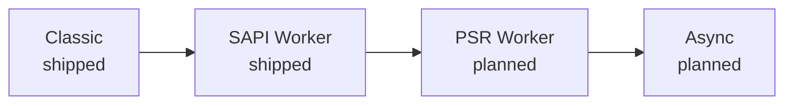

# Execution modes

Every PHP server has to answer one question: how much of your application survives between two requests? Under php-fpm the answer is "nothing" — the framework boots from zero every time, and for a modern application that boot is often the most expensive part of the request. Rapira does not force a single answer on you. It offers a ladder of four execution modes, and an application runs on the highest rung its own code supports.

The names describe the rung itself — whether the worker stays alive, and what contract it speaks — rather than the product that made the shape familiar. The higher the rung, the more of your process is warm when a request arrives, and the more requirements that places on the code.

## Classic <Badge type="tip" text="shipped" />

The entry script runs from scratch on every request, exactly as it would under php-fpm: superglobals are filled in, the front controller boots, the response goes out, everything is torn down. Nothing is carried over, so nothing can leak from one request into the next.

This is the compatibility rung. An existing application runs as it is — Rapira takes php-fpm's place with no changes to your code, and the gain comes from the layer underneath rather than from your app: PHP is embedded in the server process, so there is no FastCGI hop between the HTTP front and the interpreter.

See [Classic mode](/docs/classic) for how to run it.

## SAPI Worker <Badge type="tip" text="shipped" />

The same shape as Classic — you still read the superglobals, still `echo` your response — except the worker does not die at the end of a request. A resident script boots everything once, then loops: the server refills `$_GET`, `$_POST`, `$_SERVER`, `$_COOKIE` and the rest for each new request, runs your handler, and hands you the next one. Autoloader, DI container, configuration, database connections — anything created outside the loop stays warm.

That is the point of the rung: the boot cost is paid once per worker instead of once per request. In exchange, the process no longer starts clean on every request. Whatever your application leaves in static properties, singletons or global state is still there on the next request, which is exactly what makes this rung a property of your code rather than a switch.

See [Worker mode](/docs/worker) for the worker script and its loop, and [HTTP](/docs/http) for how requests and responses are handled.

## PSR Worker <Badge type="warning" text="planned" />

On this rung control is inverted: instead of waiting to be called, the worker pulls a request from Rapira through an API call and decides what to do with it. It can fill the superglobals for compatibility, or skip them entirely and work with a PSR-7 message it passes straight to a framework's HTTP kernel. One request at a time, same as the rung below.

The gain is that the request stops being ambient global state and becomes a value you can pass around, wrap, or hand to a middleware stack — which is how modern PHP frameworks expect to receive it.

::: info
This rung is a concept, not an implementation. Nothing about it ships today, and neither its configuration nor its PHP-side API has been designed, so there are no function names or config keys to show yet.
:::

## Async <Badge type="warning" text="planned" />

The same API as the PSR Worker rung, except the worker asks for more than one request at once and handles them concurrently inside a single interpreter. PHP 8.1 fibers are what make that possible: a request that is waiting on I/O can yield while another one makes progress, without threads and without a second process.

This is the top rung and the one with the strictest requirements: concurrency inside one interpreter means every library in the request path has to work correctly when it is suspended halfway through.

::: info
This rung is a concept too: there is nothing to install and nothing to configure. Read the section above as a description of the planned direction, not of something you can run today.
:::

## What decides your rung

Not the server. All four rungs are open to any application; what limits the choice is the application's own stack.

Global state that cannot survive a second request keeps you on Classic. A library that is not fiber-safe keeps you below Async. A framework with a runtime integration makes the SAPI Worker rung available with almost no work — see [Frameworks](/docs/frameworks/) for the ones with a documented integration. In every case that is a property of the code, not a restriction Rapira imposes: all four rungs are available, and the application's own code determines which one it can use.

Moving up a rung is a one-way change only in the sense that it costs work on the PHP side — a worker rung needs a resident entry script that the Classic rung does not. Going back is always safe: turn Classic back on — a flag on the command line or a single key in the config file — point Rapira at your ordinary front controller, and you are on the Classic rung, with the same server, the same binary and the same [process model](/docs/process-model) underneath.

::: tip
Start on Classic if you are replacing php-fpm and want everything working first. Move up once you know your application boots cleanly and holds no state it shouldn't — the measurement that matters is your own app, not a benchmark.
:::

::: question Which mode does Rapira use by default?
The worker rung. Classic is opt-in — it is a flag on the command line or a single key in the config file; see [Configuration](/docs/configuration) and the [CLI reference](/docs/cli).
:::

::: question My app leaks memory in worker mode. Is that a bug in Rapira?
Usually it is your application or one of its dependencies holding on to per-request data. It is a real constraint of the rung, not a defect — and Rapira can recycle a worker after a set number of requests so a slow leak never becomes an outage while you track it down. See [Configuration](/docs/configuration).
:::

::: question Can I run some routes on Classic and others in a worker?
No — a rung is chosen per server instance, not per route. If part of your application is not worker-safe, run it behind its own Rapira instance on the Classic rung.
:::

::: question When will PSR Worker and Async ship?
There is no date to give. Both are described here so the direction is clear, but nothing about them is designed to the point where it could be documented — when that changes, this page and the [documentation index](/docs/) change with it.
:::
