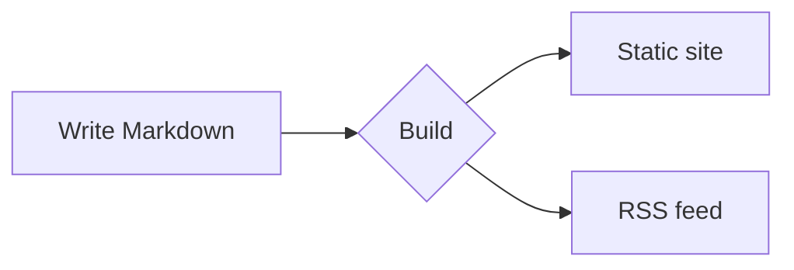

# Getting Started

Welcome to the Rapira documentation. This page doubles as a live showcase: every block below is produced by the same Markdown you'll write in your own pages.

## Callout blocks

Wrap text in a fenced `:::` container to get a colored, icon-marked callout:

```md
::: tip
Handy advice worth highlighting.
:::
::: info
Neutral, contextual information.
:::
::: warning
Something to watch out for.
:::
::: danger
A real risk — proceed carefully.
:::
```

::: tip
Handy advice worth highlighting.
:::

::: info
Neutral, contextual information.
:::

::: warning
Something to watch out for.
:::

::: danger
A real risk — proceed carefully.
:::

Add your own heading right after the type:

::: tip Pro tip
Give a block a custom title when the default label isn't specific enough.
:::

## Code blocks

Fenced code gets syntax highlighting, a language label, and a copy button:

```rust
fn main() {
    println!("Hello, Rapira!");
}
```

Point the reader at exact lines — highlight, focus, or show a diff with inline markers:

```rust{3}
fn main() {
    let answer = 42;
    println!("The answer is {answer}"); // this line is highlighted
}
```

```rust
fn main() {
    let ready = true;      // [!code focus]
    println!("{ready}");
}
```

```rust
fn setup() {
    let retries = 1;       // [!code --]
    let retries = 3;       // [!code ++]
}
```

Group alternative snippets into tabs:

::: code-group

```bash [npm]
npm install
```

```bash [pnpm]
pnpm install
```

```bash [yarn]
yarn
```

:::

## Diagrams

A fenced `mermaid` block renders as a diagram:



## Tables and badges

Standard Markdown tables just work:

| Feature      | Included |
| ------------ | :------: |
| Callouts     |    ✅    |
| Code groups  |    ✅    |
| Mermaid      |    ✅    |
| FAQ spoilers |    ✅    |

Inline badges are handy for status labels: <Badge type="tip" text="new" /> <Badge type="warning" text="beta" /> <Badge type="danger" text="deprecated" />.

## Questions (FAQ spoilers)

Write a `::: question` block anywhere in a page:

```md
::: question How do I run the site locally?
`npm install` once, then `npm run dev`.
:::
```

The engine pulls every question out of the text and groups them into collapsible spoilers at the end of the section — like the ones just below.

::: question How do I run the site locally?
Run `npm install` once, then `npm run dev` and open the local URL it prints.
:::

::: question Where do translations live?
Each language has its own folder — `ru/`, `es/`, `zh/`, `pl/` — mirroring the English structure. English is the source of truth.
:::
