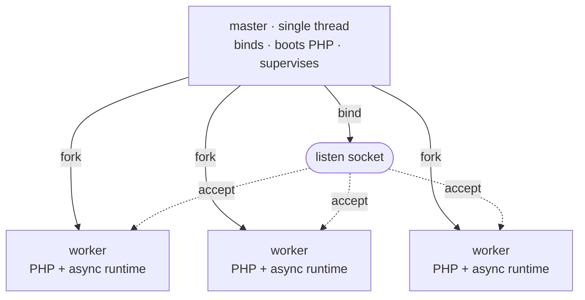

# Process model

Rapira runs as one master process and a pool of workers. The master holds everything that must exist exactly once — the listening socket, the PHP engine image, the pidfile — and then it forks; the workers handle the requests. No request is ever handed from one process to another: the workers *are* copies of the master, forked once PHP was already up, and each of them takes its connections straight off the socket.

This shape is the same in [Classic](/docs/classic), [Worker](/docs/worker) and Dispatcher mode. The execution mode, set by `pool.mode`, decides what happens inside a worker for each request. It does not change how the pool is built, supervised or reloaded. See [Execution modes](/docs/execution-modes) for more information.

## Master and workers

Booting happens in a fixed order:

1. **Bind the listen socket(s).** The master binds before anything else, so a port that is already in use fails the boot immediately — before PHP is even started.
2. **Start PHP once.** The engine goes through `MINIT` in the still-single-threaded master. OPcache's shared memory is created here, which means every worker forked afterwards inherits the same OPcache SHM segment, so the first worker to compile a file fills the cache for all of them instead of every process compiling its own copy.
3. **Fork the workers.** Each child inherits the bound socket and the initialized engine.



Each worker runs one NTS PHP interpreter behind its own asynchronous HTTP stack. The stack uses hyper on a private tokio runtime with two runtime threads. The worker accepts connections on its inherited socket. No process routes connections to the workers. Every worker waits in `accept()` on the same socket. The kernel gives each incoming connection to one worker.

The master never serves a request. It has no HTTP stack at all — it is a single thread blocked in `poll(2)` over a self-pipe, waiting for signals, child deaths and its own timers, and under `ondemand` also for a readable listen socket. The process that must survive to restart everything else does as little as possible.

::: info
The master also holds the PHP module for its whole life and is the only process that shuts it down. A worker exits without tearing anything down, so a worker that crashes or recycles never tears down the engine image the other workers are still using.
:::

## Supervision

Once the pool is up, the master runs a maintenance tick roughly once a second and reacts to child deaths as they happen.

- **Reap and respawn.** A worker that exits cleanly (drained, or recycled by quota) is replaced immediately (under `ondemand`, the slot is simply left free for the next connection to refill). A worker that *crashes* is replaced after a backoff that starts at 100 ms and doubles with each consecutive quick crash, capping at around 25 seconds — so a segfault loop throttles itself instead of spinning the CPU. Surviving at least ten seconds resets that streak.
- **Boot failures.** If a first-generation worker reports itself unhealthy before the pool has ever served a single successful request, the master treats it as an unrecoverable boot failure and exits, rather than respawning a broken entrypoint forever. Once the pool has served something, the same exit is just a respawn with backoff — a bad reload can never take down a healthy pool.
- **Recycling.** With `pool.max_requests` set, a worker retires after that many requests and is replaced right away. Each worker gets its own random extra on top of the quota (up to half of it), so a pool started together does not recycle in lockstep, which would leave no warm workers for a moment.
- **A watchdog on single requests.** With `pool.request_terminate_timeout_secs` set, a worker still on the same request past that wall-clock limit gets `SIGTERM`, and `SIGKILL` if it is still there a tick later. The kill is logged at `warn`, its queued connections close, and the slot is refilled immediately. The watchdog is suspended while a stop or a reload is in progress.
- **Scaling.** Under `dynamic` the same tick decides whether to fork more workers or retire idle ones; under `ondemand` it only retires workers idle past their timeout — there a fork is triggered by an arriving connection. See below.
- **A pipe in the other direction.** Every worker holds the read end of a pipe the master never writes to. If the master dies, the pipe hits EOF and each worker drains itself, so a `kill -9` on the master cannot leave orphaned workers holding the port.

## Pool scaling

`pool.scaling` selects how the pool changes its size. It is separate from `pool.mode`, which sets the execution mode inside a worker. `pool.processes` is an exact count for `static` scaling. It is the maximum count for `dynamic` and `ondemand` scaling. Its default is one worker for each logical CPU.

| Scaling | How many workers | Keys that apply |
| --- | --- | --- |
| `static` (default) | Exactly `pool.processes`, forked at boot and kept at that number. | `processes` |
| `dynamic` | As many as demand requires, up to `pool.processes`; the master keeps the *idle* count inside the spare band. | `min_spare`, `max_spare` |
| `ondemand` | Zero at boot; forked as traffic arrives, up to `pool.processes`. | `process_idle_timeout_secs` |

**`static`** suits most deployments: memory use is flat, and a worker that dies is simply replaced. PHP is synchronous, so a worker handles one request at a time: pools whose requests spend most of their time waiting on a database or an upstream API usually want more workers than cores, CPU-bound ones rarely do.

**`dynamic`** keeps the number of *idle* workers inside a band. On each tick, fewer idle workers than `min_spare` means fork more (in bursts that double as the pressure persists, so a traffic spike is met quickly rather than one worker per second); more idle than `max_spare` means the oldest idle worker is retired. It starts with the midpoint of the band, and warns once when it hits the `pool.processes` ceiling and still wants more.

```toml
[pool]
scaling = "dynamic"
processes = 8
min_spare = 1
max_spare = 3
```

The bounds must satisfy `1 <= min_spare <= max_spare <= processes`, and they are required under `dynamic` and rejected under the other policies. Setting them elsewhere is a config error rather than a silently ignored key.

**`ondemand`** forks nothing at startup. The master watches the listen socket. When a connection arrives without an idle worker, the master forks one and lets the child accept. A worker retires after it is idle for longer than `pool.process_idle_timeout_secs`. The first request to an idle pool waits for a fork. Use `ondemand` for staging environments and sites with little traffic. Use another policy for steady traffic.

The full key reference lives on the [configuration](/docs/configuration) page.

## Signals

Signals stop a running server, reload it, and make it report its state. All of them go to the **master**.

| Signal | What the master does |
| --- | --- |
| `SIGTERM`, `SIGINT` | Graceful stop: in-flight requests finish, then the pool drains. A second `SIGTERM` or `SIGINT` forces the exit. |
| `SIGQUIT` | The same graceful stop. Repeating it changes nothing — a stop asked for gracefully is never escalated by another `SIGQUIT`. |
| `SIGUSR2`, `SIGHUP` | Rolling reload: the pool is replaced one worker at a time, without dropping connections. |
| `SIGUSR1` | Dump the pool's status into the log. |
| `SIGCHLD` | Internal — a worker exited; reap it and decide whether to replace it. |

Set `supervisor.pidfile` and your scripts have a stable place to read the master pid from:

```bash
kill -USR2 $(cat /run/rapira.pid)   # rolling reload
kill -USR1 $(cat /run/rapira.pid)   # status dump
kill -TERM $(cat /run/rapira.pid)   # graceful stop
```

::: warning
Send signals to the master, never to an individual worker. Workers ignore `SIGUSR1` and `SIGUSR2` outright, and they treat `SIGTERM` as an immediate kill — it is what the request watchdog uses when a request has to die *now*. Signalling a worker directly bypasses the supervision described on this page.
:::

### Stopping

Every stop begins gracefully, whichever of the three signals asked for it: the master sends `SIGQUIT` to each worker, which stops taking new work and finishes what it is holding. From there it escalates on a timer — `supervisor.process_control_timeout_secs` (30 seconds by default) is the grace period, after which the remaining workers get `SIGTERM`, and then `SIGKILL` if even that does not land. A worker that does not answer the graceful `SIGQUIT` is TERMed and then KILLed rather than waited on forever.

A second `SIGTERM` or `SIGINT` skips the wait and forces the exit immediately.

### Rolling reload

`SIGUSR2` (or `SIGHUP`) replaces the whole pool with fresh workers — which is how a resident worker's booted application gets thrown away and built again from the deployed code.

In Classic mode the entry script is executed from scratch on every request. There is nothing resident to replace, so new code takes effect without a reload. If you set `opcache.validate_timestamps = 0`, the master's OPcache segment keeps serving the old opcodes until a full restart. In Worker and Dispatcher mode the application is booted once and stays in memory, so deployed code only takes effect after a rolling reload. Make it a step of your deploy. See [deployment](/docs/deployment) for more information.

The reload does not reduce serving capacity because worker replacement overlaps. The master starts one new worker and waits until that worker accepts connections. Then, the master drains one old worker. When the old worker exits, the master starts the next new worker in that slot. Each drain uses the same `SIGQUIT` → `SIGTERM` → `SIGKILL` escalation as a stop. The same control timeout applies to each worker.

A replacement that never starts serving does not stall the reload either: once the control timeout elapses the master logs a warning and moves on to the next worker anyway. Under `ondemand` no replacement is pre-forked at all — old workers are drained one at a time and demand forks the new ones.

A reload while a stop is already under way is ignored: stopping takes priority.

::: info
A reload replaces workers, not the master. The new workers are forked from the same master process, with the same engine image it booted at startup — so `rapira.toml`, `php.ini` and the binary itself only change on a full restart.
:::

### Status dump

`SIGUSR1` makes the master write a snapshot of the pool to the log — a summary line with the number of running and idle workers plus the current generation, then one line per slot with its pid, state, and its `handled`, `errors` and `recycles` counters.

::: tip
The dump is written at `info` on the `master` target, and the default log level is `error` — so on a stock config `kill -USR1` looks like it did nothing at all. Raise that one target and the dump appears:

```toml
[log.targets]
master = "info"
```

The same target carries every supervision event: forks, reaps, respawns, reloads and pool scaling. See [logging](/docs/logging) for the rest.
:::
