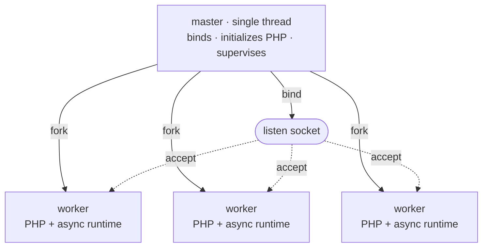

# Process model

Rapira runs one master process and a pool of workers. The master owns the listen socket, initialized PHP engine, and pidfile. The master then creates worker processes. Each worker inherits PHP and accepts connections from the shared socket. Rapira does not pass a request between processes.

This process model is the same in [Classic](/docs/classic), [Worker](/docs/worker), and Dispatcher modes. `pool.mode` controls request processing inside a worker. This setting does not change pool creation, supervision, or reloads. See [Execution modes](/docs/execution-modes) for more information.

## Master and workers

Initialization uses this order:

1. **Bind the listen socket or sockets.** A port conflict stops initialization before PHP starts.
2. **Start PHP once.** The engine runs `MINIT` in the single-threaded master.
   OPcache creates shared memory at this point. Each later worker inherits the same OPcache segment.
   When one worker compiles a file, the other workers can use the cached data.
3. **Fork the workers.** Each child inherits the bound socket and the initialized engine.



Each worker runs one NTS PHP interpreter and an asynchronous HTTP server. The server uses hyper on a private tokio runtime with two threads. Each worker calls `accept()` on its inherited socket. The operating system assigns each new connection to one worker.

The master does not serve requests and has no HTTP server. Its single thread calls `poll(2)` on a self-pipe.
It waits for signals, worker exits, and timers. With `ondemand`, it also waits for activity on the listen socket.

::: info
The master keeps the PHP module for its complete lifetime. Only the master shuts down the module. A worker exits but does not shut down this shared engine state.
:::

## Supervision

After pool initialization, the master runs maintenance approximately once each second. It also processes worker exits when they occur.

- **Worker replacement.** The master immediately replaces a worker after normal exit.
- With `ondemand`, it waits for the next connection before it creates the replacement.
- After a failure, the replacement delay starts at 100 ms. It doubles after each consecutive failure and reaches its maximum near 25 seconds.
- A worker lifetime of at least ten seconds resets the delay.
- **Initialization failures.** The master exits when all initial workers fail before the pool serves a request.
- After the pool serves a request, the master uses the normal replacement delay. During reload, a worker initialization failure does not make the master exit.
- **Request limits.** With `pool.max_requests`, a worker exits after its request limit. The master then replaces it.
- Rapira adds a random value of up to half the limit. This prevents simultaneous worker replacement.
- **Request timeout.** With `pool.request_terminate_timeout_secs`, the master sends `SIGTERM` after a request exceeds the limit.
- It sends `SIGKILL` one maintenance interval later if the worker remains active. It closes queued connections and creates a replacement.
- The master does not apply this timeout during a stop or reload.
- **Scaling.** With `dynamic`, maintenance can create workers or remove idle workers.
- With `ondemand`, maintenance removes workers after the idle limit. A new connection causes worker creation.
- **Master monitoring.** Each worker reads from a pipe that the master keeps open.
- If the master exits, the pipe reaches EOF and each worker does not accept new work. Thus, a master failure does not leave unmanaged workers.

## Pool scaling

`pool.scaling` selects how the pool changes its size. The scaling policy is separate from `pool.mode`. The `pool.mode` key sets the execution mode inside a worker. `pool.processes` is an exact count for `static` scaling. `pool.processes` is the maximum count for `dynamic` and `ondemand` scaling. The default value is one worker for each logical CPU.

| Scaling | How many workers | Keys that apply |
| --- | --- | --- |
| `static` (default) | Exactly `pool.processes`, created during initialization and kept at that number. | `processes` |
| `dynamic` | Up to `pool.processes`, as demand requires. The master keeps the idle count between the spare limits. | `min_spare`, `max_spare` |
| `ondemand` | Zero during initialization. Connections cause worker creation, up to `pool.processes`. | `process_idle_timeout_secs` |

**`static`** is suitable for most deployments. It uses a fixed worker count and replaces workers that exit.
PHP is synchronous, so each worker handles one request at a time. I/O-bound applications can require more workers than CPU cores.
CPU-bound applications usually do not.

**`dynamic`** keeps the idle worker count between two limits. It creates workers when the count is below `min_spare`.
The number of new workers doubles during consecutive maintenance intervals with insufficient capacity. It removes the oldest idle worker above `max_spare`.
The initial count is the midpoint between the limits. Rapira writes one warning when demand exceeds `pool.processes`.

```toml
[pool]
scaling = "dynamic"
processes = 8
min_spare = 1
max_spare = 3
```

The limits must satisfy `1 <= min_spare <= max_spare <= processes`. Dynamic scaling requires both limits.
Rapira rejects them with the other policies.

**`ondemand`** forks nothing at startup. The master watches the listen socket. When a connection arrives without an idle worker, the master forks one and lets the child accept. A worker retires after it is idle for longer than `pool.process_idle_timeout_secs`.

The first request to an idle pool waits for a fork. Use `ondemand` for staging environments and sites with little traffic. Use another policy for steady traffic.

See [configuration](/docs/configuration) for the complete key reference.

## Signals

Signals stop a running server, reload it, and make it report its state. All of them go to the **master**.

| Signal | What the master does |
| --- | --- |
| `SIGTERM`, `SIGINT` | The master lets current requests finish and then stops the workers. A second signal forces the workers to stop. |
| `SIGQUIT` | The master does the same controlled stop. Another `SIGQUIT` has no effect. |
| `SIGUSR2`, `SIGHUP` | The master replaces one worker at a time. Each old worker does not accept new work and finishes current requests. |
| `SIGUSR1` | The master writes pool status to the log. |
| `SIGCHLD` | The master removes an exited worker from the process table. It then decides whether to replace the worker. |

Set `supervisor.pidfile` to give scripts a stable location for the master process identifier:

```bash
kill -USR2 $(cat /run/rapira.pid)   # Replace workers one at a time.
kill -USR1 $(cat /run/rapira.pid)   # Write pool status to the log.
kill -TERM $(cat /run/rapira.pid)   # Stop after current requests finish.
```

::: warning
Send signals only to the master. Workers ignore `SIGUSR1` and `SIGUSR2`.
Workers treat `SIGTERM` as immediate termination. The request timeout uses this signal.
A direct worker signal bypasses master supervision.
:::

### Stopping

For each stop signal, the master immediately sends `SIGQUIT` to each worker. The workers do not accept new work and finish current requests. After `supervisor.process_control_timeout_secs`, the master sends `SIGTERM` to workers that remain. The default limit is 30 seconds. If workers remain, the master sends `SIGKILL` one second after `SIGTERM`.

A second `SIGTERM` or `SIGINT` skips the wait and forces the exit immediately.

### Worker replacement lets current requests finish

`SIGUSR2` or `SIGHUP` replaces the complete pool. Each replacement worker initializes the application from the deployed code.

In Classic mode, the entry script executes in a new PHP request each time. New code takes effect without a reload. However, `opcache.validate_timestamps = 0` requires a complete restart. Worker and Dispatcher keep initialized application code. Reload the pool after each deployment in these modes. See [deployment](/docs/deployment) for more information.

The master starts one new worker and waits until it reports an idle or active state. The master then stops one old worker. After that worker exits, the master starts a new worker in the next slot.

Each worker stop uses the `SIGQUIT` → `SIGTERM` → `SIGKILL` sequence. The same control timeout applies to each worker. An old worker closes idle keep-alive connections after it receives `SIGQUIT`. Current requests can finish before the control timeout.

If the new worker reports neither state before the control timeout, the master logs a warning. The master then stops the next old worker even if the new worker does not serve requests. With `ondemand`, the master removes old workers one at a time. New connections create replacements.

The master ignores a reload during a stop.

::: info
A reload replaces workers but not the master. New workers inherit the same initialized engine.
Restart Rapira to apply changes to `rapira.toml`, `php.ini`, or the binary.
:::

### Writing status to the log

`SIGUSR1` makes the master write pool status to the log. A summary contains worker counts and the current generation.
One line for each worker contains its process identifier, state, and counters.

::: tip
The status output uses `info` on the `master` target. The default log level is `error`.
Set this target to `info` to show the output:

```toml
[log.targets]
master = "info"
```

The same target contains worker creation, worker exit, reload, and pool scaling records. See [logging](/docs/logging) for more information.
:::
