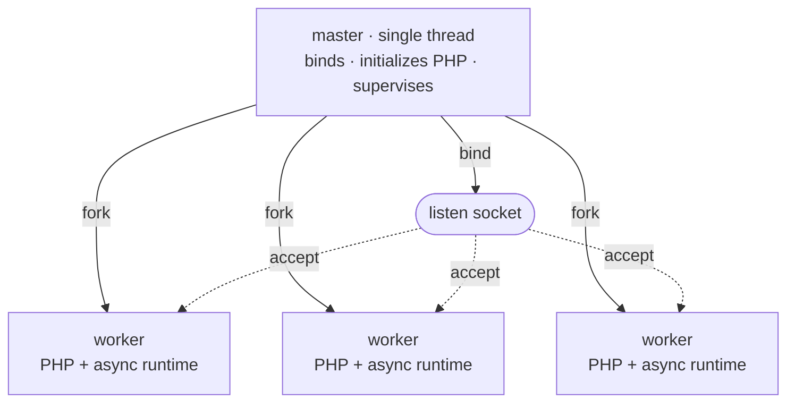

# Process model

Rapira runs one master process and a worker pool for each enabled protocol. The master owns the listen sockets, initialized PHP engine, and pidfile. The master then creates worker processes. Each worker inherits PHP and accepts connections from its pool's shared socket. Rapira does not pass a request between processes.

HTTP and [gRPC](./grpc) have separate listeners, entrypoints, and pools. `[http.pool]` and `[grpc.pool]` configure them independently. The gRPC pool uses Dispatcher mode and handles one active call per worker.

When the configuration has an `[observability]` table, the master also starts one process for metrics and health checks. This process runs no PHP code. On Linux, its process name is `rapira-obs`, and PHP workers have the name `rapira-worker`. The master supervises, reloads, and stops this process together with the PHP workers. See [Metrics and health checks](/docs/observability) for more information.

This process model is the same in [Classic](/docs/classic), [Worker](/docs/worker), and [Dispatcher](/docs/dispatcher) modes. `http.pool.mode` controls request processing inside a worker. This setting does not change pool creation, supervision, or reloads. See [Execution modes](/docs/execution-modes) for more information.

## Master and workers

Initialization uses this order:

1. **Bind the listen socket or sockets.** A port conflict stops initialization before PHP starts.
2. **Start PHP once.** The master runs `MINIT` in its single thread. OPcache creates its shared memory at this point, and every worker inherits it. When one worker compiles a file, the other workers use the cached result.
3. **Fork the workers.** Each child inherits the bound socket and the initialized engine.


```mermaid
flowchart TB
  M["master · single thread<br/>binds · initializes PHP · supervises"]
  S(["listen socket"])
  W1["worker<br/>PHP + async runtime"]
  W2["worker<br/>PHP + async runtime"]
  W3["worker<br/>PHP + async runtime"]
  M -- bind --> S
  M -- fork --> W1
  M -- fork --> W2
  M -- fork --> W3
  S -. accept .-> W1
  S -. accept .-> W2
  S -. accept .-> W3
```

The diagram shows one pool. Each worker runs one NTS PHP interpreter and an asynchronous HTTP or gRPC server. The server uses hyper on a private tokio runtime with two threads. Each worker calls `accept()` on its inherited socket. The operating system assigns each new connection to one worker.

The master does not serve requests. Its single thread waits for signals, worker exits, and timers.

::: info
The master keeps the PHP module for its complete lifetime. Only the master shuts down the module. A worker exits but does not shut down this shared engine state.
:::

## Supervision

The master runs maintenance once each second. It also processes each worker exit when it occurs.

- **Worker replacement.** After a normal exit, the master replaces the worker immediately. After a crash or an unhealthy exit, the replacement delay starts at 100 ms. The delay doubles after each consecutive failure and stops at 25.6 seconds. A worker that runs for at least 10 seconds resets the delay.
- **Boot failures.** In Worker and Dispatcher modes, a boot fails when the entry script ends before it receives a request. The worker then waits up to 5 seconds and runs the entry script again. It answers a request that arrives during the wait with HTTP `503` or gRPC `UNAVAILABLE`. After five consecutive boot failures, the worker exits as unhealthy.
- **Master stop on boot failure.** The master stops with exit code 70 when an unhealthy generation-zero worker exits. This rule applies only when the pool has no successful request and no idle or active worker. Generation zero identifies workers created before the first reload. In all other cases, the master replaces the worker after the replacement delay. A worker crash never stops the master.
- **Request limits.** With `http.pool.max_requests`, a worker exits after a random number of requests between `max_requests + 1` and approximately `1.5 × max_requests`. The master replaces it immediately. The random range prevents simultaneous worker replacement.
- **Request timeout.** With `http.pool.request_terminate_timeout_secs`, the master sends `SIGTERM` to a worker when its current request exceeds the limit. If the worker is still active at the next maintenance run, the master sends `SIGKILL`. The master then replaces the worker immediately. The master applies this timeout during a reload, but not during a stop.
- **Master monitoring.** Each worker reads from a pipe that the master keeps open. If the master exits, each worker stops accepting new work, finishes its current requests, and exits.

## Pool size

The settings below use `[http.pool]`. The same settings apply to `[grpc.pool]`.

`http.pool.processes` sets the worker count. The master creates these workers during initialization and replaces each worker that exits. The default value is one worker for each CPU that the process can use. If a container has a CPU limit, the default follows that limit.

The total worker count of all pools must be 2048 or less. When observability is enabled, its process counts as one worker. A larger total stops Rapira with exit code 70.

PHP is synchronous, so each worker handles one request at a time. I/O-bound applications can require more workers than CPU cores. CPU-bound applications usually do not.

The worker count does not change while the server runs. To change the capacity with the load, change the number of Rapira instances, for example with a container orchestrator.

See [configuration](/docs/configuration) for the complete key reference.

## Signals

Signals stop a running server, reload it, and make it report its state. All of them go to the **master**.

| Signal | What the master does |
| --- | --- |
| `SIGTERM`, `SIGINT` | The master lets current requests finish and then stops the workers. A second signal forces the workers to stop. |
| `SIGQUIT` | The master does the same controlled stop. Another `SIGQUIT` has no effect. |
| `SIGUSR2`, `SIGHUP` | The master replaces one worker at a time. Each old worker does not accept new work and finishes current requests. |
| `SIGUSR1` | The master writes pool status to the log. |

Set `supervisor.pidfile` to give scripts a stable location for the master process identifier:

```bash
kill -USR2 $(cat /run/rapira.pid)   # Replace workers one at a time.
kill -USR1 $(cat /run/rapira.pid)   # Write pool status to the log.
kill -TERM $(cat /run/rapira.pid)   # Stop after current requests finish.
```

::: warning
Send signals only to the master. Workers ignore `SIGUSR1` and `SIGUSR2`. `SIGTERM` and `SIGHUP` stop a worker immediately and cut its current requests. The request timeout uses `SIGTERM`. A direct worker signal bypasses master supervision.

`Ctrl-C` in a terminal sends `SIGINT` to the master and to all workers. Each worker then also gets `SIGQUIT` from the master. A second stop signal makes a worker exit immediately with code 131, so its current requests do not finish. To let current requests finish, send `SIGTERM` to the master only.
:::

### Stopping

After a stop signal, the master immediately sends `SIGQUIT` to each worker. The workers do not accept new work and finish current requests. After `supervisor.process_control_timeout_secs`, the master sends `SIGTERM` to workers that remain. The default limit is 30 seconds. If workers remain, the master sends `SIGKILL` one second after `SIGTERM`.

The connection drain budget is the control timeout minus the smaller of five seconds or half the timeout. With the default settings, connections have 25 seconds to finish. Responses that exceed this budget can be cut short. The same budget applies during reload.

A second `SIGTERM` or `SIGINT` skips the wait and forces the exit immediately. See [Exit codes](/docs/cli#exit-codes) for the exit codes of the master.

### Worker replacement lets current requests finish

`SIGUSR2` or `SIGHUP` replaces the complete pool. Each replacement worker initializes the application from the deployed code.

In Classic mode, each request runs the entry script in a new PHP request, so new code takes effect without a reload. Worker and Dispatcher modes keep the application in memory. Reload the pool after each deployment in these modes. With `opcache.validate_timestamps = 0`, a reload does not load new code in any mode, because new workers use the OPcache memory of the master. Restart Rapira in this case. See [deployment](/docs/deployment) for more information.

The master starts one new worker and waits until it reports an idle or active state. The master then stops the oldest old worker. After that worker exits, the master starts the next new worker in its place. This sequence continues until no old worker remains. All pools reload at the same time.

Each worker stop uses the `SIGQUIT` → `SIGTERM` → `SIGKILL` sequence. The same control timeout applies to each worker. An old worker closes idle keep-alive connections after it receives `SIGQUIT`. Current requests have the shorter connection drain budget described above.

If the new worker reports neither state before the control timeout, the master logs a warning. The master then stops the next old worker even if the new worker does not serve requests.

The master ignores a reload signal during a stop or while a reload is in progress. It does not log the ignored signal. Send the signal again after the reload completes.

::: info
A reload replaces workers but not the master. New workers inherit the same initialized engine. Restart Rapira to apply changes to the binary or to files that the master reads, such as `rapira.toml` and `php.ini`.
:::

### Writing status to the log

`SIGUSR1` makes the master write the status of each pool to the log. The first line of a pool shows the running and idle worker counts and the reload generation. Then one line for each worker slot shows the process identifier, the state, and three counters:

```text
status: http pool: 4 running, 3 idle, generation 0
  slot 0 pid 4242 state 2 handled 1500 errors 2 recycles 0
```

| State | Meaning |
| --- | --- |
| `1` | Starting. The application did not boot yet, or its last boot failed. |
| `2` | Idle. The worker waits for work. |
| `3` | Active. The worker processes a request. |
| `4` | Draining. The worker finishes its work and exits. |

A slot keeps its counters when the master replaces its worker. `recycles` counts restarts of the entry script inside a worker.

::: tip
The status output uses `info` on the `master` target. The default log level is `error`. Set this target to `info` to show the output:

```toml
[log.targets]
master = "info"
```

The same target contains spawn errors, reload readiness warnings, and request timeout warnings. See [logging](/docs/logging) for more information.
:::

::: question Does Rapira use transparent huge pages?
No. On Linux, the master turns off transparent huge pages for its own process before PHP starts. Workers and the processes that PHP starts with `proc_open()` or `exec()` inherit this setting. Thus, `USE_ZEND_ALLOC_HUGE_PAGES=1` and `opcache.huge_code_pages` get no transparent huge pages. These options can still use explicit huge pages that the host reserves with `vm.nr_hugepages`. No setting changes this behavior.
:::

::: question Can the master run as PID 1 in a container?
Yes. As PID 1, the master handles the stop signals and removes all exited child processes. You do not need a separate init process.
:::
