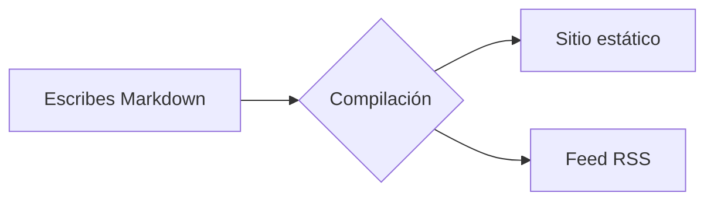

# Contribuir a la documentación

¿Quieres ayudar a mejorar la documentación de Rapira? Estupendo. Esta página es un recorrido en vivo por todo lo que puede hacer el motor de documentación: cada bloque de abajo se genera con el mismo Markdown que escribirás tú, así que tenla a mano como chuleta mientras editas páginas.

## Bloques de aviso

Envuelve el texto en un contenedor `:::` para obtener un aviso con color e icono:

```md
::: tip
Un consejo útil que conviene destacar.
:::
::: info
Información contextual y neutral.
:::
::: warning
Algo con lo que hay que tener cuidado.
:::
::: danger
Un riesgo real: procede con cuidado.
:::
```

::: tip
Un consejo útil que conviene destacar.
:::

::: info
Información contextual y neutral.
:::

::: warning
Algo con lo que hay que tener cuidado.
:::

::: danger
Un riesgo real: procede con cuidado.
:::

Justo después del tipo puedes poner tu propio título:

::: tip Consejo
Ponle un título propio al bloque cuando la etiqueta por defecto se quede corta.
:::

## Bloques de código

El código en un bloque cercado recibe resaltado de sintaxis, una etiqueta de lenguaje y un botón de copiar:

```rust
fn main() {
    println!("Hello, Rapira!");
}
```

Dirige la atención del lector a líneas concretas: resáltalas, enfócalas o muestra los cambios:

```rust{3}
fn main() {
    let answer = 42;
    println!("The answer is {answer}"); // esta línea está resaltada
}
```

```rust
fn main() {
    let ready = true;      // [!code focus]
    println!("{ready}");
}
```

```rust
fn setup() {
    let retries = 1;       // [!code --]
    let retries = 3;       // [!code ++]
}
```

Agrupa variantes de un comando en pestañas:

::: code-group

```bash [npm]
npm install
```

```bash [pnpm]
pnpm install
```

```bash [yarn]
yarn
```

:::

## Diagramas

Un bloque `mermaid` se convierte en un diagrama:



## Tablas y etiquetas

Las tablas normales de Markdown funcionan sin más:

| Función         | Incluida |
| --------------- | :------: |
| Avisos          |    ✅    |
| Grupos de código|    ✅    |
| Mermaid         |    ✅    |
| Spoilers de FAQ |    ✅    |

Las etiquetas en línea van muy bien para marcar estados: <Badge type="tip" text="nuevo" /> <Badge type="warning" text="beta" /> <Badge type="danger" text="obsoleto" />.

## Frontmatter de la página

Define las opciones de la página en un bloque YAML al principio del archivo:

```yaml
---
title: Título propio      # reemplaza el H1 en <title> / og:title
description: Resumen breve # meta description y og:description
outline: [2, 3]           # el menú «En esta página» — ver abajo
aside: false              # ocultar por completo la columna derecha
lastUpdated: false        # ocultar la marca «Actualizado» en esta página
editLink: false           # ocultar el enlace «Editar esta página»
prev: false               # ocultar el enlace «Anterior» del pie
next:                     # o renombrar / redirigir un enlace del pie
  text: Blog
  link: /es/blog/
faqLevel: 2               # dónde se agrupan los bloques ::: question (ver arriba)
---
```

El **outline** controla el índice «En esta página» de la derecha:

```yaml
outline: [2, 3]   # por defecto — H2 y H3
outline: deep     # todos los niveles, H2–H6
outline: 2        # solo H2
outline: false    # ocultarlo
```

Usa `layout: home` para una portada o `layout: page` para una página sin barra lateral ni índice; las páginas normales usan el layout `doc` por defecto.

## Preguntas (spoilers de FAQ)

Escribe un bloque `::: question` en cualquier parte de la página:

```md
::: question ¿Cómo ejecuto el sitio en local?
`npm install` una vez y luego `npm run dev`.
:::
```

El motor extrae todas las preguntas del texto y las agrupa en spoilers desplegables al final de la sección, como los de aquí abajo.

Dónde aparecen depende de ti: define `faqLevel` en el frontmatter de la página:

```yaml
---
faqLevel: 1       # por defecto — al final de cada sección H1 (normalmente el final de la página)
faqLevel: 2       # al final de cada sección H2
faqLevel: 0       # al final de la página, sin tener en cuenta los encabezados
faqLevel: false   # sin agrupar — cada pregunta se queda donde la escribiste
---
```

::: question ¿Cómo ejecuto el sitio en local?
Ejecuta `npm install` una vez y luego `npm run dev`; abre la URL local que aparece en pantalla.
:::

::: question ¿Dónde están las traducciones?
Cada idioma tiene su propia carpeta —`ru/`, `es/`, `zh/`, `pl/`— con la misma estructura que la versión en inglés. El inglés es la fuente de referencia.
:::
