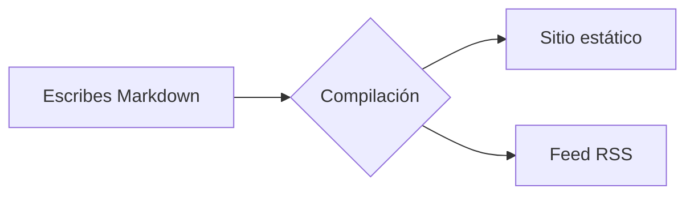

# Contribuir a la documentación

Esta página documenta las funciones de autoría del sitio. Cada ejemplo se genera a partir del Markdown mostrado.

Ejecuta `npm ci` para instalar las dependencias bloqueadas. Después, ejecuta `npm run dev`. Abre la URL local que muestra el comando. Los directorios de traducción tienen la misma estructura que los archivos canónicos en inglés.

## Bloques de aviso

Envuelve el texto en un contenedor `:::` para obtener un aviso con color e icono:

```md
::: tip
Un consejo útil que conviene destacar.
:::
::: info
Información contextual y neutral.
:::
::: warning
Algo con lo que hay que tener cuidado.
:::
::: danger
Un riesgo real: procede con cuidado.
:::
```

::: tip
Un consejo útil que conviene destacar.
:::

::: info
Información contextual y neutral.
:::

::: warning
Algo con lo que hay que tener cuidado.
:::

::: danger
Un riesgo real: procede con cuidado.
:::

Añade un título específico después del tipo:

::: tip Consejo
Ponle un título propio al bloque cuando la etiqueta por defecto se quede corta.
:::

## Bloques de código

El código en un bloque cercado recibe resaltado de sintaxis, una etiqueta de lenguaje y un botón de copiar:

```rust
fn main() {
    println!("Hello, Rapira!");
}
```

Dirige la atención del lector a líneas concretas: resáltalas, enfócalas o muestra los cambios:

```rust{3}
fn main() {
    let answer = 42;
    println!("The answer is {answer}"); // esta línea está resaltada
}
```

```rust
fn main() {
    let ready = true;      // [!code focus]
    println!("{ready}");
}
```

```rust
fn setup() {
    let retries = 1;       // [!code --]
    let retries = 3;       // [!code ++]
}
```

Agrupa variantes de un comando en pestañas:

::: code-group

```bash [npm]
npm install
```

```bash [pnpm]
pnpm install
```

```bash [yarn]
yarn
```

:::

## Pestañas de archivos

Un bloque `<CodeTabs>` muestra varios archivos como lo haría un editor: una pestaña por archivo y, debajo, el código de la pestaña abierta. Declara la lista de pestañas en un bloque `<script setup>` de la página y coloca cada fragmento en un `<template>` cuyo nombre coincida con el `slot` de la pestaña:

````md
<script setup>
const appTabs = [
  { name: 'index.php', slot: 'classic' },
  { name: 'worker.php', slot: 'worker' },
  { name: 'rapira.toml', slot: 'config' },
]
</script>

<CodeTabs :tabs="appTabs">

<template #classic>

```php
<?php
require __DIR__ . '/vendor/autoload.php';

echo (new App())->handle($_SERVER['REQUEST_URI']);
```

</template>

<template #worker>

```php
<?php
require __DIR__ . '/vendor/autoload.php';

$app = new App(); // se arranca una vez y se reutiliza en cada petición

$handler = static function () use ($app): void {
    echo $app->handle($_SERVER['REQUEST_URI']);
};

while (\Rapira\handle_request($handler)) {
}
```

</template>

<template #config>

```toml
[pool]
entrypoint = "worker.php"
mode = "worker"
processes = 4
```

</template>

</CodeTabs>
````

El icono de cada pestaña sale de la extensión de su nombre: `.php`, `.rs`, `.toml`, `.yaml`, `.json` y `.sh` tienen el suyo, y el resto recibe un icono de archivo genérico. Añade `icon` a una pestaña para elegirlo tú: `php`, `rust`, `toml`, `yaml`, `json`, `shell` o `file`.

Así se ve ese bloque en la página:

<script setup>
const appTabs = [
  { name: 'index.php', slot: 'classic' },
  { name: 'worker.php', slot: 'worker' },
  { name: 'rapira.toml', slot: 'config' },
]
</script>

<CodeTabs :tabs="appTabs">

<template #classic>

```php
<?php
require __DIR__ . '/vendor/autoload.php';

echo (new App())->handle($_SERVER['REQUEST_URI']);
```

</template>

<template #worker>

```php
<?php
require __DIR__ . '/vendor/autoload.php';

$app = new App(); // se arranca una vez y se reutiliza en cada petición

$handler = static function () use ($app): void {
    echo $app->handle($_SERVER['REQUEST_URI']);
};

while (\Rapira\handle_request($handler)) {
}
```

</template>

<template #config>

```toml
[pool]
entrypoint = "worker.php"
mode = "worker"
processes = 4
```

</template>

</CodeTabs>

## Diagramas

Un bloque `mermaid` se convierte en un diagrama:



## Tablas y etiquetas

Markdown estándar crea tablas:

| Función         | Incluida |
| --------------- | :------: |
| Avisos          |    ✅    |
| Grupos de código|    ✅    |
| Mermaid         |    ✅    |

Las etiquetas en línea pueden mostrar estados:
<Badge type="tip" text="nuevo" /> <Badge type="warning" text="beta" /> <Badge type="danger" text="obsoleto" />

## Frontmatter de la página

Define las opciones de la página en un bloque YAML al principio del archivo:

```yaml
---
title: Título propio      # reemplaza el H1 en <title> / og:title
description: Resumen breve # meta description y og:description
outline: [2, 3]           # el menú «En esta página» - ver abajo
aside: false              # ocultar por completo la columna derecha
lastUpdated: false        # ocultar la marca «Actualizado» en esta página
editLink: false           # ocultar el enlace «Editar esta página»
prev: false               # ocultar el enlace «Anterior» del pie
next:                     # o renombrar / redirigir un enlace del pie
  text: Blog
  link: /es/blog/
---
```

El **outline** controla el índice «En esta página» de la derecha:

```yaml
outline: [2, 3]   # por defecto - H2 y H3
outline: deep     # todos los niveles, H2–H6
outline: 2        # solo H2
outline: false    # ocultarlo
```

Usa `layout: home` para una portada o `layout: page` para una página sin barra lateral ni índice; las páginas normales usan el layout `doc` por defecto.
