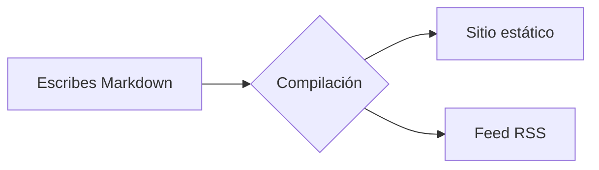

# Contribuir a la documentación

Esta página documenta las funciones de autoría del sitio de documentación.

Usa Node.js 24. Ejecuta `npm ci` para instalar las dependencias bloqueadas. Después, ejecuta `npm run dev`. Abre la URL local que muestra el comando. Los directorios de traducción tienen la misma estructura que los archivos canónicos en inglés.

Ejecuta `npm run build` antes de enviar un cambio. Genera miniaturas y comprueba la configuración de VitePress, el renderizado de Markdown y los enlaces internos.

## Bloques de aviso

Pon el texto en un contenedor `:::` para crear un aviso con color e icono:

```md
::: tip
Un consejo útil.
:::
::: info
Información neutral y de contexto.
:::
::: warning
Una condición que requiere atención.
:::
::: danger
Una condición que puede causar daños.
:::
```

::: tip
Un consejo útil.
:::

::: info
Información neutral y de contexto.
:::

::: warning
Una condición que requiere atención.
:::

::: danger
Una condición que puede causar daños.
:::

Escribe un título después del tipo, por ejemplo `::: tip Título específico`:

::: tip Título específico
Usa un título propio cuando la etiqueta por defecto no es específica.
:::

## Bloques de código

El código en un bloque delimitado recibe resaltado de sintaxis, una etiqueta de lenguaje y un botón de copiar:

```rust
fn main() {
    println!("Hello, Rapira!");
}
```

Añade `{3}` después del nombre del lenguaje para resaltar la línea 3. Añade un comentario `// [!code focus]` al final de una línea para enfocarla. Añade `// [!code --]` o `// [!code ++]` para marcar una línea eliminada o añadida. La compilación elimina estos marcadores de la salida:

```rust{3}
fn main() {
    let answer = 42;
    println!("The answer is {answer}"); // VitePress resalta esta línea.
}
```

```rust
fn main() {
    let ready = true;      // [!code focus]
    println!("{ready}");
}
```

```rust
fn setup() {
    let retries = 1;       // [!code --]
    let retries = 3;       // [!code ++]
}
```

Pon los fragmentos alternativos en un contenedor `::: code-group`. Escribe la etiqueta de la pestaña entre corchetes después del nombre del lenguaje, por ejemplo `bash [npm]`:

::: code-group

```bash [npm]
npm install
```

```bash [pnpm]
pnpm install
```

```bash [yarn]
yarn
```

:::

## Pestañas de archivos

Un bloque `<CodeTabs>` muestra una pestaña para cada archivo. Muestra el archivo seleccionado debajo de las pestañas. Declara las pestañas en un bloque `<script setup>` de la página. Pon cada ejemplo en un `<template>` que coincida con el `slot` de la pestaña.

````md
<script setup>
const appTabs = [
  { name: 'index.php', slot: 'classic' },
  { name: 'worker.php', slot: 'worker' },
  { name: 'rapira.toml', slot: 'config' },
]
</script>

<CodeTabs :tabs="appTabs">

<template #classic>

```php
<?php
require __DIR__ . '/vendor/autoload.php';

echo (new App())->handle($_SERVER['REQUEST_URI']);
```

</template>

<template #worker>

```php
<?php
require __DIR__ . '/vendor/autoload.php';

$app = new App(); // El worker crea este objeto una vez y lo reutiliza.

$handler = static function () use ($app): void {
    echo $app->handle($_SERVER['REQUEST_URI']);
};

while (\Rapira\handle_request($handler)) {
}
```

</template>

<template #config>

```toml
[http.pool]
entrypoint = "worker.php"
mode = "worker"
processes = 4
```

</template>

</CodeTabs>
````

La extensión del nombre de archivo selecciona el icono de la pestaña. El componente admite `.php`, `.rs`, `.toml`, `.yaml`, `.yml`, `.json`, `.sh` y `.bash`. Las demás extensiones usan un icono de archivo genérico. Para cambiar el icono, define `icon` como `php`, `rust`, `toml`, `yaml`, `json`, `shell` o `file`.

El bloque se muestra así:

<script setup>
const appTabs = [
  { name: 'index.php', slot: 'classic' },
  { name: 'worker.php', slot: 'worker' },
  { name: 'rapira.toml', slot: 'config' },
]
</script>

<CodeTabs :tabs="appTabs">

<template #classic>

```php
<?php
require __DIR__ . '/vendor/autoload.php';

echo (new App())->handle($_SERVER['REQUEST_URI']);
```

</template>

<template #worker>

```php
<?php
require __DIR__ . '/vendor/autoload.php';

$app = new App(); // El worker crea este objeto una vez y lo reutiliza.

$handler = static function () use ($app): void {
    echo $app->handle($_SERVER['REQUEST_URI']);
};

while (\Rapira\handle_request($handler)) {
}
```

</template>

<template #config>

```toml
[http.pool]
entrypoint = "worker.php"
mode = "worker"
processes = 4
```

</template>

</CodeTabs>

## Diagramas

Un bloque delimitado `mermaid` se muestra como un diagrama:


```mermaid
flowchart LR
  A[Escribes Markdown] --> B{Compilación}
  B --> C[Sitio estático]
  B --> D[Feed RSS]
```

## Tablas y etiquetas

Markdown estándar crea tablas:

| Función          | Incluida |
| ---------------- | :------: |
| Avisos           |    ✅    |
| Grupos de código |    ✅    |
| Mermaid          |    ✅    |

Usa el componente `<Badge>` para mostrar una etiqueta de estado, por ejemplo `<Badge type="tip" text="new" />`. El valor de `type` puede ser `tip`, `warning`, `danger` o `info`:

<Badge type="tip" text="nuevo" /> <Badge type="warning" text="beta" /> <Badge type="danger" text="obsoleto" /> <Badge type="info" text="info" />

## Bloques de preguntas frecuentes

Usa un bloque `::: question` para un detalle de implementación que el procedimiento principal no necesita. Escribe la pregunta después de `question`:

```md
::: question ¿Puedo ejecutar el sitio sin instalar nada de forma global?
Ejecuta `npm ci` en local. Después, ejecuta `npm run dev`.
:::
```

La compilación reúne las preguntas en una sección de elementos desplegables. Define la posición de la sección con la clave de frontmatter `faqLevel`:

```yaml
faqLevel: 1       # Después de cada sección h1 (por defecto).
faqLevel: 2       # Después de cada sección h2.
faqLevel: 0       # Al final de la página.
faqLevel: false   # Mantiene las preguntas en su posición original.
```

Esta página usa el nivel por defecto. Por tanto, el ejemplo generado está al final de la página.

::: question ¿Puedo ejecutar el sitio sin instalar nada de forma global?
Ejecuta `npm ci` en local. Después, ejecuta `npm run dev`.
:::

## Frontmatter de la página

Define las opciones de la página en un bloque YAML al principio del archivo:

```yaml
---
title: Título propio       # Reemplaza el H1 en <title> y og:title.
description: Resumen breve # Define la meta description y og:description.
outline: [2, 3]            # Define el menú «En esta página». Consulta las opciones abajo.
aside: false               # Oculta la columna derecha.
lastUpdated: false         # Oculta la hora «Actualizado» en esta página.
editLink: false            # Oculta el enlace «Editar esta página».
prev: false                # Oculta el enlace «anterior» del pie.
next:                      # Cambia la etiqueta o el destino de un enlace del pie.
  text: Blog
  link: /es/blog/
---
```

El **outline** controla el índice «En esta página» de la derecha:

```yaml
outline: 2        # Por defecto. Muestra solo H2.
outline: [2, 3]   # Muestra H2 y H3.
outline: deep     # Muestra cada nivel de H2 a H6.
outline: false    # Oculta el menú.
```

Usa `layout: home` para una página de inicio. Usa `layout: page` para una página sin barra lateral ni índice. Las demás páginas usan el layout `doc` por defecto.
