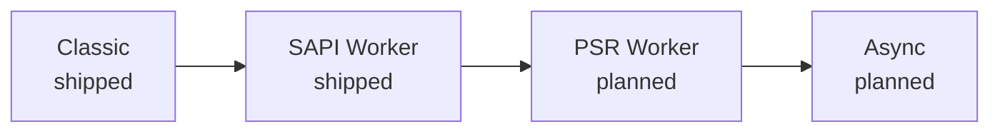

# Modos de ejecución

Todo servidor de PHP tiene que responder a una pregunta: ¿cuánto de tu aplicación sobrevive de una petición a la siguiente? Con php-fpm la respuesta es «nada»: el framework arranca desde cero cada vez y, en una aplicación moderna, ese arranque suele ser la parte más cara de la petición. Rapira no te impone una única respuesta. Te ofrece una escalera de cuatro modos de ejecución, y cada aplicación se ejecuta en el peldaño más alto que le permita su propio código.

Los nombres describen el peldaño en sí —si el worker sigue vivo y qué contrato habla— y no el producto que popularizó cada forma de trabajar. Cuanto más alto es el peldaño, más partes de tu proceso siguen calientes cuando llega una petición, y más exigencias impone eso a tu código.

## Classic <Badge type="tip" text="disponible" />

El script de entrada se ejecuta desde cero en cada petición, igual que haría con php-fpm: se rellenan las superglobales, arranca el front controller, sale la respuesta y todo se destruye. No se arrastra nada, así que nada puede filtrarse de una petición a la siguiente.

Este es el peldaño de la compatibilidad. Una aplicación que ya existe funciona tal cual: Rapira ocupa el lugar de php-fpm sin que toques el código, y la ganancia viene de la capa de abajo, no de tu aplicación —PHP va incrustado en el proceso del servidor, así que no hay ningún salto FastCGI entre el frontal HTTP y el intérprete.

En [Modo clásico](/es/docs/classic) tienes cómo ponerlo en marcha.

## SAPI Worker <Badge type="tip" text="disponible" />

Misma forma que Classic —sigues leyendo las superglobales, sigues haciendo `echo` de la respuesta— salvo que el worker no muere al terminar la petición. Un script residente arranca todo una vez y entra en un bucle: el servidor vuelve a rellenar `$_GET`, `$_POST`, `$_SERVER`, `$_COOKIE` y las demás en cada petición nueva, ejecuta tu handler y te pasa la siguiente. Autoloader, contenedor de DI, configuración, conexiones a la base de datos: todo lo que crees fuera del bucle se queda caliente.

Ese es el sentido del peldaño: el coste del arranque se paga una vez por worker en lugar de una vez por petición. A cambio, el proceso ya no arranca limpio en cada petición. Todo lo que tu aplicación deje en propiedades estáticas, singletons o estado global seguirá ahí en la siguiente petición, y eso es justo lo que convierte este peldaño en una propiedad de tu código y no en un interruptor.

En [Modo worker](/es/docs/worker) está el script del worker y su bucle; en [HTTP](/es/docs/http), cómo se manejan las peticiones y las respuestas.

## PSR Worker <Badge type="warning" text="previsto" />

En este peldaño se invierte el control: en lugar de esperar a que lo llamen, el worker le pide una petición a Rapira mediante una llamada a la API y decide qué hacer con ella. Puede rellenar las superglobales por compatibilidad, o saltárselas del todo y trabajar con un mensaje PSR-7 que entrega directamente al kernel HTTP del framework. Una petición cada vez, igual que en el peldaño de abajo.

Lo que ganas es que la petición deja de ser estado global ambiental y se convierte en un valor que puedes pasar de un lado a otro, envolver o entregar a una pila de middleware, que es justo como esperan recibirla los frameworks de PHP modernos.

::: info
Este peldaño es un concepto, no una implementación. Hoy no hay nada de esto disponible y ni su configuración ni su API del lado de PHP están diseñadas, así que todavía no hay nombres de funciones ni claves de configuración que enseñar.
:::

## Async <Badge type="warning" text="previsto" />

La misma API que el peldaño PSR Worker, salvo que el worker pide más de una petición a la vez y las atiende de forma concurrente dentro de un mismo intérprete. Esto lo hacen posible las fibras de PHP 8.1: una petición que está esperando a la E/S puede ceder el paso mientras otra avanza, sin hilos y sin un segundo proceso.

Es el peldaño más alto y el más exigente: con concurrencia dentro de un solo intérprete, cada biblioteca que intervenga en la petición tiene que funcionar correctamente cuando se la suspende a mitad de ejecución.

::: info
Este peldaño también es un concepto: no hay nada que instalar ni nada que configurar. Lee la sección de arriba como una descripción de la dirección prevista, no de algo que puedas ejecutar hoy.
:::

## Qué decide tu peldaño

El servidor no. Los cuatro peldaños están abiertos a cualquier aplicación; lo que limita la elección es el stack de la propia aplicación.

Un estado global que no sobrevive a una segunda petición te deja en Classic. Una biblioteca que no es segura con fibras te deja por debajo de Async. Un framework con integración de runtime deja disponible el peldaño SAPI Worker casi sin trabajo extra: en [Frameworks](/es/docs/frameworks/) están los que ya tienen una integración documentada. En todos los casos es una propiedad del código, no una restricción que imponga Rapira: los cuatro peldaños están disponibles y es el código de la aplicación el que determina cuál puede usar.

Subir de peldaño solo es un cambio de ida en el sentido de que cuesta trabajo del lado de PHP: un peldaño de worker necesita un script de entrada residente que el peldaño Classic no pide. Volver atrás siempre es seguro: vuelves a activar Classic —un flag en la línea de comandos o una sola clave en el archivo de configuración—, apuntas Rapira a tu front controller de siempre y ya estás en el peldaño Classic, con el mismo servidor, el mismo binario y el mismo [modelo de procesos](/es/docs/process-model) por debajo.

::: tip
Empieza por Classic si vienes a sustituir php-fpm y lo primero que quieres es tenerlo todo funcionando. Sube de peldaño cuando sepas que tu aplicación arranca limpia y no guarda estado que no debería; la medida que cuenta es tu propia aplicación, no un benchmark.
:::

::: question ¿Qué modo usa Rapira por defecto?
El peldaño worker. Classic hay que pedirlo: un flag en la línea de comandos o una sola clave en el archivo de configuración; consulta [Configuración](/es/docs/configuration) y la [referencia de la línea de comandos](/es/docs/cli).
:::

::: question Mi aplicación pierde memoria en modo worker. ¿Es un fallo de Rapira?
Casi siempre es tu aplicación, o alguna de sus dependencias, que se queda con datos de cada petición. Es una restricción real del peldaño, no un defecto, y Rapira puede reciclar el worker cada cierto número de peticiones para que una fuga lenta no acabe en una caída mientras la localizas. Consulta [Configuración](/es/docs/configuration).
:::

::: question ¿Puedo ejecutar unas rutas en Classic y otras en un worker?
No: el peldaño se elige por instancia del servidor, no por ruta. Si una parte de tu aplicación no es segura en modo worker, ponla detrás de su propia instancia de Rapira en el peldaño Classic.
:::

::: question ¿Cuándo estarán listos PSR Worker y Async?
No hay fecha que dar. Los dos se describen aquí para que la dirección quede clara, pero ninguno está diseñado hasta el punto de poder documentarse; cuando eso cambie, cambiarán con ello esta página y el [índice de la documentación](/es/docs/).
:::
