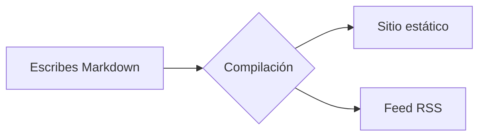

# Primeros pasos

Te damos la bienvenida a la documentación de Rapira. Esta página es además una muestra en vivo: cada bloque de abajo se genera con el mismo Markdown que escribirás en tus propias páginas.

## Bloques de aviso

Envuelve el texto en un contenedor `:::` para obtener un aviso con color e icono:

```md
::: tip
Un consejo útil que conviene destacar.
:::
::: info
Información contextual y neutral.
:::
::: warning
Algo con lo que hay que tener cuidado.
:::
::: danger
Un riesgo real: procede con cuidado.
:::
```

::: tip
Un consejo útil que conviene destacar.
:::

::: info
Información contextual y neutral.
:::

::: warning
Algo con lo que hay que tener cuidado.
:::

::: danger
Un riesgo real: procede con cuidado.
:::

Justo después del tipo puedes poner tu propio título:

::: tip Consejo
Ponle un título propio al bloque cuando la etiqueta por defecto se quede corta.
:::

## Bloques de código

El código en un bloque cercado recibe resaltado de sintaxis, una etiqueta de lenguaje y un botón de copiar:

```rust
fn main() {
    println!("Hello, Rapira!");
}
```

Dirige la atención del lector a líneas concretas: resáltalas, enfócalas o muestra los cambios:

```rust{3}
fn main() {
    let answer = 42;
    println!("The answer is {answer}"); // esta línea está resaltada
}
```

```rust
fn main() {
    let ready = true;      // [!code focus]
    println!("{ready}");
}
```

```rust
fn setup() {
    let retries = 1;       // [!code --]
    let retries = 3;       // [!code ++]
}
```

Agrupa variantes de un comando en pestañas:

::: code-group

```bash [npm]
npm install
```

```bash [pnpm]
pnpm install
```

```bash [yarn]
yarn
```

:::

## Diagramas

Un bloque `mermaid` se convierte en un diagrama:



## Tablas y etiquetas

Las tablas normales de Markdown funcionan sin más:

| Función         | Incluida |
| --------------- | :------: |
| Avisos          |    ✅    |
| Grupos de código|    ✅    |
| Mermaid         |    ✅    |
| Spoilers de FAQ |    ✅    |

Las etiquetas en línea van muy bien para marcar estados: <Badge type="tip" text="nuevo" /> <Badge type="warning" text="beta" /> <Badge type="danger" text="obsoleto" />.

## Preguntas (spoilers de FAQ)

Escribe un bloque `::: question` en cualquier parte de la página:

```md
::: question ¿Cómo ejecuto el sitio en local?
`npm install` una vez y luego `npm run dev`.
:::
```

El motor extrae todas las preguntas del texto y las agrupa en spoilers desplegables al final de la sección, como los de aquí abajo.

::: question ¿Cómo ejecuto el sitio en local?
Ejecuta `npm install` una vez y luego `npm run dev`; abre la URL local que aparece en pantalla.
:::

::: question ¿Dónde están las traducciones?
Cada idioma tiene su propia carpeta —`ru/`, `es/`, `zh/`, `pl/`— con la misma estructura que la versión en inglés. El inglés es la fuente de referencia.
:::
