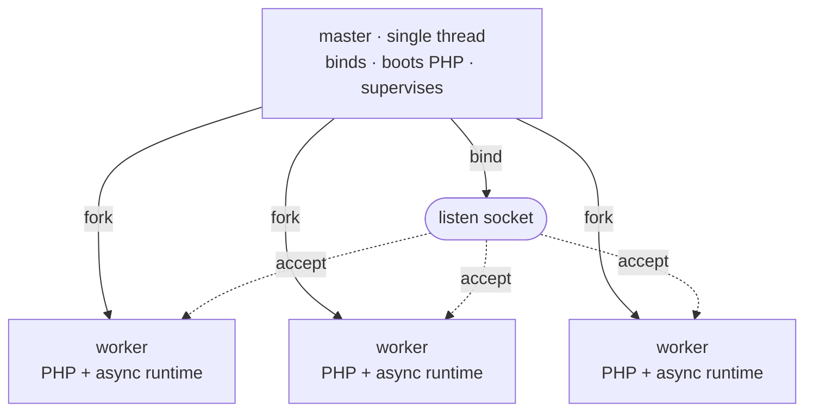

# Modelo de procesos

Rapira se ejecuta como un proceso maestro y un pool de workers. El maestro mantiene todo lo que tiene que existir exactamente una vez —el socket de escucha, la imagen del motor de PHP, el pidfile— y después hace fork; de las peticiones se encargan los workers. Ninguna petición pasa jamás de un proceso a otro: los workers *son* copias del maestro, hechas con fork cuando PHP ya estaba en marcha, y cada uno recoge sus conexiones directamente del socket.

El esquema es el mismo tanto si ejecutas el modo [Classic](/es/docs/classic) como el modo [SAPI Worker](/es/docs/worker). El [modo de ejecución](/es/docs/execution-modes) decide qué ocurre dentro de un worker con cada petición; no cambia cómo se construye el pool, ni cómo se supervisa, ni cómo se recarga.

## Maestro y workers

El arranque sigue un orden fijo:

1. **Abrir los sockets de escucha.** El maestro los reserva antes que nada, así que un puerto que ya esté ocupado tumba el arranque al momento, antes siquiera de poner PHP en marcha.
2. **Arrancar PHP una sola vez.** El motor pasa por `MINIT` dentro del maestro, que todavía es de un único hilo. Aquí se crea la memoria compartida de OPcache, y por eso todos los workers que se forkeen después heredan ese mismo segmento SHM: el primer worker que compile un archivo llena la caché para todos los demás, en lugar de que cada proceso compile su propia copia.
3. **Hacer fork de los workers.** Cada hijo hereda el socket ya abierto y el motor ya inicializado.



Cada worker ejecuta un intérprete de PHP NTS detrás de su propio runtime HTTP asíncrono y acepta conexiones en el socket que ha heredado. Delante del pool no hay ningún repartidor: todos los workers están aparcados en `accept()` sobre el mismo socket, y el kernel le entrega cada conexión entrante a uno solo de ellos.

El maestro no atiende ni una petición. No tiene pila HTTP en absoluto: es un único hilo bloqueado en `poll(2)` sobre un self-pipe, esperando señales, muertes de sus hijos, sus propios temporizadores y, en modo `ondemand`, también a que el socket de escucha esté listo. El proceso que tiene que sobrevivir para reiniciar todo lo demás hace lo mínimo imprescindible.

::: info
El maestro también mantiene cargado el módulo de PHP mientras vive y es el único proceso que lo cierra. Un worker sale sin desmontar nada, así que un worker que se cae o que se recicla nunca destruye la imagen del motor que siguen usando los demás workers.
:::

## Supervisión

Con el pool ya en marcha, el maestro ejecuta un tick de mantenimiento más o menos una vez por segundo y reacciona a la muerte de cada hijo en cuanto ocurre.

- **Recoger y reponer.** Un worker que sale limpiamente (drenado, o reciclado al agotar su cuota) se sustituye al momento; con `ondemand` la plaza simplemente se queda libre para que la vuelva a llenar la siguiente conexión. A un worker que *se cae* se le sustituye tras una espera que empieza en 100 ms y se duplica con cada caída rápida seguida, con un tope de unos 25 segundos: así un bucle de segfaults se frena solo en lugar de quemar la CPU. Aguantar vivo diez segundos reinicia esa racha.
- **Fallos de arranque.** Si un worker de la primera generación se declara enfermo antes de que el pool haya atendido una sola petición con éxito, el maestro lo toma por un fallo de arranque sin remedio y sale, en vez de reponer eternamente un punto de entrada roto. Cuando el pool ya ha servido algo, esa misma salida no es más que una reposición con espera: una recarga mala nunca puede tumbar un pool sano.
- **Reciclaje.** Con `pool.max_requests` definido, un worker se jubila al llegar a ese número de peticiones y se sustituye enseguida. Cada worker suma a la cuota un extra aleatorio propio (de hasta la mitad de la cuota), así que un pool arrancado a la vez no se recicla en bloque, cosa que dejaría un momento sin ningún worker caliente.
- **Un vigilante para cada petición.** Con `pool.request_terminate_timeout_secs` definido, el worker que siga con la misma petición pasado ese límite de tiempo real recibe un `SIGTERM`, y un `SIGKILL` si sigue ahí un tick después. El cierre forzado se registra en `warn`, sus conexiones en cola se cierran y la plaza se vuelve a llenar de inmediato. El vigilante queda suspendido mientras hay una parada o una recarga en curso.
- **Escalado.** Con `dynamic`, ese mismo tick decide si hace fork de más workers o si jubila a los que están ociosos; con `ondemand` solo jubila a los que llevan ociosos más tiempo del permitido, porque ahí el fork lo dispara una conexión que llega. Lo tienes más abajo.
- **Un pipe en el otro sentido.** Cada worker se queda con el extremo de lectura de un pipe en el que el maestro no escribe nunca. Si el maestro muere, el pipe da EOF y cada worker se drena solo, así que un `kill -9` al maestro no puede dejar workers huérfanos ocupando el puerto.

## Modos del pool

`pool.mode` elige cómo se dimensiona el pool. En los tres modos el número que manda es `pool.processes` —una cifra exacta con `static` y un techo con los otros dos— y por defecto vale un worker por CPU lógica.

| Modo | Cuántos workers | Claves que aplican |
| --- | --- | --- |
| `static` (por defecto) | Exactamente `pool.processes`, forkeados al arrancar y mantenidos en esa cifra. | `processes` |
| `dynamic` | Los que pida la demanda, hasta `pool.processes`; el maestro mantiene la cifra de *ociosos* dentro de la banda de reserva. | `min_spare`, `max_spare` |
| `ondemand` | Cero al arrancar; se forkean según llega el tráfico, hasta `pool.processes`. | `process_idle_timeout_secs` |

**`static`** le conviene a la mayoría de los despliegues: el consumo de memoria es plano y un worker que muere se sustituye sin más. PHP es síncrono, así que un worker atiende una petición cada vez: los pools cuyas peticiones se pasan casi todo el tiempo esperando a una base de datos o a una API externa suelen querer más workers que núcleos, y los que están limitados por CPU casi nunca.

**`dynamic`** mantiene el número de workers *ociosos* dentro de una banda. En cada tick, si hay menos ociosos que `min_spare` forkea más (a ráfagas que se van duplicando mientras la presión aguanta, para responder rápido a un pico de tráfico en vez de ir a worker por segundo); si hay más ociosos que `max_spare`, jubila al ocioso más veterano. Empieza por el punto medio de la banda y avisa una vez cuando toca el techo de `pool.processes` y aun así querría más.

```toml
[pool]
mode = "dynamic"
processes = 8
min_spare = 1
max_spare = 3
```

Los límites tienen que cumplir `1 <= min_spare <= max_spare <= processes`; son obligatorios con `dynamic` y se rechazan en los demás modos, porque ponerlos donde no van es un error de configuración y no una clave que se ignora en silencio.

**`ondemand`** no forkea nada al arrancar. Aquí es el propio maestro quien vigila el socket de escucha y, cuando llega una conexión y no hay ningún worker ocioso que la coja, forkea uno y deja que el hijo la acepte. Un worker que lleve ocioso más de `pool.process_idle_timeout_secs` vuelve a jubilarse. Un pool ocioso no consume nada, pero la primera petición tras un rato sin tráfico espera a un fork: usa `ondemand` en entornos de pruebas y sitios con muy pocas visitas, y cualquiera de los otros modos con tráfico constante.

La referencia completa de claves está en la página de [configuración](/es/docs/configuration).

## Señales

Las señales paran un servidor en marcha, lo recargan y le hacen informar de su estado. Todas van al **maestro**.

| Señal | Qué hace el maestro |
| --- | --- |
| `SIGTERM`, `SIGINT` | Parada ordenada: las peticiones en curso terminan y luego el pool se drena. Un segundo `SIGTERM` o `SIGINT` fuerza la salida. |
| `SIGQUIT` | La misma parada ordenada. Repetirla no cambia nada: una parada pedida por las buenas nunca se escala con otro `SIGQUIT`. |
| `SIGUSR2`, `SIGHUP` | Recarga progresiva: el pool se sustituye worker a worker, sin tirar ninguna conexión. |
| `SIGUSR1` | Vuelca en el registro el estado del pool. |
| `SIGCHLD` | Interna: ha salido un worker; recogerlo y decidir si se sustituye. |

Define `supervisor.pidfile` y tus scripts tendrán un sitio fijo del que leer el pid del maestro:

```bash
kill -USR2 $(cat /run/rapira.pid)   # rolling reload
kill -USR1 $(cat /run/rapira.pid)   # status dump
kill -TERM $(cat /run/rapira.pid)   # graceful stop
```

::: warning
Manda las señales al maestro, nunca a un worker suelto. Los workers ignoran `SIGUSR1` y `SIGUSR2` sin más, y para ellos un `SIGTERM` es una muerte inmediata: es justo lo que usa el vigilante de peticiones cuando una petición tiene que morir *ya*. Señalar un worker directamente se salta la supervisión que describe esta página.
:::

### Parar el servidor

Toda parada empieza por las buenas, la haya pedido cualquiera de las tres señales: el maestro le manda `SIGQUIT` a cada worker, que deja de coger trabajo nuevo y termina lo que tiene entre manos. A partir de ahí la escalada va por temporizador: `supervisor.process_control_timeout_secs` (30 segundos por defecto) es el periodo de gracia y, cuando se agota, los workers que sigan ahí reciben `SIGTERM` y, si ni por esas, `SIGKILL`. Al worker que no responde al `SIGQUIT` amable se le manda TERM y luego KILL, en lugar de esperarlo eternamente.

Un segundo `SIGTERM` o `SIGINT` se salta la espera y fuerza la salida al instante.

### Recarga progresiva

`SIGUSR2` (o `SIGHUP`) sustituye el pool entero por workers nuevos, que es la forma de tirar la aplicación ya arrancada de un worker residente y volver a construirla con el código que has desplegado.

En modo Classic el script de entrada se ejecuta desde cero en cada petición, así que no hay nada residente que sustituir y el código nuevo entra en juego sin recarga, salvo que hayas puesto `opcache.validate_timestamps = 0`: entonces el segmento de OPcache del maestro sigue sirviendo los opcodes viejos hasta un reinicio completo. En modo SAPI Worker la aplicación arranca una vez y se queda en memoria, con lo que el código desplegado no entra en juego hasta que hay una recarga progresiva: conviértela en un paso más de tu despliegue. Consulta [En producción](/es/docs/deployment) para más información.

La recarga nunca te baja de la capacidad con la que estabas sirviendo, porque solapa en vez de reiniciar: el maestro levanta un worker nuevo, espera a que ese worker esté aceptando de verdad y solo entonces drena uno viejo. Cuando el viejo se ha ido, su plaza pasa al siguiente worker nuevo, y así hasta el final de la generación. Cada drenaje es la misma escalada ordenada de `SIGQUIT` → `SIGTERM` → `SIGKILL` que una parada, acotada por el mismo tiempo de control, aplicada a ese único worker.

Un sustituto que nunca llega a servir tampoco atasca la recarga: en cuanto vence el tiempo de control, el maestro escribe un aviso y pasa al siguiente worker de todas formas. Con `ondemand` no se forkea ningún sustituto por adelantado: los workers viejos se drenan de uno en uno y a los nuevos los crea la demanda.

Una recarga que llega con una parada ya en marcha se ignora: la parada tiene prioridad.

::: info
Una recarga sustituye los workers, no el maestro. Los nuevos salen por fork del mismo proceso maestro y con la misma imagen del motor que este arrancó al principio, así que `rapira.toml`, `php.ini` y el propio binario solo cambian con un reinicio completo.
:::

### Volcado de estado

`SIGUSR1` hace que el maestro escriba en el registro una foto del pool: una línea de resumen con cuántos workers hay en marcha y cuántos ociosos, más la generación actual, y después una línea por plaza con su pid, su estado y sus contadores `handled`, `errors` y `recycles`.

::: tip
El volcado se escribe en `info` sobre el target `master`, y el nivel de registro por defecto es `error`, así que con la configuración de fábrica parece que `kill -USR1` no hiciera absolutamente nada. Sube ese target y el volcado aparece:

```toml
[log.targets]
master = "info"
```

Por ese mismo target pasan todos los eventos de supervisión: forks, recogidas, reposiciones, recargas y escalado del pool. Lo demás está en [Registros](/es/docs/logging).
:::
