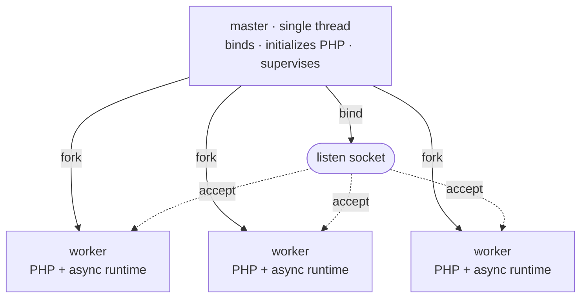

# Modelo de procesos

Rapira se ejecuta como un proceso maestro y un pool de workers. El maestro mantiene todo lo que tiene que existir exactamente una vez -el socket de escucha, la imagen del motor de PHP, el pidfile- y después hace fork; de las peticiones se encargan los workers. Ninguna petición pasa jamás de un proceso a otro: los workers *son* copias del maestro, hechas con fork cuando PHP ya estaba en marcha, y cada uno recoge sus conexiones directamente del socket.

El esquema es el mismo en los modos [Classic](/es/docs/classic), [Worker](/es/docs/worker) y Dispatcher. El modo de ejecución, que fija `pool.mode`, decide qué ocurre dentro de un worker con cada petición; no cambia cómo se construye el pool, ni cómo se supervisa, ni cómo se recarga. Consulta [Modos de ejecución](/es/docs/execution-modes) para más información.

## Maestro y workers

El arranque sigue un orden fijo:

1. **Abrir los sockets de escucha.** El maestro los reserva antes que nada, así que un puerto que ya esté ocupado tumba el arranque al momento, antes siquiera de poner PHP en marcha.
2. **Arrancar PHP una sola vez.** El motor pasa por `MINIT` dentro del maestro, que todavía es de un único hilo. Aquí se crea la memoria compartida de OPcache, y por eso todos los workers que se forkeen después heredan ese mismo segmento SHM: el primer worker que compile un archivo llena la caché para todos los demás, en lugar de que cada proceso compile su propia copia.
3. **Hacer fork de los workers.** Cada hijo hereda el socket ya abierto y el motor ya inicializado.



Cada worker ejecuta un intérprete de PHP NTS detrás de su propia pila HTTP asíncrona. Esa pila es hyper sobre un runtime de tokio propio, con dos hilos de ejecución. El worker acepta conexiones en el socket que ha heredado. Ningún proceso reparte las conexiones entre los workers: todos están aparcados en `accept()` sobre el mismo socket, y el kernel le entrega cada conexión entrante a uno solo de ellos.

El maestro no atiende ni una petición. No tiene pila HTTP en absoluto: es un único hilo bloqueado en `poll(2)` sobre un self-pipe, esperando señales, muertes de sus hijos, sus propios temporizadores y, en modo `ondemand`, también a que el socket de escucha esté listo. El proceso que tiene que sobrevivir para reiniciar todo lo demás hace lo mínimo imprescindible.

::: info
El maestro también mantiene cargado el módulo de PHP mientras vive y es el único proceso que lo cierra. Un worker sale sin desmontar nada, así que un worker que se cae o que se recicla nunca destruye la imagen del motor que siguen usando los demás workers.
:::

## Supervisión

Después de iniciar el pool, el maestro ejecuta el mantenimiento aproximadamente una vez por segundo. También procesa las salidas de los workers cuando ocurren.

- **Sustitución de workers.** El maestro sustituye inmediatamente un worker después de una salida normal.
- Con `ondemand`, espera a la siguiente conexión antes de crear la sustitución.
- Después de un fallo, la espera empieza en 100 ms. Se duplica tras cada fallo consecutivo y deja de aumentar cerca de 25 segundos.
- Una vida del worker de diez segundos reinicia la espera.
- **Fallos de inicialización.** El maestro termina si todos los workers iniciales fallan antes de que el pool procese una petición.
- Después de la primera petición, el maestro usa la espera normal. Una recarga fallida no detiene los workers existentes.
- **Límites de peticiones.** Con `pool.max_requests`, un worker termina después de su límite. El maestro lo sustituye.
- Rapira añade un valor aleatorio de hasta la mitad del límite. Esto evita la sustitución simultánea de workers.
- **Tiempo límite de petición.** Con `pool.request_terminate_timeout_secs`, el maestro envía `SIGTERM` cuando una petición supera el límite.
- Envía `SIGKILL` un ciclo después si el worker sigue activo. Cierra las conexiones en cola y crea una sustitución.
- El maestro no aplica este límite durante una parada o recarga.
- **Escalado.** Con `dynamic`, el mantenimiento puede crear workers o eliminar workers inactivos.
- Con `ondemand`, elimina workers después del límite de inactividad. Una conexión nueva causa la creación de un worker.
- **Control del maestro.** Cada worker lee de un pipe que el maestro mantiene abierto.
- Si termina el maestro, el pipe devuelve EOF y cada worker deja de aceptar trabajo. Un fallo del maestro no deja workers sin control.

## Escalado del pool

`pool.scaling` selecciona cómo cambia el tamaño del pool. Es independiente de `pool.mode`.
La clave `pool.mode` establece el modo de ejecución de un worker. `pool.processes` es el número exacto con `static`.
Es el número máximo con `dynamic` y `ondemand`. El valor predeterminado es un worker por CPU lógica.

| Escalado | Cuántos workers | Claves que aplican |
| --- | --- | --- |
| `static` (por defecto) | Exactamente `pool.processes`, forkeados al arrancar y mantenidos en esa cifra. | `processes` |
| `dynamic` | Los que pida la demanda, hasta `pool.processes`; el maestro mantiene la cifra de *ociosos* dentro de la banda de reserva. | `min_spare`, `max_spare` |
| `ondemand` | Cero al arrancar; se forkean según llega el tráfico, hasta `pool.processes`. | `process_idle_timeout_secs` |

**`static`** es adecuado para la mayoría de los despliegues. Usa un número fijo de workers y sustituye los que terminan.
PHP es síncrono, por lo que cada worker procesa una petición cada vez. Las aplicaciones con mucha E/S pueden requerir más workers que CPU.
Las aplicaciones limitadas por CPU normalmente no los requieren.

**`dynamic`** mantiene los workers inactivos entre dos límites. Crea workers cuando la cantidad es menor que `min_spare`.
El número de workers nuevos se duplica durante ciclos consecutivos sin capacidad suficiente. Elimina el worker inactivo más antiguo por encima de `max_spare`.
El número inicial es el punto medio de los límites. Rapira registra un aviso cuando la demanda supera `pool.processes`.

```toml
[pool]
scaling = "dynamic"
processes = 8
min_spare = 1
max_spare = 3
```

Los límites tienen que cumplir `1 <= min_spare <= max_spare <= processes`; son obligatorios con `dynamic` y se rechazan con las demás políticas. Ponerlos donde no van es un error de configuración y no una clave que se ignora en silencio.

**`ondemand`** no crea workers al iniciar. El maestro observa el socket de escucha.
Cuando llega una conexión sin un worker inactivo, el maestro crea uno. Un worker termina después de `pool.process_idle_timeout_secs` de inactividad.
La primera petición a un pool vacío espera la creación de un worker. Usa `ondemand` para pruebas y sitios con poco tráfico.
Usa otra política para el tráfico constante.

La referencia completa de claves está en la página de [configuración](/es/docs/configuration).

## Señales

Las señales paran un servidor en marcha, lo recargan y le hacen informar de su estado. Todas van al **maestro**.

| Señal | Qué hace el maestro |
| --- | --- |
| `SIGTERM`, `SIGINT` | Parada ordenada: las peticiones en curso terminan y luego el pool se drena. Un segundo `SIGTERM` o `SIGINT` fuerza la salida. |
| `SIGQUIT` | La misma parada ordenada. Repetirla no cambia nada: una parada pedida por las buenas nunca se escala con otro `SIGQUIT`. |
| `SIGUSR2`, `SIGHUP` | Recarga progresiva: el pool se sustituye worker a worker. Cada worker antiguo deja de aceptar trabajo y termina las peticiones actuales. |
| `SIGUSR1` | Vuelca en el registro el estado del pool. |
| `SIGCHLD` | Interna: ha salido un worker; recogerlo y decidir si se sustituye. |

Define `supervisor.pidfile` y tus scripts tendrán un sitio fijo del que leer el pid del maestro:

```bash
kill -USR2 $(cat /run/rapira.pid)   # Replace workers one at a time.
kill -USR1 $(cat /run/rapira.pid)   # Write pool status to the log.
kill -TERM $(cat /run/rapira.pid)   # Stop after current requests finish.
```

::: warning
Envía las señales solo al maestro. Los workers ignoran `SIGUSR1` y `SIGUSR2`.
Los workers tratan `SIGTERM` como una terminación inmediata. El tiempo límite de petición usa esta señal.
Una señal directa al worker evita la supervisión del maestro.
:::

### Parar el servidor

Para cada señal de parada, el maestro envía inmediatamente `SIGQUIT` a todos los workers. Los workers dejan de aceptar trabajo y terminan las peticiones actuales.
Después de `supervisor.process_control_timeout_secs`, el maestro envía `SIGTERM` a los workers restantes. El valor predeterminado es 30 segundos.
Si quedan workers, el maestro envía `SIGKILL` un segundo después de `SIGTERM`.

Un segundo `SIGTERM` o `SIGINT` se salta la espera y fuerza la salida al instante.

### La sustitución deja terminar las peticiones actuales

`SIGUSR2` o `SIGHUP` sustituye el pool completo. Cada nuevo worker inicializa la aplicación con el código desplegado.

En Classic, el script de entrada se ejecuta en una petición PHP nueva. El código nuevo funciona sin recarga.
Sin embargo, `opcache.validate_timestamps = 0` requiere un reinicio completo.
Worker y Dispatcher conservan la aplicación inicializada. Recarga el pool después de cada despliegue en estos modos.
Consulta [En producción](/es/docs/deployment).

El maestro inicia un worker nuevo y espera hasta que informa del estado `idle` o `active`.
Después detiene un worker antiguo. Cuando termina, el maestro inicia un worker nuevo en la siguiente posición.
Cada parada usa la secuencia `SIGQUIT` → `SIGTERM` → `SIGKILL`. El mismo límite de control se aplica a cada worker.
Un worker antiguo cierra las conexiones keep-alive inactivas cuando empieza a detenerse. Las peticiones actuales pueden terminar antes del límite de control.

Si el worker nuevo no informa de ninguno de estos estados antes del límite de control, el maestro registra una advertencia.
Después, el maestro detiene el siguiente worker antiguo aunque el worker nuevo todavía no atienda peticiones.
Con `ondemand`, el maestro elimina workers antiguos uno a uno. Las conexiones nuevas crean sustitutos.

Una recarga que llega con una parada ya en marcha se ignora: la parada tiene prioridad.

::: info
Una recarga sustituye los workers, no el maestro. Los workers nuevos usan la misma imagen del motor.
Los cambios de `rapira.toml`, `php.ini` y del binario requieren un reinicio completo.
:::

### Volcado de estado

`SIGUSR1` hace que el maestro escriba en el registro una foto del pool: una línea de resumen con cuántos workers hay en marcha y cuántos ociosos, más la generación actual, y después una línea por plaza con su pid, su estado y sus contadores `handled`, `errors` y `recycles`.

::: tip
El volcado se escribe en `info` sobre el target `master`, y el nivel de registro por defecto es `error`, así que con la configuración de fábrica parece que `kill -USR1` no hiciera absolutamente nada. Sube ese target y el volcado aparece:

```toml
[log.targets]
master = "info"
```

Por ese mismo target pasan todos los eventos de supervisión: forks, recogidas, reposiciones, recargas y escalado del pool. Lo demás está en [Registros](/es/docs/logging).
:::
