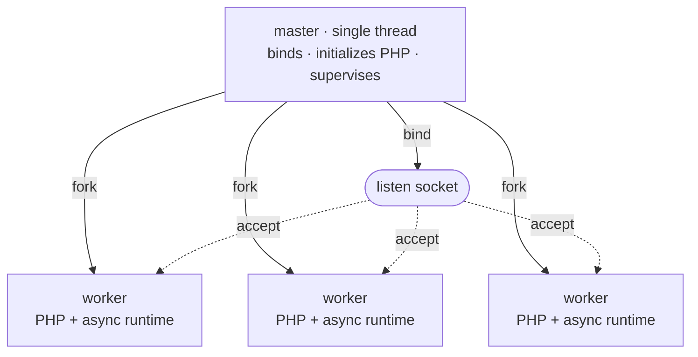

# Modelo de procesos

Rapira ejecuta un proceso maestro y un pool de workers para cada protocolo activado. El maestro mantiene los sockets de escucha, el motor PHP inicializado y el pidfile. Después, el maestro crea los procesos worker. Cada worker hereda PHP y acepta conexiones desde el socket compartido de su pool. Rapira no pasa una petición entre procesos.

HTTP y [gRPC](./grpc) tienen escuchas, scripts de entrada y pools separados. `[http.pool]` y `[grpc.pool]` los configuran de forma independiente. El pool gRPC usa el modo Dispatcher y procesa una llamada activa por worker.

Cuando la configuración tiene una tabla `[observability]`, el maestro también inicia un proceso para las métricas y las comprobaciones de salud. Este proceso no ejecuta código PHP. En Linux, su nombre de proceso es `rapira-obs`, y los workers PHP tienen el nombre `rapira-worker`. El maestro supervisa, recarga y detiene este proceso junto con los workers PHP. Consulta [Métricas y comprobaciones de salud](/es/docs/observability) para más información.

Este modelo de procesos es el mismo en los modos [Classic](/es/docs/classic), [Worker](/es/docs/worker) y [Dispatcher](/es/docs/dispatcher). `http.pool.mode` controla el procesamiento de las peticiones dentro de un worker. Este ajuste no cambia la creación del pool, la supervisión ni las recargas. Consulta [Modos de ejecución](/es/docs/execution-modes) para más información.

## Maestro y workers

La inicialización sigue este orden:

1. **Enlazar el socket o los sockets de escucha.** Un conflicto de puerto detiene la inicialización antes de que PHP se inicie.
2. **Iniciar PHP una vez.** El maestro ejecuta `MINIT` en su único hilo. OPcache crea su memoria compartida en este momento, y cada worker la hereda. Cuando un worker compila un archivo, los otros workers usan el resultado en caché.
3. **Hacer fork de los workers.** Cada hijo hereda el socket enlazado y el motor inicializado.


```mermaid
flowchart TB
  M["master · single thread<br/>binds · initializes PHP · supervises"]
  S(["listen socket"])
  W1["worker<br/>PHP + async runtime"]
  W2["worker<br/>PHP + async runtime"]
  W3["worker<br/>PHP + async runtime"]
  M -- bind --> S
  M -- fork --> W1
  M -- fork --> W2
  M -- fork --> W3
  S -. accept .-> W1
  S -. accept .-> W2
  S -. accept .-> W3
```

El diagrama muestra un pool. Cada worker ejecuta un intérprete PHP NTS y un servidor HTTP o gRPC asíncrono. El servidor usa hyper sobre un runtime de tokio propio, con dos hilos. Cada worker llama a `accept()` en el socket que ha heredado. El sistema operativo asigna cada conexión nueva a un worker.

El maestro no atiende peticiones. Su único hilo espera señales, salidas de workers y temporizadores.

::: info
El maestro mantiene el módulo PHP durante toda su vida. Solo el maestro cierra el módulo. Un worker termina, pero no cierra este estado compartido del motor.
:::

## Supervisión

El maestro ejecuta el mantenimiento una vez por segundo. También procesa cada salida de un worker cuando ocurre.

- **Sustitución de workers.** Después de una salida normal, el maestro sustituye el worker inmediatamente. Después de un fallo o de una salida unhealthy, la espera de sustitución empieza en 100 ms. La espera se duplica tras cada fallo consecutivo y se detiene en 25,6 segundos. Un worker que funciona al menos 10 segundos reinicia la espera.
- **Arranques fallidos.** En los modos Worker y Dispatcher, un arranque falla cuando el script de entrada termina antes de recibir una petición. Después, el worker espera hasta 5 segundos y vuelve a ejecutar el script de entrada. Responde a una petición que llega durante la espera con HTTP `503` o gRPC `UNAVAILABLE`. Después de cinco arranques fallidos consecutivos, el worker termina como unhealthy.
- **Parada del maestro por arranque fallido.** El maestro se detiene con el código de salida 70 cuando termina un worker unhealthy de la generación cero. Esta regla solo se aplica cuando el pool no tiene ninguna petición correcta ni ningún worker idle o active. La generación cero identifica los workers creados antes de la primera recarga. En todos los demás casos, el maestro sustituye el worker después de la espera de sustitución. Un fallo de un worker nunca detiene el maestro.
- **Límites de peticiones.** Con `http.pool.max_requests`, un worker termina después de un número aleatorio de peticiones entre `max_requests + 1` y aproximadamente `1.5 × max_requests`. El maestro lo sustituye inmediatamente. El rango aleatorio evita la sustitución simultánea de workers.
- **Tiempo límite de petición.** Con `http.pool.request_terminate_timeout_secs`, el maestro envía `SIGTERM` a un worker cuando su petición actual supera el límite. Si el worker sigue activo en el siguiente mantenimiento, el maestro envía `SIGKILL`. Después, el maestro sustituye el worker inmediatamente. El maestro aplica este límite durante una recarga, pero no durante una parada.
- **Control del maestro.** Cada worker lee de un pipe que el maestro mantiene abierto. Si el maestro termina, cada worker deja de aceptar trabajo nuevo, termina sus peticiones actuales y sale.

## Tamaño del pool

Los ajustes siguientes usan `[http.pool]`. Los mismos ajustes se aplican a `[grpc.pool]`.

`http.pool.processes` establece el número de workers. El maestro crea estos workers durante la inicialización y sustituye cada worker que termina. El valor predeterminado es un worker por cada CPU que el proceso puede usar. Si un contenedor tiene un límite de CPU, el valor predeterminado sigue ese límite.

El total de workers de todos los pools debe ser 2048 o menos. Cuando la observabilidad está activada, su proceso cuenta como un worker. Un total mayor detiene Rapira con el código de salida 70.

PHP es síncrono, por lo que cada worker procesa una petición cada vez. Las aplicaciones con mucha E/S pueden requerir más workers que núcleos de CPU. Las aplicaciones limitadas por CPU normalmente no los requieren.

El número de workers no cambia mientras el servidor está en marcha. Para adaptar la capacidad a la carga, cambia el número de instancias de Rapira, por ejemplo con un orquestador de contenedores.

Consulta la [configuración](/es/docs/configuration) para ver la referencia completa de claves.

## Señales

Las señales detienen un servidor en marcha, lo recargan y le hacen informar de su estado. Todas van al **maestro**.

| Señal | Qué hace el maestro |
| --- | --- |
| `SIGTERM`, `SIGINT` | El maestro deja terminar las peticiones actuales y después detiene los workers. Una segunda señal fuerza la parada de los workers. |
| `SIGQUIT` | El maestro hace la misma parada ordenada. Otro `SIGQUIT` no tiene efecto. |
| `SIGUSR2`, `SIGHUP` | El maestro sustituye un worker cada vez. Cada worker antiguo deja de aceptar trabajo nuevo y termina las peticiones actuales. |
| `SIGUSR1` | El maestro escribe el estado del pool en el registro. |

Define `supervisor.pidfile` para dar a los scripts una ubicación fija del identificador del proceso maestro:

```bash
kill -USR2 $(cat /run/rapira.pid)   # Sustituir los workers uno a uno.
kill -USR1 $(cat /run/rapira.pid)   # Escribir el estado del pool en el registro.
kill -TERM $(cat /run/rapira.pid)   # Detener después de terminar las peticiones actuales.
```

::: warning
Envía las señales solo al maestro. Los workers ignoran `SIGUSR1` y `SIGUSR2`. `SIGTERM` y `SIGHUP` detienen un worker inmediatamente y cortan sus peticiones actuales. El tiempo límite de petición usa `SIGTERM`. Una señal directa a un worker evita la supervisión del maestro.

`Ctrl-C` en un terminal envía `SIGINT` al maestro y a todos los workers. Después, cada worker también recibe `SIGQUIT` del maestro. Una segunda señal de parada hace que un worker salga inmediatamente con el código 131, así que sus peticiones actuales no terminan. Para dejar terminar las peticiones actuales, envía `SIGTERM` solo al maestro.
:::

### Parar el servidor

Después de una señal de parada, el maestro envía inmediatamente `SIGQUIT` a cada worker. Los workers dejan de aceptar trabajo nuevo y terminan las peticiones actuales. Después de `supervisor.process_control_timeout_secs`, el maestro envía `SIGTERM` a los workers restantes. El límite predeterminado es 30 segundos. Si quedan workers, el maestro envía `SIGKILL` un segundo después de `SIGTERM`.

El plazo de drenaje de las conexiones es el tiempo límite de control menos el menor valor entre cinco segundos y la mitad de ese límite. Con los ajustes predeterminados, las conexiones tienen 25 segundos para terminar. Las respuestas que superen este plazo pueden interrumpirse. El mismo plazo se aplica durante la recarga.

Un segundo `SIGTERM` o `SIGINT` salta la espera y fuerza la salida inmediatamente. Consulta [Códigos de salida](/es/docs/cli#codigos-de-salida) para ver los códigos de salida del maestro.

### La sustitución de workers deja terminar las peticiones actuales

`SIGUSR2` o `SIGHUP` sustituye el pool completo. Cada worker nuevo inicializa la aplicación con el código desplegado.

En el modo Classic, cada petición ejecuta el script de entrada en una petición PHP nueva, así que el código nuevo funciona sin recarga. Los modos Worker y Dispatcher mantienen la aplicación en memoria. Recarga el pool después de cada despliegue en estos modos. Con `opcache.validate_timestamps = 0`, una recarga no carga código nuevo en ningún modo, porque los workers nuevos usan la memoria de OPcache del maestro. En este caso, reinicia Rapira. Consulta [despliegue](/es/docs/deployment) para más información.

El maestro inicia un worker nuevo y espera hasta que informa del estado idle o active. Después, el maestro detiene el worker antiguo más viejo. Cuando ese worker termina, el maestro inicia el siguiente worker nuevo en su lugar. Esta secuencia continúa hasta que no queda ningún worker antiguo. Todos los pools se recargan al mismo tiempo.

Cada parada de un worker usa la secuencia `SIGQUIT` → `SIGTERM` → `SIGKILL`. El mismo límite de control se aplica a cada worker. Un worker antiguo cierra las conexiones keep-alive inactivas después de recibir `SIGQUIT`. Las peticiones actuales tienen el plazo de drenaje de conexiones más corto descrito arriba.

Si el worker nuevo no informa de ninguno de estos estados antes del límite de control, el maestro registra una advertencia. Después, el maestro detiene el siguiente worker antiguo aunque el worker nuevo no atienda peticiones.

El maestro ignora una señal de recarga durante una parada o mientras una recarga está en curso. No registra la señal ignorada. Envía la señal otra vez cuando termine la recarga.

::: info
Una recarga sustituye los workers, pero no el maestro. Los workers nuevos heredan el mismo motor inicializado. Reinicia Rapira para aplicar cambios en el binario o en los archivos que lee el maestro, como `rapira.toml` y `php.ini`.
:::

### Escribir el estado en el registro

`SIGUSR1` hace que el maestro escriba el estado de cada pool en el registro. La primera línea de un pool muestra el número de workers en marcha e idle y la generación de recarga. Después, una línea por cada plaza de worker muestra el identificador del proceso, el estado y tres contadores:

```text
status: http pool: 4 running, 3 idle, generation 0
  slot 0 pid 4242 state 2 handled 1500 errors 2 recycles 0
```

| Estado | Significado |
| --- | --- |
| `1` | Iniciando. La aplicación todavía no ha arrancado, o su último arranque falló. |
| `2` | Idle. El worker espera trabajo. |
| `3` | Active. El worker procesa una petición. |
| `4` | Drenando. El worker termina su trabajo y sale. |

Una plaza conserva sus contadores cuando el maestro sustituye su worker. `recycles` cuenta los reinicios del script de entrada dentro de un worker.

::: tip
La salida de estado usa `info` en el target `master`. El nivel de registro predeterminado es `error`. Establece este target en `info` para mostrar la salida:

```toml
[log.targets]
master = "info"
```

El mismo target contiene errores de creación de workers, advertencias de disponibilidad durante la recarga y advertencias de tiempo límite de petición. Consulta [registro](/es/docs/logging) para más información.
:::

::: question ¿Usa Rapira transparent huge pages?
No. En Linux, el maestro desactiva las transparent huge pages para su propio proceso antes de que PHP se inicie. Los workers y los procesos que PHP inicia con `proc_open()` o `exec()` heredan este ajuste. Por eso, `USE_ZEND_ALLOC_HUGE_PAGES=1` y `opcache.huge_code_pages` no obtienen transparent huge pages. Estas opciones todavía pueden usar huge pages explícitas que el host reserva con `vm.nr_hugepages`. Ningún ajuste cambia este comportamiento.
:::

::: question ¿Puede el maestro ejecutarse como PID 1 en un contenedor?
Sí. Como PID 1, el maestro procesa las señales de parada y recoge todos los procesos hijos que terminan. No necesitas un proceso init separado.
:::
