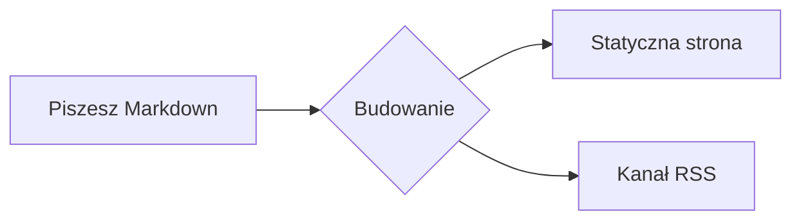

# Współtworzenie dokumentacji

Chcesz pomóc ulepszyć dokumentację Rapiry? Świetnie. Ta strona to żywy przegląd wszystkiego, co potrafi silnik dokumentacji — każdy blok poniżej powstaje z tego samego Markdownu, który będziesz pisać, więc miej ją pod ręką jako ściągę podczas edycji stron.

## Bloki z wyróżnieniem

Otocz tekst kontenerem `:::`, aby uzyskać kolorowe wyróżnienie z ikoną:

```md
::: tip
Przydatna rada, którą warto podkreślić.
:::
::: info
Neutralna informacja kontekstowa.
:::
::: warning
Coś, na co trzeba uważać.
:::
::: danger
Realne ryzyko — działaj ostrożnie.
:::
```

::: tip
Przydatna rada, którą warto podkreślić.
:::

::: info
Neutralna informacja kontekstowa.
:::

::: warning
Coś, na co trzeba uważać.
:::

::: danger
Realne ryzyko — działaj ostrożnie.
:::

Zaraz po typie możesz podać własny tytuł:

::: tip Wskazówka
Nadaj blokowi własny tytuł, gdy domyślna etykieta nie wystarcza.
:::

## Bloki kodu

Kod w bloku otrzymuje podświetlanie składni, etykietę języka i przycisk kopiowania:

```rust
fn main() {
    println!("Hello, Rapira!");
}
```

Skieruj uwagę czytelnika na konkretne wiersze — podświetl je, ustaw fokus albo pokaż zmiany:

```rust{3}
fn main() {
    let answer = 42;
    println!("The answer is {answer}"); // ten wiersz jest podświetlony
}
```

```rust
fn main() {
    let ready = true;      // [!code focus]
    println!("{ready}");
}
```

```rust
fn setup() {
    let retries = 1;       // [!code --]
    let retries = 3;       // [!code ++]
}
```

Zbierz warianty tego samego polecenia w zakładki:

::: code-group

```bash [npm]
npm install
```

```bash [pnpm]
pnpm install
```

```bash [yarn]
yarn
```

:::

## Diagramy

Blok `mermaid` renderuje się jako diagram:



## Tabele i plakietki

Zwykłe tabele Markdown działają od razu:

| Funkcja          | W zestawie |
| ---------------- | :--------: |
| Wyróżnienia      |     ✅     |
| Grupy kodu       |     ✅     |
| Mermaid          |     ✅     |
| Spoilery FAQ     |     ✅     |

Plakietki w tekście świetnie nadają się do oznaczania statusu: <Badge type="tip" text="nowość" /> <Badge type="warning" text="beta" /> <Badge type="danger" text="wycofane" />.

## Frontmatter strony

Opcje strony ustawiasz w bloku YAML na samej górze pliku:

```yaml
---
title: Własny tytuł       # nadpisuje H1 w <title> / og:title
description: Krótkie streszczenie # meta description i og:description
outline: [2, 3]           # menu „Na tej stronie” — patrz niżej
aside: false              # całkowicie ukryj prawą kolumnę
lastUpdated: false        # ukryj znacznik „Zaktualizowano” na tej stronie
editLink: false           # ukryj link „Edytuj tę stronę”
prev: false               # ukryj stopkowy link „Poprzednia”
next:                     # albo zmień nazwę / cel linku w stopce
  text: Blog
  link: /pl/blog/
faqLevel: 2               # gdzie zbierają się bloki ::: question (patrz wyżej)
---
```

**outline** steruje spisem „Na tej stronie” po prawej:

```yaml
outline: [2, 3]   # domyślnie — H2 i H3
outline: deep     # wszystkie poziomy, H2–H6
outline: 2        # tylko H2
outline: false    # ukryj
```

Użyj `layout: home` dla strony startowej lub `layout: page` dla pustej strony bez paska bocznego i spisu; zwykłe strony korzystają z domyślnego układu `doc`.

## Pytania (spoilery FAQ)

Napisz blok `::: question` w dowolnym miejscu strony:

```md
::: question Jak uruchomić stronę lokalnie?
Raz `npm install`, a potem `npm run dev`.
:::
```

Silnik wyławia z tekstu wszystkie pytania i zbiera je w rozwijane spoilery na końcu sekcji — takie jak poniżej.

Gdzie się pojawią, zależy od Ciebie — ustaw `faqLevel` we frontmatterze strony:

```yaml
---
faqLevel: 1       # domyślnie — na końcu każdej sekcji H1 (zwykle koniec strony)
faqLevel: 2       # na końcu każdej sekcji H2
faqLevel: 0       # na samym końcu strony, niezależnie od nagłówków
faqLevel: false   # bez grupowania — każde pytanie zostaje tam, gdzie je napisałeś
---
```

::: question Jak uruchomić stronę lokalnie?
Uruchom raz `npm install`, a potem `npm run dev` i otwórz wyświetlony lokalny adres.
:::

::: question Gdzie są tłumaczenia?
Każdy język ma własny katalog — `ru/`, `es/`, `zh/`, `pl/` — o tej samej strukturze co wersja angielska. Angielski jest źródłem prawdy.
:::
