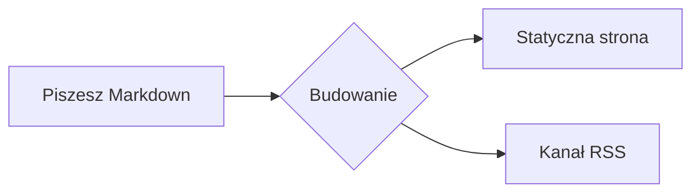

# Współtworzenie dokumentacji

Ta strona opisuje funkcje tworzenia dokumentacji. Każdy przykład powstaje z przedstawionego kodu Markdown.

Uruchom `npm ci`, aby zainstalować zablokowane zależności. Następnie uruchom `npm run dev`. Otwórz lokalny adres z danych wyjściowych polecenia. Katalogi tłumaczeń mają taką samą strukturę jak kanoniczne pliki angielskie.

## Bloki z wyróżnieniem

Otocz tekst kontenerem `:::`, aby uzyskać kolorowe wyróżnienie z ikoną:

```md
::: tip
Przydatna rada, którą warto podkreślić.
:::
::: info
Neutralna informacja kontekstowa.
:::
::: warning
Coś, na co trzeba uważać.
:::
::: danger
Realne ryzyko - działaj ostrożnie.
:::
```

::: tip
Przydatna rada, którą warto podkreślić.
:::

::: info
Neutralna informacja kontekstowa.
:::

::: warning
Coś, na co trzeba uważać.
:::

::: danger
Realne ryzyko - działaj ostrożnie.
:::

Dodaj konkretny tytuł po typie:

::: tip Wskazówka
Nadaj blokowi własny tytuł, gdy domyślna etykieta nie wystarcza.
:::

## Bloki kodu

Kod w bloku otrzymuje podświetlanie składni, etykietę języka i przycisk kopiowania:

```rust
fn main() {
    println!("Hello, Rapira!");
}
```

Skieruj uwagę czytelnika na konkretne wiersze - podświetl je, ustaw fokus albo pokaż zmiany:

```rust{3}
fn main() {
    let answer = 42;
    println!("The answer is {answer}"); // ten wiersz jest podświetlony
}
```

```rust
fn main() {
    let ready = true;      // [!code focus]
    println!("{ready}");
}
```

```rust
fn setup() {
    let retries = 1;       // [!code --]
    let retries = 3;       // [!code ++]
}
```

Zbierz warianty tego samego polecenia w zakładki:

::: code-group

```bash [npm]
npm install
```

```bash [pnpm]
pnpm install
```

```bash [yarn]
yarn
```

:::

## Karty plików

Blok `<CodeTabs>` pokazuje kilka plików tak, jak robi to edytor: u góry karta na każdy plik, pod nimi kod otwartej karty. Wypisz karty w bloku `<script setup>` na stronie, a każdy fragment umieść w `<template>` o nazwie zgodnej ze `slot` danej karty:

````md
<script setup>
const appTabs = [
  { name: 'index.php', slot: 'classic' },
  { name: 'worker.php', slot: 'worker' },
  { name: 'rapira.toml', slot: 'config' },
]
</script>

<CodeTabs :tabs="appTabs">

<template #classic>

```php
<?php
require __DIR__ . '/vendor/autoload.php';

echo (new App())->handle($_SERVER['REQUEST_URI']);
```

</template>

<template #worker>

```php
<?php
require __DIR__ . '/vendor/autoload.php';

$app = new App(); // uruchamiany raz, obsługuje kolejne żądania

$handler = static function () use ($app): void {
    echo $app->handle($_SERVER['REQUEST_URI']);
};

while (\Rapira\handle_request($handler)) {
}
```

</template>

<template #config>

```toml
[pool]
entrypoint = "worker.php"
mode = "worker"
processes = 4
```

</template>

</CodeTabs>
````

Ikonę karty wyznacza rozszerzenie w jej nazwie: `.php`, `.rs`, `.toml`, `.yaml`, `.json` i `.sh` mają własne, pozostałe dostają zwykły znaczek pliku. Aby wybrać ikonę samodzielnie, dodaj karcie pole `icon` o wartości `php`, `rust`, `toml`, `yaml`, `json`, `shell` lub `file`.

Tak ten blok wygląda na stronie:

<script setup>
const appTabs = [
  { name: 'index.php', slot: 'classic' },
  { name: 'worker.php', slot: 'worker' },
  { name: 'rapira.toml', slot: 'config' },
]
</script>

<CodeTabs :tabs="appTabs">

<template #classic>

```php
<?php
require __DIR__ . '/vendor/autoload.php';

echo (new App())->handle($_SERVER['REQUEST_URI']);
```

</template>

<template #worker>

```php
<?php
require __DIR__ . '/vendor/autoload.php';

$app = new App(); // uruchamiany raz, obsługuje kolejne żądania

$handler = static function () use ($app): void {
    echo $app->handle($_SERVER['REQUEST_URI']);
};

while (\Rapira\handle_request($handler)) {
}
```

</template>

<template #config>

```toml
[pool]
entrypoint = "worker.php"
mode = "worker"
processes = 4
```

</template>

</CodeTabs>

## Diagramy

Blok `mermaid` renderuje się jako diagram:



## Tabele i plakietki

Standardowy Markdown tworzy tabele:

| Funkcja          | W zestawie |
| ---------------- | :--------: |
| Wyróżnienia      |     ✅     |
| Grupy kodu       |     ✅     |
| Mermaid          |     ✅     |

Plakietki w tekście mogą przedstawiać status:
<Badge type="tip" text="nowość" /> <Badge type="warning" text="beta" /> <Badge type="danger" text="wycofane" />

## Frontmatter strony

Opcje strony ustawiasz w bloku YAML na samej górze pliku:

```yaml
---
title: Własny tytuł       # nadpisuje H1 w <title> / og:title
description: Krótkie streszczenie # meta description i og:description
outline: [2, 3]           # menu „Na tej stronie” - patrz niżej
aside: false              # całkowicie ukryj prawą kolumnę
lastUpdated: false        # ukryj znacznik „Zaktualizowano” na tej stronie
editLink: false           # ukryj link „Edytuj tę stronę”
prev: false               # ukryj stopkowy link „Poprzednia”
next:                     # albo zmień nazwę / cel linku w stopce
  text: Blog
  link: /pl/blog/
---
```

**outline** steruje spisem „Na tej stronie” po prawej:

```yaml
outline: [2, 3]   # domyślnie - H2 i H3
outline: deep     # wszystkie poziomy, H2–H6
outline: 2        # tylko H2
outline: false    # ukryj
```

Użyj `layout: home` dla strony startowej lub `layout: page` dla pustej strony bez paska bocznego i spisu; zwykłe strony korzystają z domyślnego układu `doc`.
