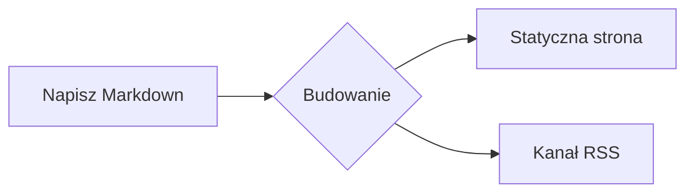

# Współtworzenie dokumentacji

Ta strona opisuje funkcje tworzenia dokumentacji.

Używaj Node.js 24. Uruchom `npm ci`, aby zainstalować zablokowane zależności. Następnie uruchom `npm run dev`. Otwórz lokalny adres z danych wyjściowych polecenia. Katalogi tłumaczeń mają taką samą strukturę jak kanoniczne pliki angielskie.

Uruchom `npm run build` przed zgłoszeniem zmiany. Polecenie generuje miniatury i sprawdza konfigurację VitePress, renderowanie Markdown oraz linki wewnętrzne.

## Bloki z wyróżnieniem

Umieść tekst w kontenerze `:::`, aby utworzyć wyróżnienie z kolorem i ikoną:

```md
::: tip
Przydatna rada.
:::
::: info
Neutralna informacja kontekstowa.
:::
::: warning
Stan, który wymaga uwagi.
:::
::: danger
Stan, który może spowodować szkodę.
:::
```

::: tip
Przydatna rada.
:::

::: info
Neutralna informacja kontekstowa.
:::

::: warning
Stan, który wymaga uwagi.
:::

::: danger
Stan, który może spowodować szkodę.
:::

Napisz tytuł po typie, na przykład `::: tip Konkretny tytuł`:

::: tip Konkretny tytuł
Użyj własnego tytułu, gdy domyślna etykieta nie jest konkretna.
:::

## Bloki kodu

Blok kodu otrzymuje podświetlanie składni, etykietę języka i przycisk kopiowania:

```rust
fn main() {
    println!("Hello, Rapira!");
}
```

Dodaj `{3}` po nazwie języka, aby podświetlić wiersz 3. Dodaj komentarz `// [!code focus]` na końcu wiersza, aby ustawić na nim fokus. Dodaj `// [!code --]` lub `// [!code ++]`, aby oznaczyć wiersz usunięty lub dodany. Budowanie usuwa te znaczniki z wyniku:

```rust{3}
fn main() {
    let answer = 42;
    println!("The answer is {answer}"); // VitePress podświetla ten wiersz.
}
```

```rust
fn main() {
    let ready = true;      // [!code focus]
    println!("{ready}");
}
```

```rust
fn setup() {
    let retries = 1;       // [!code --]
    let retries = 3;       // [!code ++]
}
```

Umieść alternatywne fragmenty w kontenerze `::: code-group`. Napisz etykietę karty w nawiasach kwadratowych po nazwie języka, na przykład `bash [npm]`:

::: code-group

```bash [npm]
npm install
```

```bash [pnpm]
pnpm install
```

```bash [yarn]
yarn
```

:::

## Karty plików

Blok `<CodeTabs>` pokazuje jedną kartę dla każdego pliku. Pod kartami pokazuje wybrany plik. Wypisz karty w bloku `<script setup>` strony. Umieść każdy przykład w `<template>`, który pasuje do `slot` karty.

````md
<script setup>
const appTabs = [
  { name: 'index.php', slot: 'classic' },
  { name: 'worker.php', slot: 'worker' },
  { name: 'rapira.toml', slot: 'config' },
]
</script>

<CodeTabs :tabs="appTabs">

<template #classic>

```php
<?php
require __DIR__ . '/vendor/autoload.php';

echo (new App())->handle($_SERVER['REQUEST_URI']);
```

</template>

<template #worker>

```php
<?php
require __DIR__ . '/vendor/autoload.php';

$app = new App(); // Worker tworzy ten obiekt raz i używa go ponownie.

$handler = static function () use ($app): void {
    echo $app->handle($_SERVER['REQUEST_URI']);
};

while (\Rapira\handle_request($handler)) {
}
```

</template>

<template #config>

```toml
[http.pool]
entrypoint = "worker.php"
mode = "worker"
processes = 4
```

</template>

</CodeTabs>
````

Rozszerzenie nazwy pliku wybiera ikonę karty. Komponent obsługuje `.php`, `.rs`, `.toml`, `.yaml`, `.yml`, `.json`, `.sh` i `.bash`. Inne rozszerzenia używają ogólnej ikony pliku. Aby nadpisać ikonę, ustaw `icon` na `php`, `rust`, `toml`, `yaml`, `json`, `shell` lub `file`.

Blok renderuje się tak:

<script setup>
const appTabs = [
  { name: 'index.php', slot: 'classic' },
  { name: 'worker.php', slot: 'worker' },
  { name: 'rapira.toml', slot: 'config' },
]
</script>

<CodeTabs :tabs="appTabs">

<template #classic>

```php
<?php
require __DIR__ . '/vendor/autoload.php';

echo (new App())->handle($_SERVER['REQUEST_URI']);
```

</template>

<template #worker>

```php
<?php
require __DIR__ . '/vendor/autoload.php';

$app = new App(); // Worker tworzy ten obiekt raz i używa go ponownie.

$handler = static function () use ($app): void {
    echo $app->handle($_SERVER['REQUEST_URI']);
};

while (\Rapira\handle_request($handler)) {
}
```

</template>

<template #config>

```toml
[http.pool]
entrypoint = "worker.php"
mode = "worker"
processes = 4
```

</template>

</CodeTabs>

## Diagramy

Blok kodu `mermaid` renderuje się jako diagram:


```mermaid
flowchart LR
  A[Napisz Markdown] --> B{Budowanie}
  B --> C[Statyczna strona]
  B --> D[Kanał RSS]
```

## Tabele i plakietki

Standardowy Markdown tworzy tabele:

| Funkcja          | W zestawie |
| ---------------- | :--------: |
| Wyróżnienia      |     ✅     |
| Grupy kodu       |     ✅     |
| Mermaid          |     ✅     |

Użyj komponentu `<Badge>`, aby pokazać etykietę statusu, na przykład `<Badge type="tip" text="new" />`. Wartość `type` może być `tip`, `warning`, `danger` lub `info`:

<Badge type="tip" text="nowość" /> <Badge type="warning" text="beta" /> <Badge type="danger" text="wycofane" /> <Badge type="info" text="informacja" />

## Bloki FAQ

Użyj bloku `::: question` dla szczegółu implementacji, którego główna procedura nie potrzebuje. Napisz pytanie po `question`:

```md
::: question Czy mogę uruchomić stronę, jeśli nic nie instaluję globalnie?
Uruchom lokalnie `npm ci`. Następnie uruchom `npm run dev`.
:::
```

Budowanie zbiera pytania w sekcję elementów do rozwinięcia. Ustaw położenie sekcji kluczem frontmatter `faqLevel`:

```yaml
faqLevel: 1       # Po każdej sekcji h1 (domyślnie).
faqLevel: 2       # Po każdej sekcji h2.
faqLevel: 0       # Na końcu strony.
faqLevel: false   # Pytania zostają na swoich miejscach w źródle.
```

Ta strona używa domyślnego poziomu. Dlatego wyrenderowany przykład jest na końcu strony.

::: question Czy mogę uruchomić stronę, jeśli nic nie instaluję globalnie?
Uruchom lokalnie `npm ci`. Następnie uruchom `npm run dev`.
:::

## Frontmatter strony

Ustaw opcje strony w bloku YAML na samej górze pliku:

```yaml
---
title: Własny tytuł        # Zastępuje H1 w <title> i og:title.
description: Krótki opis   # Ustawia meta description i og:description.
outline: [2, 3]            # Ustawia menu „Na tej stronie”. Opcje są niżej.
aside: false               # Ukrywa prawą kolumnę.
lastUpdated: false         # Ukrywa czas „Zaktualizowano” na tej stronie.
editLink: false            # Ukrywa link „Edytuj tę stronę”.
prev: false                # Ukrywa link „Poprzednia” w stopce.
next:                      # Zmienia etykietę lub cel linku w stopce.
  text: Blog
  link: /pl/blog/
---
```

Klucz **outline** steruje spisem treści „Na tej stronie” po prawej:

```yaml
outline: 2        # Domyślnie. Pokazuje tylko H2.
outline: [2, 3]   # Pokazuje H2 i H3.
outline: deep     # Pokazuje każdy poziom od H2 do H6.
outline: false    # Ukrywa menu.
```

Użyj `layout: home` dla strony głównej. Użyj `layout: page` dla strony bez paska bocznego i spisu treści. Inne strony używają domyślnego układu `doc`.
