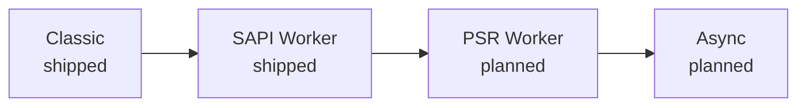

# Tryby wykonania

Każdy serwer PHP musi odpowiedzieć na jedno pytanie: ile z twojej aplikacji przeżywa między dwoma żądaniami? W php-fpm odpowiedź brzmi „nic” — framework startuje od zera za każdym razem, a w nowoczesnej aplikacji ten start bywa najdroższą częścią obsługi żądania. Rapira nie narzuca ci jednej odpowiedzi. Daje drabinę czterech trybów wykonania, a aplikacja wchodzi po niej tak wysoko, jak potrafi.

Nazwy mówią o samym szczeblu — czy worker zostaje przy życiu i jakim kontraktem się posługuje — a nie o produkcie, który spopularyzował dany model. Im wyżej, tym więcej procesu jest już rozgrzane w chwili nadejścia żądania i tym więcej musi znieść twój kod.

## Classic <Badge type="tip" text="dostępne" />

Skrypt wejściowy wykonuje się od zera przy każdym żądaniu, dokładnie tak jak pod php-fpm: zmienne superglobalne zostają wypełnione, front controller startuje, odpowiedź wychodzi, a wszystko po drodze jest sprzątane. Nic nie przechodzi dalej, więc nic nie może wyciec z jednego żądania do następnego.

To szczebel zgodności. Istniejąca aplikacja działa bez zmian — Rapira wchodzi na miejsce php-fpm, a ty nie ruszasz ani linijki kodu. Zysk bierze się z warstwy pod spodem, nie z samej aplikacji: PHP jest osadzony w procesie serwera, więc między frontem HTTP a interpreterem nie ma skoku przez FastCGI.

Jak go uruchomić, opisuje [Tryb klasyczny](/pl/docs/classic).

## SAPI Worker <Badge type="tip" text="dostępne" />

Wygląda to tak samo jak w trybie Classic — nadal czytasz zmienne superglobalne, nadal wypisujesz odpowiedź przez `echo` — z tą różnicą, że worker nie umiera po zakończeniu żądania. Rezydentny skrypt raz podnosi całą aplikację, a potem kręci się w pętli: serwer przy każdym nowym żądaniu na nowo wypełnia `$_GET`, `$_POST`, `$_SERVER`, `$_COOKIE` i resztę, uruchamia twój handler i podaje kolejne żądanie. Autoloader, kontener DI, konfiguracja, połączenia z bazą — wszystko, co powstało poza pętlą, zostaje rozgrzane.

O to właśnie chodzi na tym szczeblu: koszt rozruchu płacisz raz na workera, a nie raz na żądanie. W zamian tracisz amnezję. Wszystko, co aplikacja zostawi w statycznych polach, singletonach czy stanie globalnym, nadal tam będzie przy następnym żądaniu — i właśnie dlatego ten szczebel zależy od twojego kodu, a nie od przełącznika w konfiguracji.

O skrypcie workera i jego pętli przeczytasz w [Trybie workera](/pl/docs/worker), a o obsłudze żądań i odpowiedzi — w [HTTP](/pl/docs/http).

## PSR Worker <Badge type="warning" text="planowane" />

Na tym szczeblu strona PHP przestaje być wywoływana, a zaczyna pytać: worker sam pobiera żądanie z Rapiry wywołaniem API i decyduje, co z nim zrobić. Może wypełnić zmienne superglobalne dla zgodności albo pominąć je zupełnie i pracować na wiadomości PSR-7, którą przekazuje prosto do kernela HTTP frameworka. Po jednym żądaniu naraz, tak samo jak szczebel niżej.

Zyskujesz tyle, że żądanie przestaje być wszechobecnym stanem globalnym i staje się wartością, którą możesz przekazywać dalej, opakowywać albo puścić przez stos middleware — czyli dokładnie tak, jak chcą je dostawać nowoczesne frameworki PHP.

::: info
Ten szczebel to na razie koncepcja, a nie implementacja. Nic z niego jeszcze nie działa, a ani konfiguracja, ani API po stronie PHP nie zostały zaprojektowane — nie ma więc jeszcze żadnych nazw funkcji ani kluczy konfiguracyjnych do pokazania.
:::

## Async <Badge type="warning" text="planowane" />

To samo API co na szczeblu PSR Worker, tyle że worker prosi o więcej niż jedno żądanie naraz i obsługuje je współbieżnie w jednym interpreterze. Umożliwiają to fibery z PHP 8.1: żądanie, które czeka na I/O, oddaje sterowanie, a w tym czasie inne posuwa się do przodu — bez wątków i bez drugiego procesu.

To szczyt drabiny i szczebel, który najmniej wybacza — współbieżność w jednym interpreterze oznacza, że każda biblioteka na drodze żądania musi zachować się poprawnie, gdy zostanie wstrzymana w połowie pracy.

::: info
Ten szczebel również jest na razie koncepcją: nie ma czego instalować ani konfigurować. Potraktuj powyższą sekcję jako opis kierunku, w którym zmierza Rapira, a nie czegoś, co uruchomisz dzisiaj.
:::

## Co decyduje o twoim szczeblu

Na pewno nie serwer. Wszystkie cztery szczeble stoją otworem przed każdą aplikacją; wybór ogranicza wyłącznie jej własny stos.

Stan globalny, który nie przetrwa drugiego żądania, trzyma cię na szczeblu Classic. Biblioteka, która nie radzi sobie z fiberami, nie pozwoli wejść na Async. Framework z gotową integracją runtime'ową daje ci szczebel SAPI Worker niemal za darmo — te z opisaną ścieżką znajdziesz w sekcji [Frameworki](/pl/docs/frameworks/). Za każdym razem to cecha kodu, a nie ograniczenie narzucone przez Rapirę: cała drabina stoi do dyspozycji, a aplikacja sama decyduje, jak wysoko wejdzie.

Wejście wyżej jest zmianą w jedną stronę tylko o tyle, że kosztuje pracę po stronie PHP — szczebel workera wymaga rezydentnego skryptu wejściowego, którego Classic nie potrzebuje. Zejście niżej zawsze jest bezpieczne: włączasz z powrotem tryb Classic — flagą w wierszu poleceń albo jednym kluczem w pliku konfiguracyjnym — kierujesz Rapirę na swój zwykły front controller i jesteś na szczeblu Classic, na tym samym serwerze, tej samej binarce i tym samym [modelu procesów](/pl/docs/process-model).

::: tip
Zacznij od trybu Classic, jeśli zastępujesz php-fpm i najpierw chcesz mieć wszystko działające. Wejdź wyżej, gdy będziesz mieć pewność, że aplikacja startuje czysto i nie trzyma stanu, którego trzymać nie powinna — liczy się pomiar na twojej własnej aplikacji, a nie benchmark.
:::

::: question Którego trybu Rapira używa domyślnie?
Szczebla workera. Tryb Classic trzeba włączyć samodzielnie — flagą w wierszu poleceń albo jednym kluczem w pliku konfiguracyjnym; zobacz [Konfigurację](/pl/docs/configuration) i [opis wiersza poleceń](/pl/docs/cli).
:::

::: question Moja aplikacja wycieka pamięcią w trybie workera. To błąd Rapiry?
Zwykle to aplikacja albo któraś z jej zależności trzyma dane z pojedynczych żądań. To realne ograniczenie tego szczebla, a nie defekt — a Rapira potrafi wymienić workera po zadanej liczbie żądań, żeby powolny wyciek nigdy nie zamienił się w awarię, zanim znajdziesz przyczynę. Zobacz [Konfigurację](/pl/docs/configuration).
:::

::: question Czy mogę część tras obsługiwać w trybie Classic, a resztę w workerze?
Nie — szczebel wybiera się dla całej instancji serwera, a nie dla pojedynczej trasy. Jeśli jakaś część aplikacji nie nadaje się do pracy w workerze, uruchom ją za osobną instancją Rapiry na szczeblu Classic.
:::

::: question Kiedy pojawią się PSR Worker i Async?
Nie ma daty. Opisujemy je tutaj, żeby kierunek był jasny, ale żaden z nich nie jest zaprojektowany na tyle, żeby dało się go udokumentować — kiedy to się zmieni, zmieni się razem z tym ta strona i [spis dokumentacji](/pl/docs/).
:::
