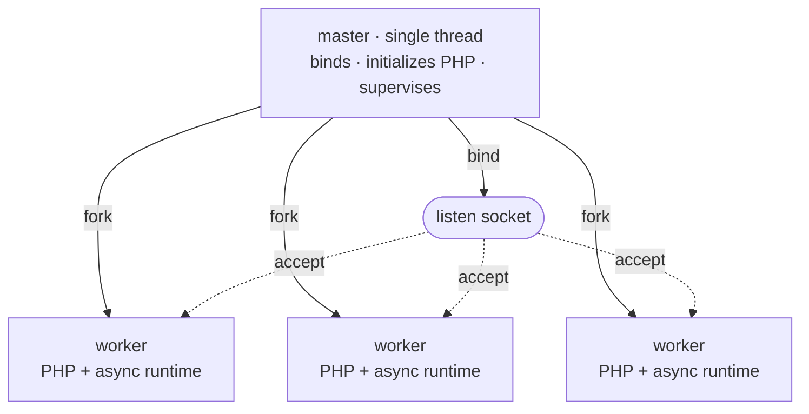

# Model procesów

Rapira działa jako jeden proces nadrzędny i pula workerów. Proces nadrzędny trzyma wszystko, co może istnieć tylko w jednym egzemplarzu - nasłuchujące gniazdo, obraz silnika PHP, pidfile - a potem forkuje; żądaniami zajmują się workery. Żadne żądanie nie wędruje z procesu do procesu: workery *są* kopiami procesu nadrzędnego, sforkowanymi już po podniesieniu PHP, i każdy z nich zdejmuje swoje połączenia prosto z gniazda.

Ten układ wygląda tak samo w trybie [Classic](/pl/docs/classic), [Worker](/pl/docs/worker) i Dispatcher. Tryb wykonania, ustawiany kluczem `pool.mode`, decyduje o tym, co dzieje się wewnątrz workera przy każdym żądaniu. Nie zmienia natomiast tego, jak pula powstaje, jak jest nadzorowana i jak się ją przeładowuje. Więcej informacji znajdziesz w [Trybach wykonania](/pl/docs/execution-modes).

## Proces nadrzędny i workery

Rozruch przebiega w ustalonej kolejności:

1. **Związanie gniazd nasłuchujących.** Proces nadrzędny robi to przed czymkolwiek innym, więc zajęty port przerywa rozruch natychmiast - jeszcze zanim wystartuje PHP.
2. **Jednorazowy start PHP.** Silnik przechodzi przez `MINIT` w procesie nadrzędnym, wciąż jednowątkowym. To tutaj powstaje pamięć współdzielona OPcache, więc każdy worker sforkowany później dziedziczy ten sam segment SHM: pierwszy worker, który skompiluje plik, wypełnia cache dla wszystkich, zamiast żeby każdy proces kompilował własną kopię.
3. **Forkowanie workerów.** Każdy potomek dziedziczy związane gniazdo i zainicjalizowany silnik.



Każdy worker to jeden interpreter PHP w wersji NTS za własnym asynchronicznym stosem HTTP. Ten stos to hyper na prywatnym runtimie tokio z dwoma wątkami. Worker przyjmuje połączenia na odziedziczonym gnieździe. Żaden proces nie rozdziela połączeń między workery: wszystkie czekają w `accept()` na tym samym gnieździe, a jądro systemu oddaje każde przychodzące połączenie dokładnie jednemu z nich.

Proces nadrzędny nigdy nie obsługuje żądania. Nie ma nawet stosu HTTP - to jeden wątek zablokowany w `poll(2)` na self-pipe, czekający na sygnały, śmierć potomków, własne timery, a w trybie `ondemand` także na gotowość gniazda nasłuchującego. Proces, który musi przeżyć, żeby zrestartować całą resztę, robi możliwie najmniej.

::: info
Proces nadrzędny trzyma też moduł PHP przez całe swoje życie i jako jedyny go zamyka. Worker kończy się, nie zwijając niczego po sobie, więc ten, który padnie albo pójdzie na recykling, nigdy nie ruszy obrazu silnika używanego wciąż przez pozostałe workery.
:::

## Nadzór

Po uruchomieniu puli proces nadrzędny wykonuje obsługę mniej więcej raz na sekundę. Obsługuje też zakończenia workerów w chwili ich wystąpienia.

- **Zastępowanie workerów.** Proces nadrzędny natychmiast zastępuje workera po normalnym zakończeniu.
- W trybie `ondemand` czeka z utworzeniem następcy do kolejnego połączenia.
- Po awarii opóźnienie zaczyna się od 100 ms. Podwaja się po każdej kolejnej awarii i przestaje rosnąć przy około 25 sekundach.
- Dziesięć sekund działania workera zeruje opóźnienie.
- **Awarie inicjalizacji.** Proces nadrzędny kończy pracę, jeśli wszystkie początkowe workery ulegną awarii przed obsłużeniem żądania.
- Po pierwszym żądaniu proces nadrzędny używa zwykłego opóźnienia. Błąd inicjalizacji workera podczas przeładowania nie powoduje zakończenia procesu nadrzędnego.
- **Limity żądań.** Z `pool.max_requests` worker kończy pracę po osiągnięciu limitu. Proces nadrzędny go zastępuje.
- Rapira dodaje losową wartość do połowy limitu. Zapobiega to jednoczesnej wymianie workerów.
- **Limit czasu żądania.** Z `pool.request_terminate_timeout_secs` proces nadrzędny wysyła `SIGTERM`, gdy żądanie przekroczy limit.
- Wysyła `SIGKILL` cykl później, jeśli worker nadal działa. Zamyka oczekujące połączenia i tworzy następcę.
- Proces nadrzędny nie stosuje tego limitu podczas zatrzymywania lub przeładowania.
- **Skalowanie.** W trybie `dynamic` obsługa może tworzyć workery albo usuwać bezczynne workery.
- W trybie `ondemand` usuwa workery po okresie bezczynności. Nowe połączenie powoduje utworzenie workera.
- **Monitorowanie procesu nadrzędnego.** Każdy worker czyta z potoku, który proces nadrzędny utrzymuje otwarty.
- Gdy proces nadrzędny kończy pracę, potok zwraca EOF i workery przestają przyjmować pracę. Awaria nie pozostawia workerów bez nadzoru.

## Skalowanie puli

`pool.scaling` określa sposób zmiany rozmiaru puli. Jest niezależny od `pool.mode`. Klucz `pool.mode` ustawia tryb wykonania w workerze. Przy `static` wartość `pool.processes` jest dokładną liczbą. Przy `dynamic` i `ondemand` jest liczbą maksymalną. Domyślna wartość to jeden worker na logiczny procesor.

| Skalowanie | Ile workerów | Klucze, które działają |
| --- | --- | --- |
| `static` (domyślny) | Dokładnie `pool.processes` - forkowane przy starcie i utrzymywane w tej liczbie. | `processes` |
| `dynamic` | Tyle, ile wymaga ruch, maksymalnie `pool.processes`; proces nadrzędny trzyma liczbę *bezczynnych* w wyznaczonym paśmie. | `min_spare`, `max_spare` |
| `ondemand` | Zero przy starcie; forkowane wraz z napływem ruchu, maksymalnie `pool.processes`. | `process_idle_timeout_secs` |

**`static`** jest odpowiedni dla większości wdrożeń. Używa stałej liczby workerów i zastępuje zakończone workery. PHP działa synchronicznie, więc każdy worker obsługuje jedno żądanie naraz. Aplikacje wykonujące dużo operacji wejścia i wyjścia mogą wymagać większej liczby workerów. Aplikacje ograniczone przez procesor zwykle jej nie wymagają.

**`dynamic`** utrzymuje liczbę bezczynnych workerów między dwoma limitami. Tworzy workery, gdy liczba jest mniejsza niż `min_spare`. Liczba nowych workerów podwaja się w kolejnych cyklach z niewystarczającą wydajnością. Powyżej `max_spare` usuwa najstarszy bezczynny worker. Liczba początkowa jest środkiem między limitami. Rapira zapisuje jedno ostrzeżenie, gdy zapotrzebowanie przekracza `pool.processes`.

```toml
[pool]
scaling = "dynamic"
processes = 8
min_spare = 1
max_spare = 3
```

Granice muszą spełniać `1 <= min_spare <= max_spare <= processes`. W polityce `dynamic` są wymagane, a w pozostałych odrzucane. Ustawienie ich gdzie indziej to błąd konfiguracji, a nie po cichu zignorowany klucz.

**`ondemand`** nie tworzy workerów przy uruchomieniu. Proces nadrzędny obserwuje gniazdo nasłuchujące. Gdy połączenie przychodzi bez bezczynnego workera, proces nadrzędny tworzy worker. Worker kończy pracę po `pool.process_idle_timeout_secs` bezczynności. Pierwsze żądanie do pustej puli czeka na utworzenie workera. Użyj `ondemand` dla środowisk testowych i stron z małym ruchem. Użyj innej polityki dla stałego ruchu.

Pełny wykaz kluczy znajdziesz w [Konfiguracji](/pl/docs/configuration).

## Sygnały

Sygnały zatrzymują działający serwer, przeładowują go i każą mu zgłosić swój stan. Wszystkie trafiają do **procesu nadrzędnego**.

| Sygnał | Co robi proces nadrzędny |
| --- | --- |
| `SIGTERM`, `SIGINT` | Łagodne zatrzymanie: żądania w toku zostają dokończone, potem pula się wygasza. Drugi `SIGTERM` albo `SIGINT` wymusza wyjście. |
| `SIGQUIT` | To samo łagodne zatrzymanie. Powtórzenie nic nie zmienia - kolejny `SIGQUIT` nigdy nie eskaluje zatrzymania, o które poproszono łagodnie. |
| `SIGUSR2`, `SIGHUP` | Przeładowanie kroczące: pula wymienia się po jednym workerze. Stary worker przestaje przyjmować pracę i kończy bieżące żądania. |
| `SIGUSR1` | Zrzuca stan puli do logu. |
| `SIGCHLD` | Wewnętrzny - worker się zakończył; sprząta po nim i decyduje, czy podstawić następcę. |

Ustaw `supervisor.pidfile`, a twoje skrypty będą miały stałe miejsce, z którego odczytają pid procesu nadrzędnego:

```bash
kill -USR2 $(cat /run/rapira.pid)   # Replace workers one at a time.
kill -USR1 $(cat /run/rapira.pid)   # Write pool status to the log.
kill -TERM $(cat /run/rapira.pid)   # Stop after current requests finish.
```

::: warning
Wysyłaj sygnały tylko do procesu nadrzędnego. Workery ignorują `SIGUSR1` i `SIGUSR2`. Workery traktują `SIGTERM` jako natychmiastowe zakończenie. Limit czasu żądania używa tego sygnału. Bezpośredni sygnał do workera omija nadzór procesu nadrzędnego.
:::

### Zatrzymywanie

Dla każdego sygnału zatrzymania proces nadrzędny natychmiast wysyła `SIGQUIT` do wszystkich workerów. Workery przestają przyjmować pracę i kończą bieżące żądania. Po `supervisor.process_control_timeout_secs` proces nadrzędny wysyła `SIGTERM` do pozostałych workerów. Wartość domyślna wynosi 30 sekund. Jeśli pozostały workery, proces nadrzędny wysyła `SIGKILL` sekundę po `SIGTERM`.

Drugi `SIGTERM` albo `SIGINT` pomija czekanie i wymusza natychmiastowe wyjście.

### Wymiana workera pozwala dokończyć bieżące żądania

`SIGUSR2` lub `SIGHUP` wymienia całą pulę. Każdy nowy worker inicjalizuje aplikację z wdrożonego kodu.

W trybie Classic skrypt wejściowy wykonuje się w nowym żądaniu PHP. Nowy kod działa bez przeładowania. Jednak `opcache.validate_timestamps = 0` wymaga pełnego restartu. Worker i Dispatcher zachowują zainicjalizowaną aplikację. Przeładuj pulę po każdym wdrożeniu w tych trybach. Zobacz [Wdrożenie](/pl/docs/deployment).

Proces nadrzędny uruchamia nowego workera i czeka, aż zgłosi on stan `idle` lub `active`. Następnie zatrzymuje jednego starego workera. Po jego zakończeniu uruchamia nowego workera w następnym miejscu. Każde zatrzymanie używa sekwencji `SIGQUIT` → `SIGTERM` → `SIGKILL`. Ten sam limit sterowania dotyczy każdego workera. Stary worker zamyka bezczynne połączenia keep-alive po otrzymaniu `SIGQUIT`. Bieżące żądania mogą zakończyć się przed upływem limitu sterowania.

Jeśli nowy worker nie zgłosi żadnego z tych stanów przed upływem limitu sterowania, proces nadrzędny zapisuje ostrzeżenie. Następnie proces nadrzędny zatrzymuje kolejnego starego workera, nawet jeśli nowy worker nie obsługuje jeszcze żądań. W trybie `ondemand` usuwa stare workery pojedynczo. Nowe połączenia tworzą zastępstwa.

Przeładowanie zgłoszone w trakcie zatrzymywania jest ignorowane: zatrzymanie ma zawsze pierwszeństwo.

::: info
Przeładowanie wymienia workery, a nie proces nadrzędny. Nowe workery używają tego samego obrazu silnika. Zmiany `rapira.toml`, `php.ini` i pliku binarnego wymagają pełnego restartu.
:::

### Zrzut stanu

Na `SIGUSR1` proces nadrzędny zapisuje do logu migawkę puli - linię podsumowania z liczbą działających i bezczynnych workerów oraz numerem bieżącego pokolenia, a potem po jednej linii na slot: pid, stan i liczniki `handled`, `errors` i `recycles`.

::: tip
Zrzut trafia na poziom `info` do targetu `master`, a domyślny poziom logowania to `error` - więc przy fabrycznej konfiguracji `kill -USR1` wygląda, jakby nie zrobił zupełnie nic. Podnieś ten jeden target, a zrzut się pojawi:

```toml
[log.targets]
master = "info"
```

Tym samym targetem idą wszystkie zdarzenia nadzoru: forki, sprzątanie po potomkach, odtworzenia, przeładowania i skalowanie puli. Resztę opisuje [Logowanie](/pl/docs/logging).
:::
