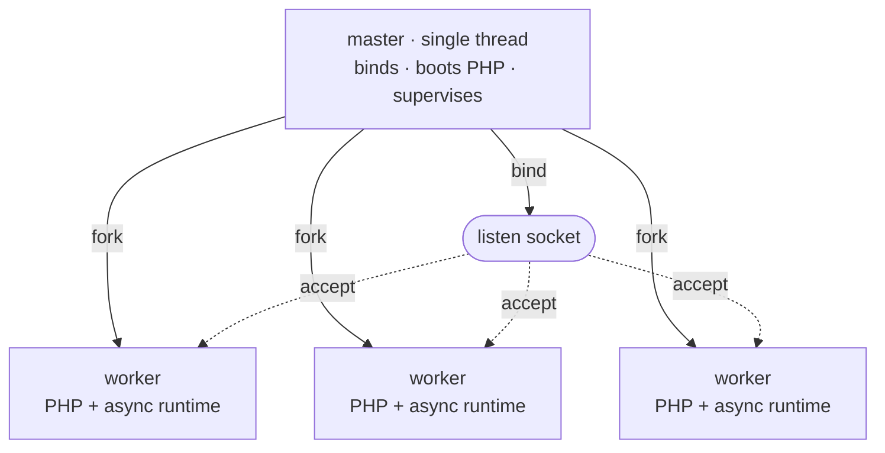

# Model procesów

Rapira działa jako jeden proces nadrzędny i pula workerów. Proces nadrzędny trzyma wszystko, co może istnieć tylko w jednym egzemplarzu — nasłuchujące gniazdo, obraz silnika PHP, pidfile — a potem forkuje; żądaniami zajmują się workery. Żadne żądanie nie wędruje z procesu do procesu: workery *są* kopiami procesu nadrzędnego, sforkowanymi już po podniesieniu PHP, i każdy z nich zdejmuje swoje połączenia prosto z gniazda.

Ten układ wygląda tak samo w trybie [Classic](/pl/docs/classic) i w trybie [SAPI Worker](/pl/docs/worker). [Tryb wykonania](/pl/docs/execution-modes) decyduje o tym, co dzieje się wewnątrz workera przy każdym żądaniu; nie zmienia natomiast tego, jak pula powstaje, jak jest nadzorowana i jak się ją przeładowuje.

## Proces nadrzędny i workery

Rozruch przebiega w ustalonej kolejności:

1. **Związanie gniazd nasłuchujących.** Proces nadrzędny robi to przed czymkolwiek innym, więc zajęty port przerywa rozruch natychmiast — jeszcze zanim wystartuje PHP.
2. **Jednorazowy start PHP.** Silnik przechodzi przez `MINIT` w procesie nadrzędnym, wciąż jednowątkowym. To tutaj powstaje pamięć współdzielona OPcache, więc każdy worker sforkowany później dziedziczy ten sam segment SHM: pierwszy worker, który skompiluje plik, wypełnia cache dla wszystkich, zamiast żeby każdy proces kompilował własną kopię.
3. **Forkowanie workerów.** Każdy potomek dziedziczy związane gniazdo i zainicjalizowany silnik.



Każdy worker to jeden interpreter PHP w wersji NTS z własnym asynchronicznym runtime'em HTTP, przyjmujący połączenia na odziedziczonym gnieździe. Przed pulą nie stoi żaden dyspozytor: wszystkie workery czekają w `accept()` na tym samym gnieździe, a jądro systemu oddaje każde przychodzące połączenie dokładnie jednemu z nich.

Proces nadrzędny nigdy nie obsługuje żądania. Nie ma nawet stosu HTTP — to jeden wątek zablokowany w `poll(2)` na self-pipe, czekający na sygnały, śmierć potomków, własne timery, a w trybie `ondemand` także na gotowość gniazda nasłuchującego. Proces, który musi przeżyć, żeby zrestartować całą resztę, robi możliwie najmniej.

::: info
Proces nadrzędny trzyma też moduł PHP przez całe swoje życie i jako jedyny go zamyka. Worker kończy się, nie zwijając niczego po sobie, więc ten, który padnie albo pójdzie na recykling, nigdy nie ruszy obrazu silnika używanego wciąż przez pozostałe workery.
:::

## Nadzór

Gdy pula już stoi, proces nadrzędny mniej więcej raz na sekundę wykonuje cykl porządkowy, a na śmierć potomka reaguje od razu, gdy ta nastąpi.

- **Sprzątanie i odtwarzanie.** Worker zakończony czysto (wygaszony albo wymieniony po wyczerpaniu limitu) dostaje następcę natychmiast (w trybie `ondemand` slot po prostu zostaje wolny i wypełni go kolejne połączenie). Worker, który *padł*, wraca dopiero po odczekaniu: zaczyna się od 100 ms i podwaja z każdą kolejną szybką awarią, aż do jakichś 25 sekund — więc pętla segfaultów sama się dławi, zamiast palić procesor. Dziesięć sekund przy życiu wystarczy, żeby wyzerować tę serię.
- **Awarie rozruchu.** Jeśli worker z pierwszego pokolenia zgłosi się jako niesprawny, zanim pula obsłużyła choć jedno udane żądanie, proces nadrzędny uznaje to za nieodwracalną awarię rozruchu i kończy pracę, zamiast w kółko odtwarzać zepsuty skrypt wejściowy. Gdy pula ma już coś obsłużone, dokładnie to samo wyjście jest tylko odtworzeniem z odczekaniem — nieudane przeładowanie nigdy nie położy zdrowej puli.
- **Recykling.** Przy ustawionym `pool.max_requests` worker kończy pracę po tylu żądaniach i od razu dostaje następcę. Każdy dostaje przy tym własną losową nadwyżkę ponad limit (do połowy limitu), więc pula wystartowana naraz nie wymienia się równym krokiem — inaczej przez moment nie byłoby ani jednego rozgrzanego workera.
- **Nadzór nad pojedynczym żądaniem.** Przy ustawionym `pool.request_terminate_timeout_secs` worker, który po przekroczeniu tego limitu czasu rzeczywistego wciąż tkwi w tym samym żądaniu, dostaje `SIGTERM`, a jeśli cykl później nadal żyje — `SIGKILL`. Wymuszone zakończenie trafia do logu na poziomie `warn`, zakolejkowane połączenia zostają zamknięte, a slot natychmiast dostaje nowego workera. Na czas zatrzymywania albo przeładowania ten nadzór jest zawieszony.
- **Skalowanie.** W trybie `dynamic` ten sam cykl decyduje, czy sforkować kolejne workery, czy wycofać bezczynne; w trybie `ondemand` wycofuje tylko te, które przekroczyły swój limit bezczynności — fork wyzwala tam dopiero przychodzące połączenie. Szczegóły niżej.
- **Potok w drugą stronę.** Każdy worker trzyma koniec odczytu potoku, do którego proces nadrzędny nigdy nic nie pisze. Gdy nadrzędny umrze, potok dostaje EOF i każdy worker sam się wygasza — `kill -9` na procesie nadrzędnym nie zostawi więc osieroconych workerów trzymających port.

## Tryby puli

`pool.mode` decyduje o tym, jak pula dobiera swój rozmiar. W każdym trybie liczy się `pool.processes` — dla `static` to dokładna liczba procesów, dla pozostałych dwóch sufit — a domyślnie przypada jeden worker na logiczny rdzeń CPU.

| Tryb | Ile workerów | Klucze, które działają |
| --- | --- | --- |
| `static` (domyślny) | Dokładnie `pool.processes` — forkowane przy starcie i utrzymywane w tej liczbie. | `processes` |
| `dynamic` | Tyle, ile wymaga ruch, maksymalnie `pool.processes`; proces nadrzędny trzyma liczbę *bezczynnych* w wyznaczonym paśmie. | `min_spare`, `max_spare` |
| `ondemand` | Zero przy starcie; forkowane wraz z napływem ruchu, maksymalnie `pool.processes`. | `process_idle_timeout_secs` |

**`static`** sprawdza się w większości wdrożeń: zużycie pamięci jest płaskie, a worker, który padnie, po prostu dostaje następcę. PHP działa synchronicznie, więc worker obsługuje jedno żądanie naraz: tam, gdzie żądania spędzają większość czasu na czekaniu na bazę albo zewnętrzne API, workerów zwykle przyda się więcej niż rdzeni; tam, gdzie całą robotę wykonuje procesor — rzadko kiedy.

**`dynamic`** trzyma liczbę *bezczynnych* workerów w zadanym paśmie. W każdym cyklu: mniej bezczynnych niż `min_spare` oznacza fork kolejnych (partiami, które podwajają się, dopóki utrzymuje się presja, więc skok ruchu zostaje odbity od razu, a nie po jednym workerze na sekundę); więcej bezczynnych niż `max_spare` oznacza wycofanie najstarszego z nich. Start następuje od środka pasma, a gdy pula dobije do sufitu `pool.processes` i wciąż będzie chciała więcej, w logu pojawi się jednorazowe ostrzeżenie.

```toml
[pool]
mode = "dynamic"
processes = 8
min_spare = 1
max_spare = 3
```

Granice muszą spełniać `1 <= min_spare <= max_spare <= processes`. W trybie `dynamic` są wymagane, a w pozostałych odrzucane — ustawienie ich gdzie indziej to błąd konfiguracji, a nie po cichu zignorowany klucz.

**`ondemand`** nie forkuje przy starcie niczego. Tutaj proces nadrzędny sam pilnuje gniazda nasłuchującego: gdy przychodzi połączenie, a nie ma bezczynnego workera, który by je wziął, forkuje jednego i pozwala potomkowi je przyjąć. Worker bezczynny dłużej niż `pool.process_idle_timeout_secs` znowu zostaje wycofany. Bezczynna pula nic wtedy nie zużywa, ale pierwsze żądanie po przerwie w ruchu czeka na fork — `ondemand` wybieraj dla środowisk stagingowych i rzadko odwiedzanych stron, a przy stałym ruchu jeden z pozostałych trybów.

Pełny wykaz kluczy znajdziesz w [Konfiguracji](/pl/docs/configuration).

## Sygnały

Sygnały zatrzymują działający serwer, przeładowują go i każą mu zgłosić swój stan. Wszystkie trafiają do **procesu nadrzędnego**.

| Sygnał | Co robi proces nadrzędny |
| --- | --- |
| `SIGTERM`, `SIGINT` | Łagodne zatrzymanie: żądania w toku zostają dokończone, potem pula się wygasza. Drugi `SIGTERM` albo `SIGINT` wymusza wyjście. |
| `SIGQUIT` | To samo łagodne zatrzymanie. Powtórzenie nic nie zmienia — kolejny `SIGQUIT` nigdy nie eskaluje zatrzymania, o które poproszono łagodnie. |
| `SIGUSR2`, `SIGHUP` | Przeładowanie kroczące: pula wymienia się po jednym workerze, bez zrywania połączeń. |
| `SIGUSR1` | Zrzuca stan puli do logu. |
| `SIGCHLD` | Wewnętrzny — worker się zakończył; sprząta po nim i decyduje, czy podstawić następcę. |

Ustaw `supervisor.pidfile`, a twoje skrypty będą miały stałe miejsce, z którego odczytają pid procesu nadrzędnego:

```bash
kill -USR2 $(cat /run/rapira.pid)   # rolling reload
kill -USR1 $(cat /run/rapira.pid)   # status dump
kill -TERM $(cat /run/rapira.pid)   # graceful stop
```

::: warning
Sygnały wysyłaj do procesu nadrzędnego, nigdy do pojedynczego workera. Workery `SIGUSR1` i `SIGUSR2` po prostu ignorują, a `SIGTERM` traktują jak natychmiastowe ubicie — właśnie tym posługuje się nadzór nad żądaniem, gdy żądanie ma zginąć *już teraz*. Wysłanie sygnału wprost do workera omija nadzór opisany na tej stronie.
:::

### Zatrzymywanie

Każde zatrzymanie zaczyna się łagodnie, którykolwiek z trzech sygnałów by o nie poprosił: proces nadrzędny wysyła do każdego workera `SIGQUIT`, a ten przestaje przyjmować nową pracę i kończy to, co trzyma. Dalszą eskalacją steruje zegar — `supervisor.process_control_timeout_secs` (domyślnie 30 sekund) to okres karencji, po którym pozostałe workery dostają `SIGTERM`, a jeśli i to nie poskutkuje — `SIGKILL`. Worker, który nie odpowiada na łagodny `SIGQUIT`, dostaje TERM, a potem KILL; nikt nie będzie na niego czekał w nieskończoność.

Drugi `SIGTERM` albo `SIGINT` pomija czekanie i wymusza natychmiastowe wyjście.

### Przeładowanie kroczące

`SIGUSR2` (albo `SIGHUP`) wymienia całą pulę na świeże workery — i właśnie tak aplikacja podniesiona w rezydentnym workerze zostaje odrzucona i powstaje na nowo z wdrożonego kodu.

W trybie Classic skrypt wejściowy wykonuje się od zera przy każdym żądaniu, więc nie ma tam nic rezydentnego do wymiany i nowy kod działa bez przeładowania — chyba że ustawiłeś `opcache.validate_timestamps = 0`: wtedy segment OPcache należący do procesu nadrzędnego podaje stare opcode'y aż do pełnego restartu. W trybie SAPI Worker aplikacja podnosi się raz i zostaje w pamięci, więc wdrożony kod zaczyna działać dopiero po przeładowaniu kroczącym — zrób z tego krok wdrożenia. Więcej informacji znajdziesz na stronie [Wdrożenie](/pl/docs/deployment).

Przeładowanie w żadnym momencie nie zbija twojej mocy obsługującej żądania, bo nowe workery zachodzą na stare, zamiast je restartować: proces nadrzędny podnosi jednego świeżego workera, czeka, aż ten faktycznie zacznie przyjmować połączenia, i dopiero wtedy wygasza jednego starego. Gdy stary zniknie, jego slot dostaje kolejnego świeżego i tak dalej, przez całe pokolenie. Każde wygaszanie to ta sama sekwencja `SIGQUIT` → `SIGTERM` → `SIGKILL` co przy zatrzymaniu, ograniczona tym samym limitem czasu i zastosowana do tego jednego workera.

Następca, który nigdy nie zacznie obsługiwać żądań, też nie zablokuje przeładowania: po upływie limitu proces nadrzędny zapisuje ostrzeżenie i tak czy owak przechodzi do kolejnego workera. W trybie `ondemand` nikt następcy z góry nie forkuje — stare workery wygaszane są po kolei, a nowe forkuje dopiero ruch.

Przeładowanie zgłoszone w trakcie zatrzymywania jest ignorowane: zatrzymanie ma zawsze pierwszeństwo.

::: info
Przeładowanie wymienia workery, a nie proces nadrzędny. Nowe workery forkuje ten sam proces nadrzędny i dostają ten sam obraz silnika, który podniósł przy starcie — dlatego `rapira.toml`, `php.ini` i sama binarka zmieniają się dopiero przy pełnym restarcie.
:::

### Zrzut stanu

Na `SIGUSR1` proces nadrzędny zapisuje do logu migawkę puli — linię podsumowania z liczbą działających i bezczynnych workerów oraz numerem bieżącego pokolenia, a potem po jednej linii na slot: pid, stan i liczniki `handled`, `errors` i `recycles`.

::: tip
Zrzut trafia na poziom `info` do targetu `master`, a domyślny poziom logowania to `error` — więc przy fabrycznej konfiguracji `kill -USR1` wygląda, jakby nie zrobił zupełnie nic. Podnieś ten jeden target, a zrzut się pojawi:

```toml
[log.targets]
master = "info"
```

Tym samym targetem idą wszystkie zdarzenia nadzoru: forki, sprzątanie po potomkach, odtworzenia, przeładowania i skalowanie puli. Resztę opisuje [Logowanie](/pl/docs/logging).
:::
