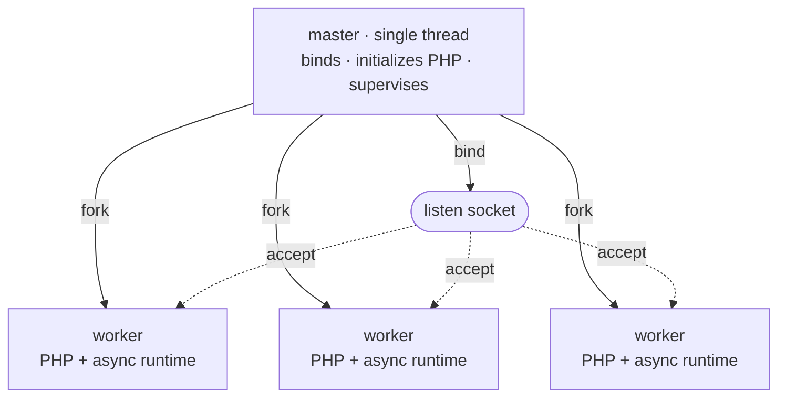

# Model procesów

Rapira uruchamia jeden proces nadrzędny i pulę workerów dla każdego włączonego protokołu. Proces nadrzędny zarządza gniazdami nasłuchującymi, zainicjalizowanym silnikiem PHP i plikiem pidfile. Następnie proces nadrzędny tworzy procesy workerów. Każdy worker dziedziczy PHP i przyjmuje połączenia ze wspólnego gniazda swojej puli. Rapira nie przekazuje żądań między procesami.

HTTP i [gRPC](./grpc) mają osobne nasłuchy, skrypty wejściowe i pule. `[http.pool]` i `[grpc.pool]` konfigurują je niezależnie. Pula gRPC używa trybu Dispatcher i obsługuje jedno aktywne wywołanie na workera.

Gdy konfiguracja zawiera tabelę `[observability]`, proces nadrzędny uruchamia też jeden proces dla metryk i kontroli stanu. Ten proces nie wykonuje kodu PHP. W systemie Linux jego nazwa procesu to `rapira-obs`, a workery PHP mają nazwę `rapira-worker`. Proces nadrzędny nadzoruje, przeładowuje i zatrzymuje ten proces razem z workerami PHP. Więcej informacji znajdziesz w [Metrykach i kontrolach stanu](/pl/docs/observability).

Ten model procesów jest taki sam w trybach [Classic](/pl/docs/classic), [Worker](/pl/docs/worker) i [Dispatcher](/pl/docs/dispatcher). `http.pool.mode` steruje przetwarzaniem żądań wewnątrz workera. To ustawienie nie zmienia tworzenia puli, nadzoru ani przeładowań. Więcej informacji znajdziesz w [Trybach wykonania](/pl/docs/execution-modes).

## Proces nadrzędny i workery

Inicjalizacja przebiega w tej kolejności:

1. **Związanie gniazda lub gniazd nasłuchujących.** Zajęty port zatrzymuje inicjalizację, zanim wystartuje PHP.
2. **Jednorazowy start PHP.** Proces nadrzędny wykonuje `MINIT` w swoim jedynym wątku. W tym momencie OPcache tworzy swoją pamięć współdzieloną, a każdy worker ją dziedziczy. Gdy jeden worker skompiluje plik, pozostałe workery używają wyniku z cache.
3. **Forkowanie workerów.** Każdy potomek dziedziczy związane gniazdo i zainicjalizowany silnik.


```mermaid
flowchart TB
  M["master · single thread<br/>binds · initializes PHP · supervises"]
  S(["listen socket"])
  W1["worker<br/>PHP + async runtime"]
  W2["worker<br/>PHP + async runtime"]
  W3["worker<br/>PHP + async runtime"]
  M -- bind --> S
  M -- fork --> W1
  M -- fork --> W2
  M -- fork --> W3
  S -. accept .-> W1
  S -. accept .-> W2
  S -. accept .-> W3
```

Diagram pokazuje jedną pulę. Każdy worker uruchamia jeden interpreter PHP w wersji NTS i asynchroniczny serwer HTTP lub gRPC. Serwer używa hyper na prywatnym runtimie tokio z dwoma wątkami. Każdy worker wywołuje `accept()` na odziedziczonym gnieździe. System operacyjny przydziela każde nowe połączenie jednemu workerowi.

Proces nadrzędny nie obsługuje żądań. Jego jedyny wątek czeka na sygnały, zakończenia workerów i timery.

::: info
Proces nadrzędny trzyma moduł PHP przez cały czas swojego działania. Tylko proces nadrzędny zamyka ten moduł. Worker kończy działanie, ale nie zamyka tego wspólnego stanu silnika.
:::

## Nadzór

Proces nadrzędny wykonuje obsługę raz na sekundę. Obsługuje też każde zakończenie workera w chwili jego wystąpienia.

- **Zastępowanie workerów.** Po normalnym zakończeniu proces nadrzędny natychmiast zastępuje workera. Po awarii lub zakończeniu w stanie niezdrowym opóźnienie zastąpienia zaczyna się od 100 ms. Opóźnienie podwaja się po każdej kolejnej awarii i przestaje rosnąć przy 25,6 sekundy. Worker, który działa co najmniej 10 sekund, zeruje opóźnienie.
- **Nieudane rozruchy.** W trybach Worker i Dispatcher rozruch jest nieudany, gdy skrypt wejściowy kończy się przed otrzymaniem żądania. Worker czeka wtedy do 5 sekund i ponownie uruchamia skrypt wejściowy. Na żądanie, które przyjdzie w tym czasie, odpowiada kodem HTTP `503` lub gRPC `UNAVAILABLE`. Po pięciu kolejnych nieudanych rozruchach worker kończy działanie jako niezdrowy.
- **Zatrzymanie procesu nadrzędnego po nieudanym rozruchu.** Proces nadrzędny zatrzymuje się z kodem wyjścia 70, gdy niezdrowy worker generacji zero zakończy działanie. Ta reguła dotyczy tylko puli bez udanego żądania i bez bezczynnego lub aktywnego workera. Generacja zero oznacza workery utworzone przed pierwszym przeładowaniem. W pozostałych przypadkach proces nadrzędny zastępuje workera po opóźnieniu zastąpienia. Awaria workera nigdy nie zatrzymuje procesu nadrzędnego.
- **Limity żądań.** Z `http.pool.max_requests` worker kończy działanie po losowej liczbie żądań od `max_requests + 1` do około `1.5 × max_requests`. Proces nadrzędny natychmiast go zastępuje. Losowy zakres zapobiega jednoczesnemu zastępowaniu workerów.
- **Limit czasu żądania.** Z `http.pool.request_terminate_timeout_secs` proces nadrzędny wysyła `SIGTERM` do workera, gdy jego bieżące żądanie przekroczy limit. Jeśli worker jest nadal aktywny przy następnej obsłudze, proces nadrzędny wysyła `SIGKILL`. Następnie proces nadrzędny natychmiast zastępuje workera. Proces nadrzędny stosuje ten limit podczas przeładowania, ale nie podczas zatrzymywania.
- **Monitorowanie procesu nadrzędnego.** Każdy worker czyta z potoku, który proces nadrzędny utrzymuje otwarty. Gdy proces nadrzędny kończy działanie, każdy worker przestaje przyjmować nową pracę, kończy bieżące żądania i kończy działanie.

## Rozmiar puli

Poniższe ustawienia używają `[http.pool]`. Te same ustawienia dotyczą `[grpc.pool]`.

`http.pool.processes` ustawia liczbę workerów. Proces nadrzędny tworzy te workery podczas inicjalizacji i zastępuje każdy worker, który zakończy działanie. Domyślna wartość to jeden worker na każdy procesor, którego proces może używać. Jeśli kontener ma limit procesora, wartość domyślna uwzględnia ten limit.

Łączna liczba workerów we wszystkich pulach musi wynosić 2048 lub mniej. Gdy obserwowalność jest włączona, jej proces liczy się jako jeden worker. Większa suma zatrzymuje Rapira z kodem wyjścia 70.

PHP działa synchronicznie, więc każdy worker obsługuje jedno żądanie naraz. Aplikacje ograniczone przez operacje wejścia i wyjścia mogą wymagać więcej workerów niż rdzeni procesora. Aplikacje ograniczone przez procesor zwykle ich nie wymagają.

Liczba workerów nie zmienia się podczas działania serwera. Aby dopasować wydajność do obciążenia, zmień liczbę instancji Rapira, na przykład za pomocą orkiestratora kontenerów.

Pełny wykaz kluczy znajdziesz w [Konfiguracji](/pl/docs/configuration).

## Sygnały

Sygnały zatrzymują działający serwer, przeładowują go i każą mu zgłosić swój stan. Wszystkie trafiają do **procesu nadrzędnego**.

| Sygnał | Co robi proces nadrzędny |
| --- | --- |
| `SIGTERM`, `SIGINT` | Proces nadrzędny pozwala dokończyć bieżące żądania, a potem zatrzymuje workery. Drugi sygnał wymusza zatrzymanie workerów. |
| `SIGQUIT` | Proces nadrzędny wykonuje to samo kontrolowane zatrzymanie. Kolejny `SIGQUIT` nic nie zmienia. |
| `SIGUSR2`, `SIGHUP` | Proces nadrzędny zastępuje workery po jednym. Każdy stary worker nie przyjmuje nowej pracy i kończy bieżące żądania. |
| `SIGUSR1` | Proces nadrzędny zapisuje stan puli do logu. |

Ustaw `supervisor.pidfile`, aby skrypty miały stałe miejsce z identyfikatorem procesu nadrzędnego:

```bash
kill -USR2 $(cat /run/rapira.pid)   # Zastąp workery po jednym.
kill -USR1 $(cat /run/rapira.pid)   # Zapisz stan puli do logu.
kill -TERM $(cat /run/rapira.pid)   # Zatrzymaj po zakończeniu bieżących żądań.
```

::: warning
Wysyłaj sygnały tylko do procesu nadrzędnego. Workery ignorują `SIGUSR1` i `SIGUSR2`. `SIGTERM` i `SIGHUP` natychmiast zatrzymują workera i przerywają jego bieżące żądania. Limit czasu żądania używa `SIGTERM`. Bezpośredni sygnał do workera omija nadzór procesu nadrzędnego.

`Ctrl-C` w terminalu wysyła `SIGINT` do procesu nadrzędnego i do wszystkich workerów. Każdy worker otrzymuje potem także `SIGQUIT` od procesu nadrzędnego. Drugi sygnał zatrzymania powoduje natychmiastowe zakończenie workera z kodem 131, więc jego bieżące żądania nie kończą się. Aby bieżące żądania mogły się zakończyć, wyślij `SIGTERM` tylko do procesu nadrzędnego.
:::

### Zatrzymywanie

Po sygnale zatrzymania proces nadrzędny natychmiast wysyła `SIGQUIT` do każdego workera. Workery nie przyjmują nowej pracy i kończą bieżące żądania. Po `supervisor.process_control_timeout_secs` proces nadrzędny wysyła `SIGTERM` do pozostałych workerów. Domyślny limit wynosi 30 sekund. Jeśli workery nadal działają, proces nadrzędny wysyła `SIGKILL` sekundę po `SIGTERM`.

Czas na zakończenie połączeń to limit sterowania pomniejszony o mniejszą z wartości: pięć sekund lub połowę limitu. Przy ustawieniach domyślnych połączenia mają 25 sekund na zakończenie. Odpowiedzi, które przekroczą ten czas, mogą zostać przerwane. Ten sam czas obowiązuje podczas przeładowania.

Drugi `SIGTERM` albo `SIGINT` pomija czekanie i wymusza natychmiastowe zakończenie. Kody wyjścia procesu nadrzędnego opisują [Kody wyjścia](/pl/docs/cli#kody-wyjscia).

### Wymiana workera pozwala dokończyć bieżące żądania

`SIGUSR2` lub `SIGHUP` wymienia całą pulę. Każdy nowy worker inicjalizuje aplikację z wdrożonego kodu.

W trybie Classic każde żądanie uruchamia skrypt wejściowy w nowym żądaniu PHP, więc nowy kod działa bez przeładowania. Tryby Worker i Dispatcher trzymają aplikację w pamięci. Przeładuj pulę po każdym wdrożeniu w tych trybach. Z `opcache.validate_timestamps = 0` przeładowanie nie wczytuje nowego kodu w żadnym trybie, ponieważ nowe workery używają pamięci OPcache procesu nadrzędnego. W tym przypadku zrestartuj Rapira. Więcej informacji znajdziesz we [Wdrożeniu](/pl/docs/deployment).

Proces nadrzędny uruchamia jednego nowego workera i czeka, aż zgłosi on stan bezczynny lub aktywny. Następnie proces nadrzędny zatrzymuje najstarszego starego workera. Po jego zakończeniu proces nadrzędny uruchamia w jego miejscu kolejnego nowego workera. Ta sekwencja trwa, aż nie zostanie żaden stary worker. Wszystkie pule przeładowują się w tym samym czasie.

Każde zatrzymanie workera używa sekwencji `SIGQUIT` → `SIGTERM` → `SIGKILL`. Ten sam limit sterowania dotyczy każdego workera. Stary worker zamyka bezczynne połączenia keep-alive po otrzymaniu `SIGQUIT`. Bieżące żądania mają opisany powyżej krótszy czas na zakończenie połączeń.

Jeśli nowy worker nie zgłosi żadnego z tych stanów przed upływem limitu sterowania, proces nadrzędny zapisuje ostrzeżenie. Następnie proces nadrzędny zatrzymuje kolejnego starego workera, nawet jeśli nowy worker nie obsługuje żądań.

Proces nadrzędny ignoruje sygnał przeładowania podczas zatrzymywania lub w trakcie przeładowania. Nie zapisuje zignorowanego sygnału w logu. Wyślij sygnał ponownie po zakończeniu przeładowania.

::: info
Przeładowanie wymienia workery, a nie proces nadrzędny. Nowe workery dziedziczą ten sam zainicjalizowany silnik. Zrestartuj Rapira, aby zastosować zmiany pliku binarnego lub plików, które czyta proces nadrzędny, na przykład `rapira.toml` i `php.ini`.
:::

### Zapisywanie stanu do logu

`SIGUSR1` powoduje, że proces nadrzędny zapisuje stan każdej puli do logu. Pierwsza linia puli pokazuje liczbę działających i bezczynnych workerów oraz pokolenie przeładowania. Potem po jednej linii na każdy slot workera pokazuje identyfikator procesu, stan i trzy liczniki:

```text
status: http pool: 4 running, 3 idle, generation 0
  slot 0 pid 4242 state 2 handled 1500 errors 2 recycles 0
```

| Stan | Znaczenie |
| --- | --- |
| `1` | Uruchamianie. Aplikacja jeszcze nie zakończyła rozruchu albo jej ostatni rozruch się nie udał. |
| `2` | Bezczynny. Worker czeka na pracę. |
| `3` | Aktywny. Worker przetwarza żądanie. |
| `4` | Wygaszanie. Worker kończy swoją pracę i kończy działanie. |

Slot zachowuje swoje liczniki, gdy proces nadrzędny zastępuje jego workera. `recycles` liczy ponowne uruchomienia skryptu wejściowego wewnątrz workera.

::: tip
Zapis stanu używa poziomu `info` w targecie `master`. Domyślny poziom logowania to `error`. Ustaw ten target na `info`, aby pokazać zapis:

```toml
[log.targets]
master = "info"
```

Ten sam target zawiera błędy tworzenia workerów, ostrzeżenia o gotowości podczas przeładowania i ostrzeżenia o przekroczeniu limitu czasu żądania. Więcej informacji znajdziesz w [Logowaniu](/pl/docs/logging).
:::

::: question Czy Rapira używa przezroczystych dużych stron (transparent huge pages)?
Nie. W systemie Linux proces nadrzędny wyłącza przezroczyste duże strony dla własnego procesu, zanim wystartuje PHP. Workery i procesy, które PHP uruchamia przez `proc_open()` lub `exec()`, dziedziczą to ustawienie. Dlatego `USE_ZEND_ALLOC_HUGE_PAGES=1` i `opcache.huge_code_pages` nie dostają przezroczystych dużych stron. Te opcje mogą nadal używać jawnych dużych stron, które host rezerwuje przez `vm.nr_hugepages`. Żadne ustawienie nie zmienia tego zachowania.
:::

::: question Czy proces nadrzędny może działać jako PID 1 w kontenerze?
Tak. Jako PID 1 proces nadrzędny obsługuje sygnały zatrzymania i usuwa wszystkie zakończone procesy potomne. Nie potrzebujesz osobnego procesu init.
:::
