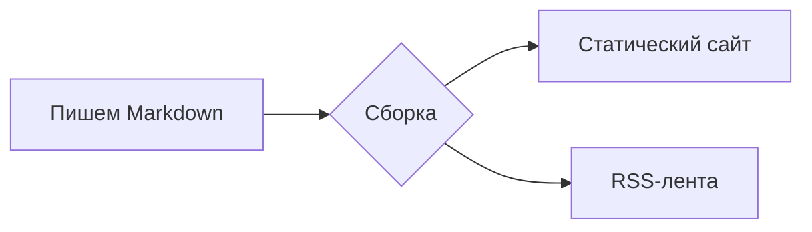

# Помощь с документацией

Эта страница описывает все возможности, которые движок документации даёт автору: каждый блок ниже собран из той же разметки Markdown, которую пишете вы. Держите её под рукой как шпаргалку, когда работаете над страницами.

Чтобы посмотреть свои правки, выполните один раз `npm install`, затем `npm run dev` и откройте локальный адрес, который он покажет. Переводы лежат в отдельных папках по языкам - `ru/`, `es/`, `zh/`, `pl/` - с той же структурой, что и английская версия, а английский остаётся источником правды.

## Блоки-выноски

Оберните текст в контейнер `:::`, чтобы получить цветную выноску с иконкой:

```md
::: tip
Полезный совет, который стоит выделить.
:::
::: info
Нейтральная справочная информация.
:::
::: warning
То, с чем стоит быть осторожнее.
:::
::: danger
Реальный риск - действуйте внимательно.
:::
```

::: tip
Полезный совет, который стоит выделить.
:::

::: info
Нейтральная справочная информация.
:::

::: warning
То, с чем стоит быть осторожнее.
:::

::: danger
Реальный риск - действуйте внимательно.
:::

Сразу после типа можно задать свой заголовок:

::: tip Совет
Задайте блоку свой заголовок, когда стандартной подписи мало.
:::

## Блоки кода

Код в ограждённом блоке получает подсветку синтаксиса, метку языка и кнопку копирования:

```rust
fn main() {
    println!("Hello, Rapira!");
}
```

Обратите внимание читателя на нужные строки - подсветите их, поставьте фокус или покажите изменения:

```rust{3}
fn main() {
    let answer = 42;
    println!("The answer is {answer}"); // эта строка подсвечена
}
```

```rust
fn main() {
    let ready = true;      // [!code focus]
    println!("{ready}");
}
```

```rust
fn setup() {
    let retries = 1;       // [!code --]
    let retries = 3;       // [!code ++]
}
```

Соберите разные варианты команды во вкладки:

::: code-group

```bash [npm]
npm install
```

```bash [pnpm]
pnpm install
```

```bash [yarn]
yarn
```

:::

## Вкладки с файлами

Блок `<CodeTabs>` показывает несколько файлов так, как это делает редактор: сверху вкладка на каждый файл, под ними - код открытой вкладки. Перечислите вкладки в блоке `<script setup>` на странице, а каждый фрагмент положите в `<template>`, имя которого совпадает со `slot` вкладки:

````md
<script setup>
const appTabs = [
  { name: 'index.php', slot: 'classic' },
  { name: 'worker.php', slot: 'worker' },
  { name: 'rapira.toml', slot: 'config' },
]
</script>

<CodeTabs :tabs="appTabs">

<template #classic>

```php
<?php
require __DIR__ . '/vendor/autoload.php';

echo (new App())->handle($_SERVER['REQUEST_URI']);
```

</template>

<template #worker>

```php
<?php
require __DIR__ . '/vendor/autoload.php';

$app = new App(); // The worker creates this object once and reuses it.

$handler = static function () use ($app): void {
    echo $app->handle($_SERVER['REQUEST_URI']);
};

while (\Rapira\handle_request($handler)) {
}
```

</template>

<template #config>

```toml
[pool]
entrypoint = "worker.php"
mode = "worker"
processes = 4
```

</template>

</CodeTabs>
````

Иконку вкладки задаёт расширение в её имени: у `.php`, `.rs`, `.toml`, `.yaml`, `.json` и `.sh` она своя, у остальных - обычный значок файла. Чтобы выбрать иконку самостоятельно, добавьте вкладке поле `icon` со значением `php`, `rust`, `toml`, `yaml`, `json`, `shell` или `file`.

Вот как этот блок выглядит на странице:

<script setup>
const appTabs = [
  { name: 'index.php', slot: 'classic' },
  { name: 'worker.php', slot: 'worker' },
  { name: 'rapira.toml', slot: 'config' },
]
</script>

<CodeTabs :tabs="appTabs">

<template #classic>

```php
<?php
require __DIR__ . '/vendor/autoload.php';

echo (new App())->handle($_SERVER['REQUEST_URI']);
```

</template>

<template #worker>

```php
<?php
require __DIR__ . '/vendor/autoload.php';

$app = new App(); // The worker creates this object once and reuses it.

$handler = static function () use ($app): void {
    echo $app->handle($_SERVER['REQUEST_URI']);
};

while (\Rapira\handle_request($handler)) {
}
```

</template>

<template #config>

```toml
[pool]
entrypoint = "worker.php"
mode = "worker"
processes = 4
```

</template>

</CodeTabs>

## Диаграммы

Блок `mermaid` превращается в диаграмму:



## Таблицы и бейджи

Обычные таблицы Markdown работают из коробки:

| Возможность    | В комплекте |
| -------------- | :---------: |
| Выноски        |     ✅      |
| Группы кода    |     ✅      |
| Mermaid        |     ✅      |

Встроенные бейджи удобны для меток статуса: <Badge type="tip" text="новое" /> <Badge type="warning" text="бета" /> <Badge type="danger" text="устарело" />.

## Frontmatter страницы

Опции страницы задаются в YAML-блоке в самом начале файла:

```yaml
---
title: Свой заголовок     # переопределяет H1 для <title> / og:title
description: Краткое описание # meta description и og:description
outline: [2, 3]           # меню «На этой странице» - см. ниже
aside: false              # полностью скрыть правую колонку
lastUpdated: false        # скрыть отметку «Обновлено» на этой странице
editLink: false           # скрыть ссылку «Редактировать эту страницу»
prev: false               # скрыть ссылку «Назад» в подвале
next:                     # либо переименовать / перенаправить ссылку
  text: Блог
  link: /ru/blog/
---
```

**outline** управляет оглавлением «На этой странице» справа:

```yaml
outline: [2, 3]   # по умолчанию - H2 и H3
outline: deep     # все уровни, H2–H6
outline: 2        # только H2
outline: false    # скрыть
```

`layout: home` - для лендинга, `layout: page` - для «голой» страницы без бокового меню и оглавления; обычные страницы используют layout `doc` по умолчанию.
