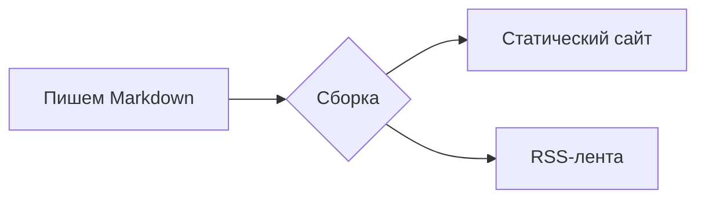

# Помощь с документацией

Эта страница описывает функции для авторов документации.

Используйте Node.js 24. Выполните `npm ci`, чтобы установить зафиксированные зависимости. Затем выполните `npm run dev`. Откройте локальный адрес из вывода команды. Каталоги переводов имеют ту же структуру, что и исходные английские файлы.

Выполните `npm run build` перед отправкой изменений. Команда создаёт миниатюры и проверяет конфигурацию VitePress, отображение Markdown и внутренние ссылки.

## Блоки-выноски

Поместите текст в контейнер `:::`, чтобы получить выноску с цветом и иконкой:

```md
::: tip
Полезный совет.
:::
::: info
Нейтральная справочная информация.
:::
::: warning
Условие, которое требует внимания.
:::
::: danger
Условие, которое может причинить вред.
:::
```

::: tip
Полезный совет.
:::

::: info
Нейтральная справочная информация.
:::

::: warning
Условие, которое требует внимания.
:::

::: danger
Условие, которое может причинить вред.
:::

Напишите заголовок после типа, например `::: tip Конкретный заголовок`:

::: tip Конкретный заголовок
Задайте свой заголовок, когда стандартная подпись недостаточно конкретна.
:::

## Блоки кода

Код в ограждённом блоке получает подсветку синтаксиса, метку языка и кнопку копирования:

```rust
fn main() {
    println!("Hello, Rapira!");
}
```

Добавьте `{3}` после имени языка, чтобы подсветить строку 3. Добавьте комментарий `// [!code focus]` в конец строки, чтобы поставить на неё фокус. Добавьте `// [!code --]` или `// [!code ++]`, чтобы отметить удалённую или добавленную строку. Сборка удаляет эти маркеры из результата:

```rust{3}
fn main() {
    let answer = 42;
    println!("The answer is {answer}"); // VitePress подсвечивает эту строку.
}
```

```rust
fn main() {
    let ready = true;      // [!code focus]
    println!("{ready}");
}
```

```rust
fn setup() {
    let retries = 1;       // [!code --]
    let retries = 3;       // [!code ++]
}
```

Поместите альтернативные фрагменты в контейнер `::: code-group`. Напишите метку вкладки в квадратных скобках после имени языка, например `bash [npm]`:

::: code-group

```bash [npm]
npm install
```

```bash [pnpm]
pnpm install
```

```bash [yarn]
yarn
```

:::

## Вкладки с файлами

Блок `<CodeTabs>` показывает одну вкладку для каждого файла. Под вкладками он показывает выбранный файл. Перечислите вкладки в блоке `<script setup>` на странице. Поместите каждый пример в `<template>`, который соответствует `slot` вкладки.

````md
<script setup>
const appTabs = [
  { name: 'index.php', slot: 'classic' },
  { name: 'worker.php', slot: 'worker' },
  { name: 'rapira.toml', slot: 'config' },
]
</script>

<CodeTabs :tabs="appTabs">

<template #classic>

```php
<?php
require __DIR__ . '/vendor/autoload.php';

echo (new App())->handle($_SERVER['REQUEST_URI']);
```

</template>

<template #worker>

```php
<?php
require __DIR__ . '/vendor/autoload.php';

$app = new App(); // Воркер создаёт этот объект один раз и использует его повторно.

$handler = static function () use ($app): void {
    echo $app->handle($_SERVER['REQUEST_URI']);
};

while (\Rapira\handle_request($handler)) {
}
```

</template>

<template #config>

```toml
[http.pool]
entrypoint = "worker.php"
mode = "worker"
processes = 4
```

</template>

</CodeTabs>
````

Расширение в имени файла выбирает иконку вкладки. Компонент поддерживает `.php`, `.rs`, `.toml`, `.yaml`, `.yml`, `.json`, `.sh` и `.bash`. Другие расширения используют обычную иконку файла. Чтобы задать иконку явно, установите `icon` в `php`, `rust`, `toml`, `yaml`, `json`, `shell` или `file`.

Блок выглядит на странице так:

<script setup>
const appTabs = [
  { name: 'index.php', slot: 'classic' },
  { name: 'worker.php', slot: 'worker' },
  { name: 'rapira.toml', slot: 'config' },
]
</script>

<CodeTabs :tabs="appTabs">

<template #classic>

```php
<?php
require __DIR__ . '/vendor/autoload.php';

echo (new App())->handle($_SERVER['REQUEST_URI']);
```

</template>

<template #worker>

```php
<?php
require __DIR__ . '/vendor/autoload.php';

$app = new App(); // Воркер создаёт этот объект один раз и использует его повторно.

$handler = static function () use ($app): void {
    echo $app->handle($_SERVER['REQUEST_URI']);
};

while (\Rapira\handle_request($handler)) {
}
```

</template>

<template #config>

```toml
[http.pool]
entrypoint = "worker.php"
mode = "worker"
processes = 4
```

</template>

</CodeTabs>

## Диаграммы

Ограждённый блок `mermaid` отображается как диаграмма:


```mermaid
flowchart LR
  A[Пишем Markdown] --> B{Сборка}
  B --> C[Статический сайт]
  B --> D[RSS-лента]
```

## Таблицы и бейджи

Стандартный Markdown создаёт таблицы:

| Возможность    | В комплекте |
| -------------- | :---------: |
| Выноски        |     ✅      |
| Группы кода    |     ✅      |
| Mermaid        |     ✅      |

Используйте компонент `<Badge>`, чтобы показать метку статуса, например `<Badge type="tip" text="new" />`. Значение `type` может быть `tip`, `warning`, `danger` или `info`:

<Badge type="tip" text="новое" /> <Badge type="warning" text="бета" /> <Badge type="danger" text="устарело" /> <Badge type="info" text="инфо" />

## Блоки FAQ

Используйте блок `::: question` для детали реализации, которая не нужна для основной процедуры. Напишите вопрос после `question`:

```md
::: question Можно ли запустить сайт без глобальной установки пакетов?
Выполните `npm ci` локально. Затем выполните `npm run dev`.
:::
```

Сборка собирает вопросы в раздел из раскрывающихся элементов. Задайте положение раздела ключом frontmatter `faqLevel`:

```yaml
faqLevel: 1       # После каждого раздела h1 (по умолчанию).
faqLevel: 2       # После каждого раздела h2.
faqLevel: 0       # В конце страницы.
faqLevel: false   # Вопросы остаются на своих исходных местах.
```

Эта страница использует уровень по умолчанию. Поэтому готовый пример находится в конце страницы.

::: question Можно ли запустить сайт без глобальной установки пакетов?
Выполните `npm ci` локально. Затем выполните `npm run dev`.
:::

## Frontmatter страницы

Задайте опции страницы в YAML-блоке в самом начале файла:

```yaml
---
title: Свой заголовок        # Заменяет H1 в <title> и og:title.
description: Краткое описание # Задаёт meta description и og:description.
outline: [2, 3]              # Задаёт меню «На этой странице». Варианты см. ниже.
aside: false                 # Скрывает правую колонку.
lastUpdated: false           # Скрывает время «Обновлено» на этой странице.
editLink: false              # Скрывает ссылку «Редактировать эту страницу».
prev: false                  # Скрывает ссылку «Назад» в подвале.
next:                        # Изменяет подпись или цель ссылки в подвале.
  text: Блог
  link: /ru/blog/
---
```

**outline** управляет оглавлением «На этой странице» справа:

```yaml
outline: 2        # По умолчанию. Показывает только H2.
outline: [2, 3]   # Показывает H2 и H3.
outline: deep     # Показывает каждый уровень от H2 до H6.
outline: false    # Скрывает меню.
```

Используйте `layout: home` для главной страницы. Используйте `layout: page` для страницы без бокового меню и оглавления. Другие страницы используют макет `doc` по умолчанию.
