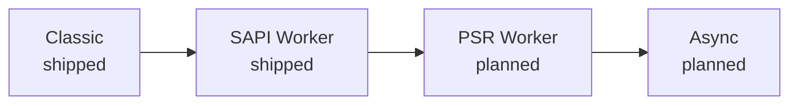

# Режимы выполнения

Любой PHP-сервер отвечает на один и тот же вопрос: что из вашего приложения доживает от запроса до запроса? У php-fpm ответ простой — ничего: фреймворк каждый раз поднимается с нуля, и для современного приложения именно этот подъём обычно и оказывается самой дорогой частью запроса. Rapira не навязывает единственный ответ, а предлагает лестницу из четырёх режимов выполнения, по которой приложение поднимается настолько высоко, насколько может.

Названия говорят о самой ступени: живёт ли воркер между запросами и по какому контракту он общается с сервером, — а не о продукте, который сделал такую схему привычной. Чем выше ступень, тем больше в процессе остаётся прогретого к приходу запроса и тем лучше код должен быть к этому готов.

## Classic <Badge type="tip" text="готово" />

Входной скрипт выполняется с нуля на каждый запрос — ровно так же, как под php-fpm: заполняются суперглобальные переменные, стартует фронт-контроллер, уходит ответ, и всё разбирается обратно. Между запросами не остаётся ничего, а значит, ничего и не протечёт из одного запроса в следующий.

Это ступень совместимости. Готовое приложение работает как есть: Rapira просто встаёт на место php-fpm, править код не нужно, а выигрыш даёт не приложение, а то, что под ним. PHP встроен прямо в процесс сервера, поэтому между HTTP-фронтом и интерпретатором нет промежуточного шага через FastCGI.

Как его запустить, описано в разделе [Классический режим](/ru/docs/classic).

## SAPI Worker <Badge type="tip" text="готово" />

Снаружи всё как в Classic: вы по-прежнему читаете суперглобальные переменные и по-прежнему отдаёте ответ через `echo`. Разница в том, что воркер не умирает в конце запроса. Резидентный скрипт один раз поднимает всё окружение и уходит в цикл: сервер на каждый новый запрос заново заполняет `$_GET`, `$_POST`, `$_SERVER`, `$_COOKIE` и всё остальное семейство, вызывает ваш обработчик и передаёт ему следующий запрос. Автозагрузчик, DI-контейнер, конфигурация, соединения с базой — всё, что создано вне цикла, остаётся прогретым.

В этом весь смысл ступени: за старт вы платите один раз на воркер, а не один раз на запрос. Взамен приходится расстаться с чистым листом. Всё, что приложение оставило в статических свойствах, синглтонах или глобальном состоянии, никуда не денется к следующему запросу, — и именно поэтому попадание на эту ступень решает ваш код, а не переключатель в конфигурации.

Про сам скрипт воркера и его цикл читайте в разделе [Режим воркера](/ru/docs/worker), а про работу с запросами и ответами — в разделе [HTTP](/ru/docs/http).

## PSR Worker <Badge type="warning" text="в планах" />

На этой ступени PHP перестаёт быть вызываемой стороной и начинает спрашивать сам: воркер забирает запрос у Rapira через вызов API и решает, что с ним делать. Можно заполнить суперглобальные переменные ради совместимости, а можно обойтись без них совсем и работать с PSR-7-сообщением, отдав его напрямую в HTTP-ядро фреймворка. По одному запросу за раз — как и ступенью ниже.

Выигрыш в том, что запрос перестаёт быть глобальным состоянием, разлитым по процессу, и становится обычным значением: его можно передать дальше, обернуть или пропустить через стек middleware — именно так современные PHP-фреймворки и хотят его получать.

::: info
Пока это идея, а не реализация. В сегодняшних сборках её нет, конфигурация и API на стороне PHP ещё не спроектированы, так что показывать имена функций и ключи конфигурации рано.
:::

## Async <Badge type="warning" text="в планах" />

API тот же, что и на ступени PSR Worker, только воркер запрашивает сразу несколько запросов и обрабатывает их конкурентно внутри одного интерпретатора. Возможным это делают файберы из PHP 8.1: запрос, который ждёт ввода-вывода, уступает управление, пока продвигается другой, — без потоков и без второго процесса.

Это верх лестницы и самая требовательная ступень: конкурентность внутри одного интерпретатора означает, что каждая библиотека на пути запроса должна корректно переживать остановку на середине работы.

::: info
Эта ступень тоже пока только идея: устанавливать и настраивать нечего. Читайте раздел выше как рассказ о том, куда движется Rapira, а не о том, что уже можно запустить.
:::

## От чего зависит ваша ступень

Не от сервера. Все четыре ступени открыты любому приложению, а ограничивает выбор его собственный стек.

Глобальное состояние, которое не переживёт второй запрос, оставит вас на Classic. Библиотека, не умеющая работать в файберах, не пустит на Async. Фреймворк с готовой интеграцией с рантаймом отдаёт ступень SAPI Worker почти даром — те, для кого путь уже описан, собраны в разделе [Фреймворки](/ru/docs/frameworks/). В любом случае дело в свойствах кода, а не в ограничениях Rapira: лестница доступна целиком, а насколько высоко по ней подниматься, решает приложение.

Подъём необратим только в одном смысле: он стоит работы на стороне PHP — воркерной ступени нужен резидентный входной скрипт, которого у Classic нет. А спуститься можно в любой момент и без риска: включите обратно Classic — это флаг в командной строке или один ключ в конфигурационном файле, — направьте Rapira на привычный фронт-контроллер, и вы снова на ступени Classic, с тем же сервером, тем же бинарником и той же [моделью процессов](/ru/docs/process-model) под ним.

::: tip
Если вы меняете php-fpm и хотите сначала просто увидеть работающее приложение, начинайте с Classic. Поднимайтесь выше, когда убедитесь, что приложение стартует чисто и не держит лишнего состояния. И мерить при этом стоит своё приложение, а не бенчмарк.
:::

::: question Какой режим Rapira использует по умолчанию?
Воркерную ступень. Classic включается явно — флагом в командной строке или одним ключом в конфигурационном файле; подробности в разделах [Конфигурация](/ru/docs/configuration) и [Командная строка](/ru/docs/cli).
:::

::: question Приложение течёт по памяти в режиме воркера. Это ошибка в Rapira?
Чаще всего данные запроса удерживает само приложение или одна из его зависимостей. Это не дефект, а честное ограничение ступени, — и Rapira умеет перезапускать воркер после заданного числа запросов, чтобы медленная утечка не превратилась в аварию, пока вы её ищете. Подробности — в разделе [Конфигурация](/ru/docs/configuration).
:::

::: question Можно часть маршрутов обрабатывать в Classic, а часть — в воркере?
Нет: ступень выбирается на весь экземпляр сервера, а не на отдельный маршрут. Если часть приложения не готова к работе в воркере, вынесите её за отдельный экземпляр Rapira на ступени Classic.
:::

::: question Когда появятся PSR Worker и Async?
Даты нет. Обе ступени описаны здесь, чтобы было понятно направление, но проработаны они пока не настолько, чтобы их можно было документировать. Как только это изменится, вместе с ним изменятся и эта страница, и [оглавление документации](/ru/docs/).
:::
