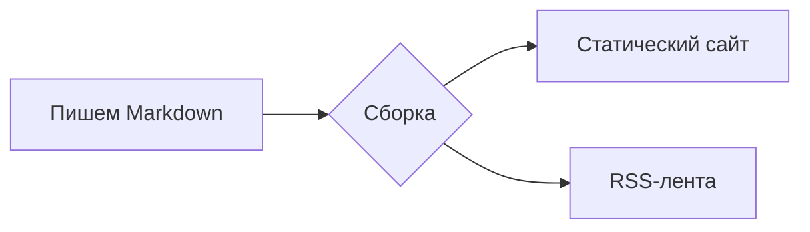

# Начало работы

Добро пожаловать в документацию Rapira. Эта страница заодно служит живой витриной: каждый блок ниже собран из той же разметки Markdown, которую вы будете писать на своих страницах.

## Блоки-выноски

Оберните текст в контейнер `:::`, чтобы получить цветную выноску с иконкой:

```md
::: tip
Полезный совет, который стоит выделить.
:::
::: info
Нейтральная справочная информация.
:::
::: warning
То, с чем стоит быть осторожнее.
:::
::: danger
Реальный риск — действуйте внимательно.
:::
```

::: tip
Полезный совет, который стоит выделить.
:::

::: info
Нейтральная справочная информация.
:::

::: warning
То, с чем стоит быть осторожнее.
:::

::: danger
Реальный риск — действуйте внимательно.
:::

Сразу после типа можно задать свой заголовок:

::: tip Совет
Задайте блоку свой заголовок, когда стандартной подписи мало.
:::

## Блоки кода

Код в ограждённом блоке получает подсветку синтаксиса, метку языка и кнопку копирования:

```rust
fn main() {
    println!("Hello, Rapira!");
}
```

Обратите внимание читателя на нужные строки — подсветите их, поставьте фокус или покажите изменения:

```rust{3}
fn main() {
    let answer = 42;
    println!("The answer is {answer}"); // эта строка подсвечена
}
```

```rust
fn main() {
    let ready = true;      // [!code focus]
    println!("{ready}");
}
```

```rust
fn setup() {
    let retries = 1;       // [!code --]
    let retries = 3;       // [!code ++]
}
```

Соберите разные варианты команды во вкладки:

::: code-group

```bash [npm]
npm install
```

```bash [pnpm]
pnpm install
```

```bash [yarn]
yarn
```

:::

## Диаграммы

Блок `mermaid` превращается в диаграмму:



## Таблицы и бейджи

Обычные таблицы Markdown работают из коробки:

| Возможность    | В комплекте |
| -------------- | :---------: |
| Выноски        |     ✅      |
| Группы кода    |     ✅      |
| Mermaid        |     ✅      |
| FAQ-спойлеры   |     ✅      |

Встроенные бейджи удобны для меток статуса: <Badge type="tip" text="новое" /> <Badge type="warning" text="бета" /> <Badge type="danger" text="устарело" />.

## Вопросы (FAQ-спойлеры)

Напишите блок `::: question` в любом месте страницы:

```md
::: question Как запустить сайт локально?
Один раз `npm install`, затем `npm run dev`.
:::
```

Движок собирает все вопросы из текста и складывает их в раскрывающиеся спойлеры в конце раздела — как раз такие, как ниже.

::: question Как запустить сайт локально?
Выполните один раз `npm install`, затем `npm run dev` и откройте локальный адрес, который он покажет.
:::

::: question Где лежат переводы?
У каждого языка своя папка — `ru/`, `es/`, `zh/`, `pl/` — с той же структурой, что и английская версия. Английский — источник правды.
:::
