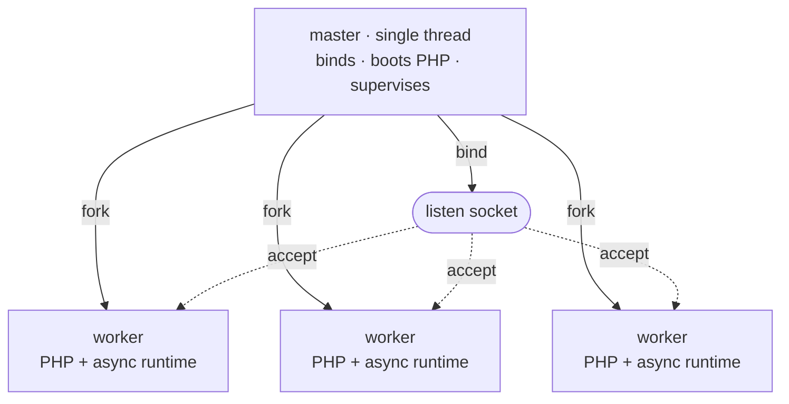

# Модель процессов

Rapira работает как один мастер-процесс и пул воркеров. Мастер держит всё, что должно существовать в единственном экземпляре: слушающий сокет, образ движка PHP, pid-файл, - а потом форкается; запросы обрабатывают воркеры. Ни один запрос не передаётся из процесса в процесс: воркеры и есть копии мастера, снятые уже после старта PHP, и соединения каждый из них забирает прямо с сокета.

Схема одна и та же в режимах [Classic](/ru/docs/classic), [Worker](/ru/docs/worker) и Dispatcher. Режим выполнения, который задаёт `pool.mode`, определяет, что происходит внутри воркера на каждом запросе, но не меняет того, как пул собирается, как за ним присматривают и как его перезагружают. Подробнее - в разделе [Режимы выполнения](/ru/docs/execution-modes).

## Мастер и воркеры

Старт идёт в строго заданном порядке:

1. **Занять слушающие сокеты.** Мастер делает это первым делом, поэтому занятый порт валит запуск сразу же, ещё до старта PHP.
2. **Один раз поднять PHP.** Движок проходит `MINIT` в мастере, пока тот ещё однопоточный. Здесь же создаётся разделяемая память OPcache, и каждый форкнутый следом воркер наследует тот же самый сегмент: воркер, первым скомпилировавший файл, наполняет кеш сразу для всех, вместо того чтобы каждый процесс компилировал свою копию.
3. **Форкнуть воркеров.** Каждому потомку достаются уже занятый сокет и уже поднятый движок.



Внутри каждого воркера работает один интерпретатор PHP в сборке NTS, а перед ним - собственный асинхронный HTTP-стек: hyper на отдельном рантайме tokio из двух рабочих потоков. Соединения воркер принимает на том самом сокете, который унаследовал. Раздающего соединения процесса здесь нет: все воркеры стоят на `accept()` одного и того же сокета, а входящее соединение ядро отдаёт ровно одному из них.

Мастер не обслуживает запросы вообще. HTTP-стека в нём попросту нет: это один поток, заблокированный в `poll(2)` на self-pipe, который ждёт сигналов, смерти потомков и собственных таймеров, а в режиме `ondemand` - ещё и готовности слушающего сокета. Процесс, который обязан выжить, чтобы перезапустить всё остальное, делает как можно меньше.

::: info
Модуль PHP мастер держит всю свою жизнь и выключает его тоже только он. Воркер завершается, ничего за собой не разбирая, поэтому упавший или перезапущенный воркер не разрушает образ движка, которым продолжают пользоваться остальные воркеры.
:::

## Надзор

Когда пул поднят, мастер примерно раз в секунду проходит служебный цикл, а на смерть воркера реагирует сразу, не дожидаясь очередного прохода.

- **Забрать и заменить.** Воркер, вышедший штатно - доработал начатое или исчерпал квоту, - заменяется немедленно (в режиме `ondemand` слот просто остаётся свободным, пока его не займёт следующее соединение). После *падения* замена приходит с задержкой: она начинается со 100 мс и удваивается с каждым новым быстрым падением подряд, упираясь примерно в 25 секунд, - так цикл из segfault сам себя притормаживает вместо того, чтобы впустую нагружать процессор. Стоит воркеру прожить хотя бы десять секунд, и серия обнуляется.
- **Сбои при старте.** Если воркер первого поколения сообщает о своей неисправности раньше, чем пул успел успешно обслужить хоть один запрос, мастер считает это неустранимым сбоем запуска и выходит, а не поднимает сломанный входной скрипт до бесконечности. Как только пул что-то обслужил, точно такой же выход становится обычной заменой с задержкой: неудачная перезагрузка не способна уронить работающий пул.
- **Перезапуск по квоте.** Если задан `pool.max_requests`, воркер завершает работу, обработав столько запросов, и тут же получает замену. К квоте каждому воркеру добавляется своя случайная надбавка, до половины квоты, - поэтому пул, стартовавший разом, не перезапускается синхронно: иначе на мгновение не осталось бы ни одного прогретого воркера.
- **Сторожевой таймер на отдельный запрос.** Если задан `pool.request_terminate_timeout_secs`, воркер, который к этому сроку по реальному времени всё ещё занят тем же запросом, получает `SIGTERM`, а если он жив и через проход - `SIGKILL`. Принудительное завершение попадает в лог на уровне `warn`, ждавшие в очереди соединения закрываются, а слот сразу же занимает новый воркер. На время остановки или перезагрузки сторожевой таймер приостанавливается.
- **Масштабирование.** При `dynamic` тот же проход решает, форкнуть ли ещё воркеров или убрать простаивающих; при `ondemand` он только убирает тех, кто простоял дольше таймаута, - там форк запускает пришедшее соединение. Подробности ниже.
- **Канал в обратную сторону.** Каждый воркер держит читающий конец канала, в который мастер никогда ничего не пишет. Если мастер умрёт, канал отдаст EOF, и каждый воркер сам доработает начатое и завершится, - так что `kill -9` по мастеру не оставит осиротевших воркеров, удерживающих порт.

## Масштабирование пула

`pool.scaling` выбирает, как пул определяет свой размер. Это отдельный ключ от `pool.mode`, который задаёт режим выполнения внутри воркера. Главное число при любой политике - `pool.processes`: для `static` это точное количество, для остальных двух - потолок; по умолчанию это один воркер на логическое ядро.

| Политика | Сколько воркеров | Какие ключи работают |
| --- | --- | --- |
| `static` (по умолчанию) | Ровно `pool.processes`: форкаются на старте и держатся в этом количестве. | `processes` |
| `dynamic` | Столько, сколько требует нагрузка, но не больше `pool.processes`; мастер держит число *простаивающих* воркеров внутри коридора. | `min_spare`, `max_spare` |
| `ondemand` | На старте ноль; воркеры форкаются по мере прихода трафика, но не больше `pool.processes`. | `process_idle_timeout_secs` |

**`static`** подходит большинству установок: расход памяти ровный, а умерший воркер просто заменяется новым. PHP синхронный, поэтому воркер обрабатывает по одному запросу за раз: если запросы в основном ждут базу данных или внешний API, воркеров обычно стоит взять больше, чем ядер, а если они упираются в процессор - почти никогда.

**`dynamic`** держит число *простаивающих* воркеров внутри коридора. На каждом проходе он смотрит на границы: простаивающих меньше `min_spare` - форкнуть ещё, порциями, которые удваиваются, пока давление не спадает, так что всплеск трафика разбирается быстро, а не по воркеру в секунду; простаивающих больше `max_spare` - убрать самого старого из них. Начинает пул с середины коридора, а упёршись в потолок `pool.processes`, когда воркеров всё ещё не хватает, один раз пишет предупреждение.

```toml
[pool]
scaling = "dynamic"
processes = 8
min_spare = 1
max_spare = 3
```

Границы обязаны укладываться в `1 <= min_spare <= max_spare <= processes`. При `dynamic` они обязательны, а при остальных политиках отвергаются: задать их не там - это ошибка конфигурации, а не молча проигнорированный ключ.

**`ondemand`** на старте не форкает ничего. Здесь мастер сам следит за слушающим сокетом: пришло соединение, а свободного воркера под него нет - мастер форкает воркер и отдаёт приём соединения ему. Воркер, простоявший дольше `pool.process_idle_timeout_secs`, снова убирается. Простаивающий пул при этом ничего не потребляет, но первый запрос после паузы в трафике ждёт форка. Берите `ondemand` для тестовых стендов и редко посещаемых сайтов, а под ровным трафиком - одну из остальных политик.

Полный справочник по ключам - на странице [Конфигурация](/ru/docs/configuration).

## Сигналы

Сигналами сервер останавливают, перезагружают и заставляют сообщить о своём состоянии. Все они отправляются **мастеру**.

| Сигнал | Что делает мастер |
| --- | --- |
| `SIGTERM`, `SIGINT` | Мягкая остановка: начатые запросы дорабатываются, затем пул завершается. Второй `SIGTERM` или `SIGINT` завершает сервер принудительно. |
| `SIGQUIT` | Та же мягкая остановка. Повторять его бессмысленно: мягко начатую остановку второй `SIGQUIT` в жёсткую не переводит. |
| `SIGUSR2`, `SIGHUP` | Плавная перезагрузка: пул меняется по одному воркеру, не разрывая соединений. |
| `SIGUSR1` | Записать состояние пула в лог. |
| `SIGCHLD` | Внутренний: воркер завершился - забрать его код выхода и решить, нужна ли замена. |

Задайте `supervisor.pidfile`, и у ваших скриптов появится постоянное место, откуда читать pid мастера:

```bash
kill -USR2 $(cat /run/rapira.pid)   # Replace workers one at a time.
kill -USR1 $(cat /run/rapira.pid)   # Write pool status to the log.
kill -TERM $(cat /run/rapira.pid)   # Stop after current requests finish.
```

::: warning
Шлите сигналы мастеру и никогда - отдельному воркеру. `SIGUSR1` и `SIGUSR2` воркеры просто игнорируют, а `SIGTERM` понимают как немедленное убийство: именно им сторожевой таймер обрывает запрос, который должен умереть *прямо сейчас*. Сигнал, поданный воркеру напрямую, обходит надзор, описанный на этой странице.
:::

### Остановка

Любая остановка начинается мягко, каким бы из трёх сигналов её ни попросили: мастер шлёт каждому воркеру `SIGQUIT`, тот перестаёт брать новую работу и доводит до конца то, что уже держит. Дальше ужесточение идёт по таймеру: `supervisor.process_control_timeout_secs` (по умолчанию 30 секунд) - это время, отведённое на мягкий уход, после которого оставшиеся воркеры получают `SIGTERM`, а если не помогает и он - `SIGKILL`. Воркер, который на мягкий `SIGQUIT` так и не ответил, получает `SIGTERM`, а затем `SIGKILL`, вместо того чтобы ждать его бесконечно.

Второй `SIGTERM` или `SIGINT` пропускает ожидание и завершает сервер немедленно.

### Плавная перезагрузка

`SIGUSR2` (или `SIGHUP`) меняет весь пул на свежие воркеры - именно так поднятое в резидентном воркере приложение выбрасывается и собирается заново из выложенного кода.

В режиме Classic входной скрипт выполняется с нуля на каждый запрос. Заменять здесь нечего, поэтому новый код начинает работать без перезагрузки. Если выставлено `opcache.validate_timestamps = 0`, сегмент OPcache, созданный в мастере, продолжает отдавать старые опкоды до полного перезапуска. В режимах Worker и Dispatcher приложение поднимается один раз и остаётся в памяти, поэтому выложенный код начинает работать только после плавной перезагрузки: сделайте её шагом деплоя. Подробнее об этом - в разделе [Запуск в продакшене](/ru/docs/deployment).

Обслуживать запросы пул при этом не перестаёт, потому что поколения перекрываются, а не сменяют друг друга через паузу: мастер поднимает один свежий воркер, дожидается, пока тот действительно начнёт принимать соединения, и только после этого отправляет доработать одного старого. Освободившийся слот достаётся следующему свежему воркеру - и так по всему поколению. Каждое такое завершение - та же последовательность `SIGQUIT` → `SIGTERM` → `SIGKILL`, что и при остановке, с тем же ограничением по времени, только применённая к одному воркеру.

Замена, которая так и не начала обслуживать запросы, перезагрузку тоже не застопорит: когда время ожидания истечёт, мастер напишет предупреждение и всё равно перейдёт к следующему воркеру. В режиме `ondemand` замена заранее не форкается вовсе - старые воркеры уходят по одному, а новых поднимает спрос.

Перезагрузка, запрошенная во время уже идущей остановки, игнорируется: приоритет всегда у остановки.

::: info
Перезагрузка меняет воркеров, а не мастера. Новые воркеры форкаются из того же мастер-процесса и получают тот же образ движка, который он поднял при старте, - поэтому `rapira.toml`, `php.ini` и сам бинарник подхватываются только при полном перезапуске.
:::

### Дамп состояния

По `SIGUSR1` мастер пишет в лог снимок пула: сначала сводную строку с числом работающих и простаивающих воркеров и номером текущего поколения, а затем по строке на каждый слот - с его pid, состоянием и счётчиками `handled`, `errors` и `recycles`.

::: tip
Снимок пишется на уровне `info` в цель `master`, а уровень логирования по умолчанию - `error`, поэтому на стандартной конфигурации `kill -USR1` выглядит так, будто вообще ничего не сделал. Поднимите уровень у одной этой цели, и снимок появится:

```toml
[log.targets]
master = "info"
```

Через эту же цель идут все события супервизора: форки, завершения потомков, замены, перезагрузки и масштабирование пула. Остальное - в разделе [Логирование](/ru/docs/logging).
:::
