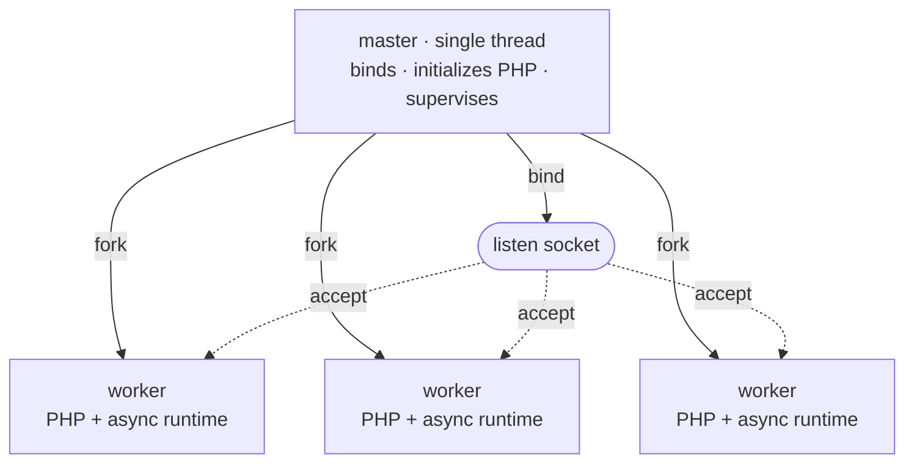

# Модель процессов

Rapira запускает один мастер-процесс и отдельный пул воркеров для каждого включённого протокола. Мастер владеет слушающими сокетами, инициализированным движком PHP и pid-файлом. Затем мастер создаёт процессы воркеров. Каждый воркер наследует PHP и принимает соединения с общего сокета своего пула. Rapira не передаёт запросы между процессами.

HTTP и [gRPC](./grpc) имеют отдельные слушатели, входные скрипты и пулы. `[http.pool]` и `[grpc.pool]` настраивают их независимо. Пул gRPC использует режим Dispatcher и обрабатывает один активный вызов на воркер.

Если в конфигурации есть таблица `[observability]`, мастер также запускает один процесс для метрик и проверок состояния. Этот процесс не выполняет код PHP. В Linux имя этого процесса `rapira-obs`, а воркеры PHP имеют имя `rapira-worker`. Мастер контролирует, перезагружает и останавливает этот процесс вместе с воркерами PHP. Подробнее - в разделе [Метрики и проверки состояния](/ru/docs/observability).

Эта модель процессов одинакова в режимах [Classic](/ru/docs/classic), [Worker](/ru/docs/worker) и [Dispatcher](/ru/docs/dispatcher). `http.pool.mode` управляет обработкой запросов внутри воркера. Эта настройка не меняет создание пула, контроль воркеров и перезагрузку. Подробнее - в разделе [Режимы выполнения](/ru/docs/execution-modes).

## Мастер и воркеры

Инициализация идёт в таком порядке:

1. **Занять слушающий сокет или сокеты.** Конфликт портов останавливает инициализацию до запуска PHP.
2. **Один раз запустить PHP.** Мастер выполняет `MINIT` в своём единственном потоке. В этот момент OPcache создаёт свою разделяемую память, и каждый воркер наследует её. Когда один воркер компилирует файл, другие воркеры используют результат из кеша.
3. **Создать воркеры через fork.** Каждый дочерний процесс наследует занятый сокет и инициализированный движок.


```mermaid
flowchart TB
  M["master · single thread<br/>binds · initializes PHP · supervises"]
  S(["listen socket"])
  W1["worker<br/>PHP + async runtime"]
  W2["worker<br/>PHP + async runtime"]
  W3["worker<br/>PHP + async runtime"]
  M -- bind --> S
  M -- fork --> W1
  M -- fork --> W2
  M -- fork --> W3
  S -. accept .-> W1
  S -. accept .-> W2
  S -. accept .-> W3
```

Схема показывает один пул. Каждый воркер выполняет один интерпретатор PHP в сборке NTS и асинхронный сервер HTTP или gRPC. Сервер использует hyper на отдельном рантайме tokio из двух потоков. Каждый воркер вызывает `accept()` на унаследованном сокете. Операционная система назначает каждое новое соединение одному воркеру.

Мастер не обслуживает запросы. Его единственный поток ждёт сигналы, завершения воркеров и таймеры.

::: info
Мастер держит модуль PHP всё время своей работы. Только мастер выключает модуль. Воркер завершается, но не выключает это общее состояние движка.
:::

## Контроль воркеров

Мастер выполняет обслуживание раз в секунду. Он также обрабатывает каждое завершение воркера сразу, когда оно происходит.

- **Замена воркера.** После штатного завершения мастер сразу заменяет воркер. После сбоя или завершения в нерабочем состоянии задержка замены начинается со 100 мс. Задержка удваивается после каждого последовательного сбоя и останавливается на 25,6 секунды. Воркер, который работает не меньше 10 секунд, сбрасывает задержку.
- **Сбои запуска.** В режимах Worker и Dispatcher запуск завершается сбоем, если входной скрипт заканчивается до получения запроса. Тогда воркер ждёт до 5 секунд и снова выполняет входной скрипт. На запрос, который приходит во время ожидания, воркер отвечает HTTP `503` или gRPC `UNAVAILABLE`. После пяти сбоев запуска подряд воркер завершается в нерабочем состоянии.
- **Остановка мастера при сбое запуска.** Мастер останавливается с кодом завершения 70, когда завершается нерабочий воркер нулевого поколения. Это правило действует, только если в пуле нет успешного запроса и нет простаивающего или активного воркера. Нулевое поколение обозначает воркеры, созданные до первой перезагрузки. Во всех других случаях мастер заменяет воркер после задержки замены. Сбой воркера никогда не останавливает мастер.
- **Ограничение запросов.** С `http.pool.max_requests` воркер завершается после случайного числа запросов от `max_requests + 1` до примерно `1.5 × max_requests`. Мастер сразу заменяет его. Случайный диапазон предотвращает одновременную замену воркеров.
- **Тайм-аут запроса.** С `http.pool.request_terminate_timeout_secs` мастер отправляет воркеру `SIGTERM`, когда его текущий запрос превышает лимит. Если воркер всё ещё активен при следующем обслуживании, мастер отправляет `SIGKILL`. Затем мастер сразу заменяет воркер. Мастер применяет этот тайм-аут во время перезагрузки, но не во время остановки.
- **Контроль мастера.** Каждый воркер читает из канала, который мастер держит открытым. Если мастер завершается, каждый воркер прекращает принимать новую работу, завершает текущие запросы и завершается.

## Размер пула

Следующие настройки используют `[http.pool]`. Те же настройки применяются к `[grpc.pool]`.

`http.pool.processes` задаёт число воркеров. Мастер создаёт эти воркеры при инициализации и заменяет каждый завершившийся воркер. По умолчанию Rapira создаёт один воркер на каждый процессор, который доступен процессу. Если у контейнера есть ограничение по процессорам, значение по умолчанию следует этому ограничению.

Общее число воркеров всех пулов должно быть не больше 2048. Если observability включено, его процесс считается одним воркером. Большее общее число останавливает Rapira с кодом завершения 70.

PHP работает синхронно, поэтому каждый воркер обрабатывает один запрос за раз. Приложения с большим числом операций ввода-вывода могут требовать больше воркеров, чем ядер процессора. Приложения с высокой нагрузкой на процессор обычно не требуют.

Число воркеров не меняется во время работы сервера. Чтобы менять ёмкость под нагрузку, меняйте число экземпляров Rapira, например с помощью оркестратора контейнеров.

Полный справочник по ключам - на странице [Конфигурация](/ru/docs/configuration).

## Сигналы

Сигналы останавливают работающий сервер, перезагружают его и заставляют его сообщить своё состояние. Все сигналы отправляются **мастеру**.

| Сигнал | Что делает мастер |
| --- | --- |
| `SIGTERM`, `SIGINT` | Мастер даёт текущим запросам завершиться, затем останавливает воркеры. Второй сигнал останавливает воркеры принудительно. |
| `SIGQUIT` | Мастер выполняет ту же контролируемую остановку. Ещё один `SIGQUIT` ничего не меняет. |
| `SIGUSR2`, `SIGHUP` | Мастер заменяет воркеры по одному. Каждый старый воркер не принимает новую работу и завершает текущие запросы. |
| `SIGUSR1` | Мастер записывает состояние пула в лог. |

Задайте `supervisor.pidfile`, чтобы у скриптов было постоянное место для идентификатора процесса мастера:

```bash
kill -USR2 $(cat /run/rapira.pid)   # Заменить воркеры по одному.
kill -USR1 $(cat /run/rapira.pid)   # Записать состояние пула в лог.
kill -TERM $(cat /run/rapira.pid)   # Остановить после завершения текущих запросов.
```

::: warning
Отправляйте сигналы только мастеру. Воркеры игнорируют `SIGUSR1` и `SIGUSR2`. `SIGTERM` и `SIGHUP` сразу останавливают воркер и прерывают его текущие запросы. Тайм-аут запроса использует `SIGTERM`. Прямой сигнал воркеру обходит контроль мастера.

`Ctrl-C` в терминале отправляет `SIGINT` мастеру и всем воркерам. Затем каждый воркер также получает `SIGQUIT` от мастера. Второй сигнал остановки заставляет воркер сразу завершиться с кодом 131, поэтому его текущие запросы не завершаются. Чтобы текущие запросы завершились, отправьте `SIGTERM` только мастеру.
:::

### Остановка

После сигнала остановки мастер сразу отправляет `SIGQUIT` каждому воркеру. Воркеры не принимают новую работу и завершают текущие запросы. После `supervisor.process_control_timeout_secs` мастер отправляет оставшимся воркерам `SIGTERM`. Значение по умолчанию - 30 секунд. Если воркеры остаются, мастер отправляет `SIGKILL` через одну секунду после `SIGTERM`.

Срок завершения соединений равен тайм-ауту управления минус меньшее из двух значений: пять секунд или половина тайм-аута. При настройках по умолчанию соединения получают 25 секунд на завершение. Ответы, которые превышают этот срок, могут быть прерваны. Тот же срок действует при перезагрузке.

Второй `SIGTERM` или `SIGINT` пропускает ожидание и сразу принудительно завершает сервер. Коды завершения мастера описаны в разделе [Коды завершения](/ru/docs/cli#коды-завершения).

### При замене воркеры завершают текущие запросы

`SIGUSR2` или `SIGHUP` заменяет весь пул. Каждый новый воркер инициализирует приложение из развёрнутого кода.

В режиме Classic каждый запрос выполняет входной скрипт в новом запросе PHP, поэтому новый код работает без перезагрузки. Режимы Worker и Dispatcher держат приложение в памяти. Перезагружайте пул после каждого развёртывания в этих режимах. С `opcache.validate_timestamps = 0` перезагрузка не загружает новый код ни в одном режиме, потому что новые воркеры используют память OPcache мастера. В этом случае перезапустите Rapira. Подробнее - в разделе [Запуск в продакшене](/ru/docs/deployment).

Мастер запускает один новый воркер и ждёт, пока тот сообщит состояние idle или active. Затем мастер останавливает самый старый из старых воркеров. После завершения этого воркера мастер запускает на его месте следующий новый воркер. Эта последовательность продолжается, пока не останется ни одного старого воркера. Все пулы перезагружаются одновременно.

Каждая остановка воркера использует последовательность `SIGQUIT` → `SIGTERM` → `SIGKILL`. К каждому воркеру применяется один и тот же тайм-аут управления. Старый воркер закрывает неактивные keep-alive-соединения после получения `SIGQUIT`. Текущие запросы получают более короткий срок завершения соединений, описанный выше.

Если новый воркер не сообщает ни одно из этих состояний до истечения тайм-аута управления, мастер записывает предупреждение. Затем мастер останавливает следующий старый воркер, даже если новый воркер не обслуживает запросы.

Мастер игнорирует сигнал перезагрузки во время остановки или пока идёт перезагрузка. Мастер не записывает проигнорированный сигнал в лог. Отправьте сигнал снова после завершения перезагрузки.

::: info
Перезагрузка заменяет воркеры, но не мастер. Новые воркеры наследуют тот же инициализированный движок. Перезапустите Rapira, чтобы применить изменения бинарного файла или файлов, которые читает мастер, например `rapira.toml` и `php.ini`.
:::

### Запись состояния в лог

`SIGUSR1` заставляет мастер записать в лог состояние каждого пула. Первая строка пула показывает число работающих и простаивающих воркеров и номер поколения перезагрузки. Затем строка для каждого слота воркера показывает идентификатор процесса, состояние и три счётчика:

```text
status: http pool: 4 running, 3 idle, generation 0
  slot 0 pid 4242 state 2 handled 1500 errors 2 recycles 0
```

| Состояние | Значение |
| --- | --- |
| `1` | Запуск. Приложение ещё не запустилось, или его последний запуск завершился сбоем. |
| `2` | Простой. Воркер ждёт работу. |
| `3` | Активен. Воркер обрабатывает запрос. |
| `4` | Завершение. Воркер завершает свою работу и выходит. |

Слот сохраняет свои счётчики, когда мастер заменяет его воркер. `recycles` считает перезапуски входного скрипта внутри воркера.

::: tip
Вывод состояния использует уровень `info` в цели `master`. Уровень логирования по умолчанию - `error`. Задайте для этой цели `info`, чтобы показать вывод:

```toml
[log.targets]
master = "info"
```

Та же цель содержит ошибки создания воркеров, предупреждения о готовности при перезагрузке и предупреждения о тайм-ауте запроса. Подробнее - в разделе [Логирование](/ru/docs/logging).
:::

::: question Использует ли Rapira прозрачные огромные страницы (transparent huge pages)?
Нет. В Linux мастер отключает transparent huge pages для своего процесса до запуска PHP. Воркеры и процессы, которые PHP запускает через `proc_open()` или `exec()`, наследуют эту настройку. Поэтому `USE_ZEND_ALLOC_HUGE_PAGES=1` и `opcache.huge_code_pages` не получают transparent huge pages. Эти опции всё ещё могут использовать явные огромные страницы, которые хост резервирует через `vm.nr_hugepages`. Никакая настройка не меняет это поведение.
:::

::: question Может ли мастер работать как PID 1 в контейнере?
Да. Как PID 1, мастер обрабатывает сигналы остановки и убирает все завершившиеся дочерние процессы. Отдельный процесс init не нужен.
:::
