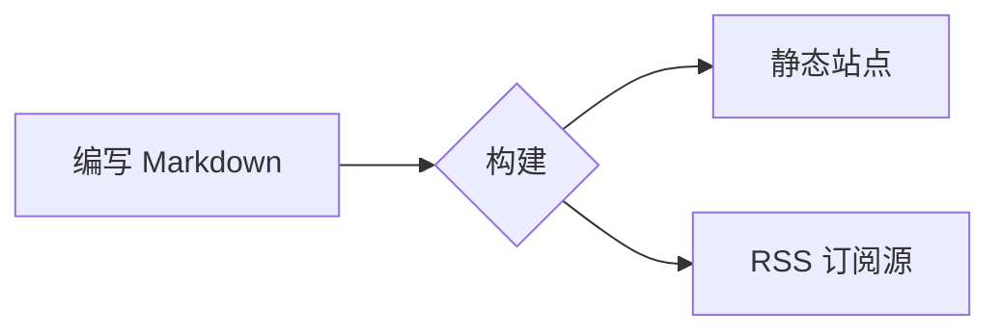

# 参与文档贡献

本页介绍文档站点的编写功能。每个示例都由显示的 Markdown 生成。

运行 `npm ci` 安装锁定的依赖项。然后运行 `npm run dev`。
打开命令输出的本地地址。翻译目录与规范英文文件具有相同结构。

## 提示块

用 `:::` 容器包裹文本，就能得到带颜色和图标的提示块：

```md
::: tip
值得强调的实用建议。
:::
::: info
中性的补充信息。
:::
::: warning
需要留意的地方。
:::
::: danger
真正的风险--请谨慎操作。
:::
```

::: tip
值得强调的实用建议。
:::

::: info
中性的补充信息。
:::

::: warning
需要留意的地方。
:::

::: danger
真正的风险--请谨慎操作。
:::

在类型后添加具体标题：

::: tip 小贴士
当默认标签不够贴切时，给区块起一个自己的标题。
:::

## 代码块

围栏代码块会获得语法高亮、语言标签和复制按钮：

```rust
fn main() {
    println!("Hello, Rapira!");
}
```

把读者的注意力引到具体的行--高亮、聚焦，或展示改动：

```rust{3}
fn main() {
    let answer = 42;
    println!("The answer is {answer}"); // 这一行被高亮
}
```

```rust
fn main() {
    let ready = true;      // [!code focus]
    println!("{ready}");
}
```

```rust
fn setup() {
    let retries = 1;       // [!code --]
    let retries = 3;       // [!code ++]
}
```

把同一命令的不同写法收进选项卡：

::: code-group

```bash [npm]
npm install
```

```bash [pnpm]
pnpm install
```

```bash [yarn]
yarn
```

:::

## 文件标签页

`<CodeTabs>` 会像编辑器那样展示一组文件：每个文件一个标签，下方是当前标签的代码。在页面的 `<script setup>` 里列出标签，再把各段代码放进与标签 `slot` 同名的 `<template>` 中：

````md
<script setup>
const appTabs = [
  { name: 'index.php', slot: 'classic' },
  { name: 'worker.php', slot: 'worker' },
  { name: 'rapira.toml', slot: 'config' },
]
</script>

<CodeTabs :tabs="appTabs">

<template #classic>

```php
<?php
require __DIR__ . '/vendor/autoload.php';

echo (new App())->handle($_SERVER['REQUEST_URI']);
```

</template>

<template #worker>

```php
<?php
require __DIR__ . '/vendor/autoload.php';

$app = new App(); // 只启动一次，供后续所有请求复用

$handler = static function () use ($app): void {
    echo $app->handle($_SERVER['REQUEST_URI']);
};

while (\Rapira\handle_request($handler)) {
}
```

</template>

<template #config>

```toml
[pool]
entrypoint = "worker.php"
mode = "worker"
processes = 4
```

</template>

</CodeTabs>
````

标签图标取自文件名后缀：`.php`、`.rs`、`.toml`、`.yaml`、`.json` 和 `.sh` 各有专属图标，其余一律使用通用文件图标。想自己指定，就给标签加上 `icon`，取值为 `php`、`rust`、`toml`、`yaml`、`json`、`shell` 或 `file`。

这段代码在页面上的效果如下：

<script setup>
const appTabs = [
  { name: 'index.php', slot: 'classic' },
  { name: 'worker.php', slot: 'worker' },
  { name: 'rapira.toml', slot: 'config' },
]
</script>

<CodeTabs :tabs="appTabs">

<template #classic>

```php
<?php
require __DIR__ . '/vendor/autoload.php';

echo (new App())->handle($_SERVER['REQUEST_URI']);
```

</template>

<template #worker>

```php
<?php
require __DIR__ . '/vendor/autoload.php';

$app = new App(); // 只启动一次，供后续所有请求复用

$handler = static function () use ($app): void {
    echo $app->handle($_SERVER['REQUEST_URI']);
};

while (\Rapira\handle_request($handler)) {
}
```

</template>

<template #config>

```toml
[pool]
entrypoint = "worker.php"
mode = "worker"
processes = 4
```

</template>

</CodeTabs>

## 图表

`mermaid` 代码块会渲染成图表：



## 表格与徽章

标准 Markdown 可创建表格：

| 功能          | 是否内置 |
| ------------- | :------: |
| 提示块        |    ✅    |
| 代码分组      |    ✅    |
| Mermaid       |    ✅    |

行内徽章可以显示状态：
<Badge type="tip" text="新" /> <Badge type="warning" text="测试版" /> <Badge type="danger" text="已弃用" />

## 页面 frontmatter

在文件最顶部的 YAML 块中设置页面选项：

```yaml
---
title: 自定义标题         # 覆盖 H1，用于 <title> / og:title
description: 简短摘要      # meta description 和 og:description
outline: [2, 3]           # “本页目录”菜单--见下文
aside: false              # 完全隐藏右侧栏
lastUpdated: false        # 隐藏本页的“最后更新于”时间
editLink: false           # 隐藏“编辑此页面”链接
prev: false               # 隐藏页脚的“上一页”链接
next:                     # 或者重命名 / 重定向页脚链接
  text: 博客
  link: /zh/blog/
---
```

**outline** 控制右侧的“本页目录”：

```yaml
outline: [2, 3]   # 默认--H2 和 H3
outline: deep     # 所有层级，H2–H6
outline: 2        # 仅 H2
outline: false    # 隐藏
```

落地页用 `layout: home`，没有侧边栏和目录的空白页用 `layout: page`；普通页面使用默认的 `doc` 布局。
