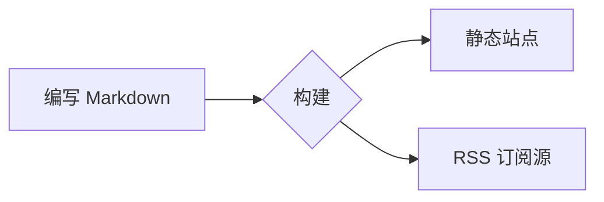

# 参与文档贡献

本页介绍文档站点的编写功能。

请使用 Node.js 24。运行 `npm ci` 安装锁定的依赖项。然后运行 `npm run dev`。打开命令输出的本地地址。翻译目录与规范英文文件具有相同结构。

提交更改前，请运行 `npm run build`。它会生成缩略图，并检查 VitePress 配置、Markdown 渲染和内部链接。

## 提示块

把文本放进 `:::` 容器，即可创建带颜色和图标的提示块：

```md
::: tip
实用的建议。
:::
::: info
中性的上下文信息。
:::
::: warning
需要注意的情况。
:::
::: danger
可能造成损害的情况。
:::
```

::: tip
实用的建议。
:::

::: info
中性的上下文信息。
:::

::: warning
需要注意的情况。
:::

::: danger
可能造成损害的情况。
:::

在类型后写一个标题，例如 `::: tip 具体标题`：

::: tip 具体标题
当默认标签不够具体时，使用自定义标题。
:::

## 代码块

围栏代码块带有语法高亮、语言标签和复制按钮：

```rust
fn main() {
    println!("Hello, Rapira!");
}
```

在语言名称后添加 `{3}`，即可高亮第 3 行。在行尾添加 `// [!code focus]` 注释，即可聚焦该行。添加 `// [!code --]` 或 `// [!code ++]`，即可把该行标记为删除的行或添加的行。构建会从输出中删除这些标记：

```rust{3}
fn main() {
    let answer = 42;
    println!("The answer is {answer}"); // VitePress 高亮这一行。
}
```

```rust
fn main() {
    let ready = true;      // [!code focus]
    println!("{ready}");
}
```

```rust
fn setup() {
    let retries = 1;       // [!code --]
    let retries = 3;       // [!code ++]
}
```

把可互相替代的代码片段放进 `::: code-group` 容器。在语言名称后的方括号中写标签名称，例如 `bash [npm]`：

::: code-group

```bash [npm]
npm install
```

```bash [pnpm]
pnpm install
```

```bash [yarn]
yarn
```

:::

## 文件标签页

`<CodeTabs>` 块为每个文件显示一个标签页。它在标签页下方显示选中的文件。在页面的 `<script setup>` 块中列出标签页。把每个示例放进与标签页 `slot` 匹配的 `<template>` 中。

````md
<script setup>
const appTabs = [
  { name: 'index.php', slot: 'classic' },
  { name: 'worker.php', slot: 'worker' },
  { name: 'rapira.toml', slot: 'config' },
]
</script>

<CodeTabs :tabs="appTabs">

<template #classic>

```php
<?php
require __DIR__ . '/vendor/autoload.php';

echo (new App())->handle($_SERVER['REQUEST_URI']);
```

</template>

<template #worker>

```php
<?php
require __DIR__ . '/vendor/autoload.php';

$app = new App(); // worker 只创建一次这个对象，然后重复使用它。

$handler = static function () use ($app): void {
    echo $app->handle($_SERVER['REQUEST_URI']);
};

while (\Rapira\handle_request($handler)) {
}
```

</template>

<template #config>

```toml
[http.pool]
entrypoint = "worker.php"
mode = "worker"
processes = 4
```

</template>

</CodeTabs>
````

文件扩展名决定标签页图标。组件支持 `.php`、`.rs`、`.toml`、`.yaml`、`.yml`、`.json`、`.sh` 和 `.bash`。其他扩展名使用通用文件图标。要覆盖图标，把 `icon` 设为 `php`、`rust`、`toml`、`yaml`、`json`、`shell` 或 `file`。

该块的渲染结果如下：

<script setup>
const appTabs = [
  { name: 'index.php', slot: 'classic' },
  { name: 'worker.php', slot: 'worker' },
  { name: 'rapira.toml', slot: 'config' },
]
</script>

<CodeTabs :tabs="appTabs">

<template #classic>

```php
<?php
require __DIR__ . '/vendor/autoload.php';

echo (new App())->handle($_SERVER['REQUEST_URI']);
```

</template>

<template #worker>

```php
<?php
require __DIR__ . '/vendor/autoload.php';

$app = new App(); // worker 只创建一次这个对象，然后重复使用它。

$handler = static function () use ($app): void {
    echo $app->handle($_SERVER['REQUEST_URI']);
};

while (\Rapira\handle_request($handler)) {
}
```

</template>

<template #config>

```toml
[http.pool]
entrypoint = "worker.php"
mode = "worker"
processes = 4
```

</template>

</CodeTabs>

## 图表

围栏 `mermaid` 块渲染为图表：


```mermaid
flowchart LR
  A[编写 Markdown] --> B{构建}
  B --> C[静态站点]
  B --> D[RSS 订阅源]
```

## 表格与徽章

标准 Markdown 可以创建表格：

| 功能          | 是否内置 |
| ------------- | :------: |
| 提示块        |    ✅    |
| 代码分组      |    ✅    |
| Mermaid       |    ✅    |

使用 `<Badge>` 组件显示状态标签，例如 `<Badge type="tip" text="new" />`。`type` 的值可以是 `tip`、`warning`、`danger` 或 `info`：

<Badge type="tip" text="新" /> <Badge type="warning" text="测试版" /> <Badge type="danger" text="已弃用" /> <Badge type="info" text="信息" />

## FAQ 块

对于主要步骤不需要的实现细节，使用 `::: question` 块。在 `question` 后写问题：

```md
::: question 如果不全局安装任何东西，可以运行站点吗？
在本地运行 `npm ci`。然后运行 `npm run dev`。
:::
```

构建把这些问题收集到一个由可折叠条目组成的区域中。使用 frontmatter 键 `faqLevel` 设置该区域的位置：

```yaml
faqLevel: 1       # 在每个 h1 章节之后（默认）。
faqLevel: 2       # 在每个 h2 章节之后。
faqLevel: 0       # 在页面末尾。
faqLevel: false   # 问题保留在原位置。
```

本页使用默认级别。因此，渲染后的示例在页面末尾。

::: question 如果不全局安装任何东西，可以运行站点吗？
在本地运行 `npm ci`。然后运行 `npm run dev`。
:::

## 页面 frontmatter

在文件最顶部的 YAML 块中设置页面选项：

```yaml
---
title: 自定义标题          # 在 <title> 和 og:title 中替换 H1。
description: 简短摘要       # 设置 meta description 和 og:description。
outline: [2, 3]            # 设置“本页目录”菜单。选项见下文。
aside: false               # 隐藏右侧栏。
lastUpdated: false         # 隐藏本页的“更新于”时间。
editLink: false            # 隐藏“编辑此页面”链接。
prev: false                # 隐藏页脚的“上一页”链接。
next:                      # 更改页脚链接的标签或目标。
  text: 博客
  link: /zh/blog/
---
```

**outline** 控制右侧的“本页目录”：

```yaml
outline: 2        # 默认。仅显示 H2。
outline: [2, 3]   # 显示 H2 和 H3。
outline: deep     # 显示 H2 到 H6 的每个层级。
outline: false    # 隐藏菜单。
```

首页使用 `layout: home`。没有侧边栏和目录的页面使用 `layout: page`。其他页面使用默认的 `doc` 布局。
