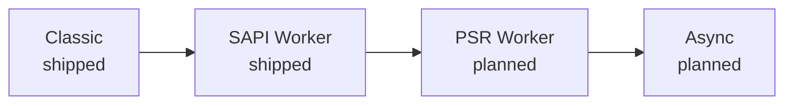

# 执行模式

每个 PHP 服务器都得回答同一个问题：两次请求之间，你的应用能留下多少东西？php-fpm 的答案是“什么都留不下”——框架每次都从零启动，而对今天的应用来说，这次启动往往是整个请求里最贵的一步。Rapira 不替你把答案锁死，它提供的是一架由四种执行模式组成的阶梯，应用能爬多高就爬多高。

这些名字描述的是每一级本身——worker 会不会常驻、它说的是哪一套契约——而不是把这种形态带火的那个产品。级别越高，请求到来时进程里预热好的东西就越多，对代码的要求也就越高。

## Classic <Badge type="tip" text="已发布" />

每个请求都会把入口脚本从头跑一遍，和在 php-fpm 下完全一样：填好超全局变量，启动前端控制器，把响应发出去，然后全部销毁。什么都不会留下，也就谈不上从上一个请求泄漏到下一个请求。

这一级主打兼容：现有应用原封不动就能跑。Rapira 直接顶替 php-fpm，你的代码一行都不用改，收益来自底层管道而不是应用本身——PHP 嵌在服务器进程里，HTTP 前端和解释器之间不再有 FastCGI 这一跳。

具体怎么运行，见[经典模式](/zh/docs/classic)。

## SAPI Worker <Badge type="tip" text="已发布" />

写法和 Classic 一样——照样读超全局变量，照样用 `echo` 输出响应——区别只在于请求结束后 worker 不会退出。一个常驻脚本先把一切启动好，然后进入循环：服务器为每个新请求重新填好 `$_GET`、`$_POST`、`$_SERVER`、`$_COOKIE` 之类的变量，调用你的处理逻辑，再把下一个请求交给你。自动加载器、DI 容器、配置、数据库连接——循环之外创建的一切都保持在热状态。

这一级的意义就在于此：启动开销从每个请求付一次，变成每个 worker 只付一次。代价是应用不再“失忆”。你随手留在静态属性、单例或全局状态里的东西，下一个请求还在那儿——正因如此，能不能站上这一级取决于你的代码，而不是拨一下开关的事。

worker 脚本和它的循环见 [Worker 模式](/zh/docs/worker)，请求与响应的处理方式见 [HTTP](/zh/docs/http)。

## PSR Worker <Badge type="warning" text="计划中" />

到了这一级，PHP 一侧不再被动等着被调用，而是主动开口来要：worker 通过一次 API 调用从 Rapira 取出请求，再自己决定怎么处理。它可以为了兼容去填超全局变量，也可以干脆跳过，直接拿一个 PSR-7 消息交给框架的 HTTP 内核。和下一级一样，一次仍然只处理一个请求。

好处是请求不再是弥散在各处的全局状态，而变成一个可以传递、包装、丢给中间件栈的值——现代 PHP 框架本来就希望这样拿到请求。

::: info
这一级目前只是构想，还不是实现。今天没有任何相关的东西发布，它的配置和 PHP 侧 API 也都还没设计，所以暂时没有函数名或配置项可以展示。
:::

## Async <Badge type="warning" text="计划中" />

API 和 PSR Worker 那一级完全相同，区别在于 worker 一次会要走多个请求，并在同一个解释器里并发处理它们。让这件事成为可能的是 PHP 8.1 的 fiber：某个请求在等 I/O 时可以让出执行权，另一个请求趁机往前推进，既不用线程，也不用第二个进程。

这是阶梯的顶端，也是最不宽容的一级——在单个解释器里并发，意味着请求路径上的每一个库都得经得起“执行到一半被挂起”。

::: info
这一级同样只是构想：没有东西可装，也没有东西可配。上面这一节讲的是 Rapira 要走的方向，而不是今天就能跑起来的功能。
:::

## 什么决定你能站到哪一级

不是服务器。四级阶梯对任何应用都敞开着，真正设限的是应用自己的技术栈。

撑不过第二个请求的全局状态会把你钉在 Classic 这一级；不是 fiber 安全的库会让你上不了 Async；而提供了运行时集成的框架，几乎是白送你一个 SAPI Worker——哪些框架已经有成文的接入方案，见[框架集成](/zh/docs/frameworks/)。这些都是代码本身的属性，不是 Rapira 强加的限制：整架阶梯就摆在那里，爬多高由应用自己决定。

说往上爬是“单向”的，只是指它要在 PHP 一侧花工夫——worker 级需要一个常驻入口脚本，Classic 级不需要。往下退则随时都安全：把 Classic 重新打开——命令行上加个参数，或者配置文件里改一个键——让 Rapira 指向你原来的前端控制器，你就回到了 Classic 级，底下还是同一个服务器、同一个二进制、同一套[进程模型](/zh/docs/process-model)。

::: tip
如果你只是想替掉 php-fpm、先让一切跑起来，那就从 Classic 起步。等确认应用启动干净、也没有攥着不该攥的状态，再往上爬——真正值得测的是你自己的应用，而不是某个基准测试。
:::

::: question Rapira 默认用哪种模式？
worker 级。Classic 需要你主动开启——命令行上的一个参数，或者配置文件里的一个键；见[配置](/zh/docs/configuration)和[命令行参考](/zh/docs/cli)。
:::

::: question 我的应用在 worker 模式下内存泄漏，这是 Rapira 的 bug 吗？
多半是你的应用或者它的某个依赖攥着单次请求的数据不放。这是这一级实实在在的约束，不是缺陷——而且 Rapira 可以在处理够一定数量的请求后回收 worker，这样在你排查期间，缓慢的泄漏也不至于演变成一次线上故障。见[配置](/zh/docs/configuration)。
:::

::: question 能不能一部分路由走 Classic，另一部分走 worker？
不行——模式是按服务器实例选的，不是按路由选的。如果应用里有一部分不是 worker 安全的，就为它单独起一个跑在 Classic 级上的 Rapira 实例。
:::

::: question PSR Worker 和 Async 什么时候发布？
给不出日期。这里写上它们是为了让方向清晰，但两者的设计都还没细到能写成文档的程度——等这一点有了变化，本页和[文档首页](/zh/docs/)会一起更新。
:::
