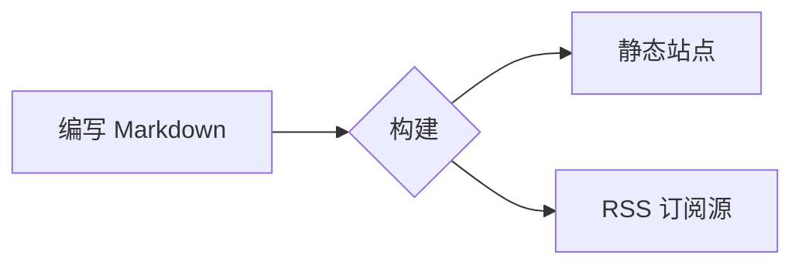

# 快速开始

欢迎阅读 Rapira 文档。本页同时也是一个实时示例：下面的每个区块都由你在自己页面里会写的同样的 Markdown 生成。

## 提示块

用 `:::` 容器包裹文本，就能得到带颜色和图标的提示块：

```md
::: tip
值得强调的实用建议。
:::
::: info
中性的补充信息。
:::
::: warning
需要留意的地方。
:::
::: danger
真正的风险——请谨慎操作。
:::
```

::: tip
值得强调的实用建议。
:::

::: info
中性的补充信息。
:::

::: warning
需要留意的地方。
:::

::: danger
真正的风险——请谨慎操作。
:::

在类型后面可以直接写自定义标题：

::: tip 小贴士
当默认标签不够贴切时，给区块起一个自己的标题。
:::

## 代码块

围栏代码块会获得语法高亮、语言标签和复制按钮：

```rust
fn main() {
    println!("Hello, Rapira!");
}
```

把读者的注意力引到具体的行——高亮、聚焦，或展示改动：

```rust{3}
fn main() {
    let answer = 42;
    println!("The answer is {answer}"); // 这一行被高亮
}
```

```rust
fn main() {
    let ready = true;      // [!code focus]
    println!("{ready}");
}
```

```rust
fn setup() {
    let retries = 1;       // [!code --]
    let retries = 3;       // [!code ++]
}
```

把同一命令的不同写法收进选项卡：

::: code-group

```bash [npm]
npm install
```

```bash [pnpm]
pnpm install
```

```bash [yarn]
yarn
```

:::

## 图表

`mermaid` 代码块会渲染成图表：



## 表格与徽章

普通的 Markdown 表格开箱即用：

| 功能          | 是否内置 |
| ------------- | :------: |
| 提示块        |    ✅    |
| 代码分组      |    ✅    |
| Mermaid       |    ✅    |
| FAQ 折叠      |    ✅    |

行内徽章很适合标注状态：<Badge type="tip" text="新" /> <Badge type="warning" text="测试版" /> <Badge type="danger" text="已弃用" />。

## 问答（FAQ 折叠）

在页面的任何位置写一个 `::: question` 块：

```md
::: question 如何在本地运行站点？
先 `npm install` 一次，再 `npm run dev`。
:::
```

引擎会把文中所有问题抽取出来，折叠收纳到章节末尾——就像下面这样。

::: question 如何在本地运行站点？
先执行一次 `npm install`，然后运行 `npm run dev`，打开它输出的本地地址即可。
:::

::: question 翻译放在哪里？
每种语言都有自己的目录——`ru/`、`es/`、`zh/`、`pl/`——结构与英文版一致。英文是内容的基准。
:::
