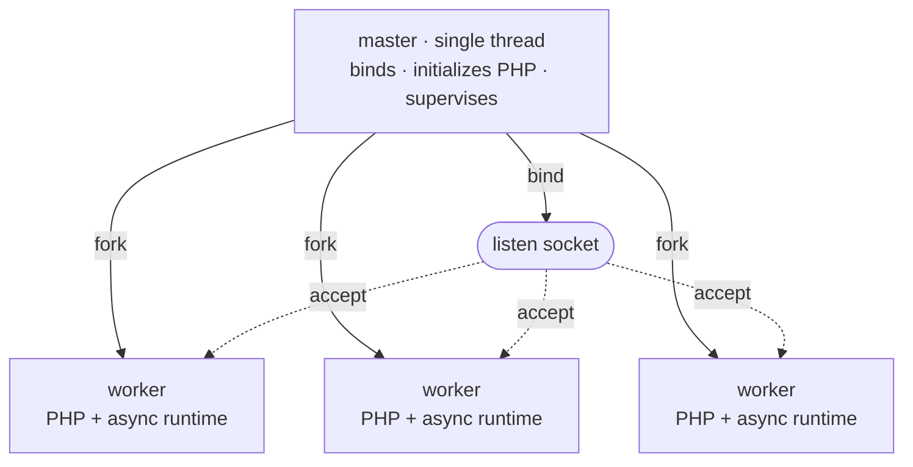

# 进程模型

Rapira 以一个 master 进程加一池 worker 的形式运行。凡是全局只能有一份的东西--监听套接字、PHP 引擎映像、pidfile--都归 master 持有，备齐之后它就 fork；请求则由 worker 处理。请求从来不需要在进程之间倒手：worker *就是* master 的副本，是在 PHP 已经起来之后 fork 出来的，各自直接从套接字上取走自己的连接。

无论运行 [Classic 模式](/zh/docs/classic)、[Worker 模式](/zh/docs/worker)还是 Dispatcher 模式，这套结构都一样。执行模式由 `pool.mode` 设定，它决定的是每个请求进了 worker 之后怎么走；至于进程池怎么搭起来、怎么被看管、怎么重载，跟它无关。更多内容见[执行模式](/zh/docs/execution-modes)。

## master 与 worker

启动按固定的顺序进行：

1. **先绑定监听套接字。** master 在做任何别的事之前先绑定，所以端口被占用会立刻让启动失败--那时候 PHP 还没来得及启动。
2. **PHP 只启动一次。** 引擎在还是单线程的 master 里走完 `MINIT`。OPcache 的共享内存就在这时创建，于是之后 fork 出来的每个 worker 都继承同一个 OPcache SHM 段--哪个 worker 先编译了某个文件，缓存就为所有 worker 填好了，不用每个进程各编译一份。
3. **fork 出 worker。** 每个子进程都继承绑好的套接字和初始化完毕的引擎。



每个 worker 在自己的异步 HTTP 栈背后跑一个 NTS PHP 解释器。这个栈就是 hyper，跑在一个私有的 tokio 运行时上，配两个运行时线程。worker 在继承来的套接字上 accept。没有任何进程负责把连接派给 worker：所有 worker 都停在同一个套接字的 `accept()` 上，进来的每条连接由内核交给其中恰好一个。

master 从不处理请求，它压根就没有 HTTP 栈--只是一个单线程，阻塞在 self-pipe 的 `poll(2)` 上，等信号、等子进程退出、等自己的定时器；在 `ondemand` 模式下还要等监听套接字变为可读。这个进程必须活下来，好把其他一切重新拉起，所以它自己要做的事越少越好。

::: info
master 还在整个生命周期里持有 PHP 模块，也只有它会去关闭这个模块。worker 退出时什么都不拆，所以某个 worker 崩溃或者被回收，都不会拆掉其他 worker 还在用的那份引擎映像。
:::

## 监管

进程池初始化后，master 大约每秒执行一次维护。worker 退出时，master 也会立即处理。

- **替换 worker。** worker 正常退出后，master 会立即替换它。
- 使用 `ondemand` 时，master 会等待下一个连接，然后创建替换 worker。
- 发生故障后，替换延迟从 100 ms 开始。每次连续故障后延迟翻倍，最大约为 25 秒。
- worker 运行至少十秒会重置延迟。
- **初始化故障。**如果所有初始 worker 都在进程池处理请求之前失败，master 会退出。
- 进程池处理请求后，master 使用正常替换延迟。失败的重载不会停止现有 worker。
- **请求限制。**使用 `pool.max_requests` 时，worker 在达到请求限制后退出。然后 master 会替换它。
- Rapira 会添加最多为限制一半的随机值。这样可以避免同时替换 worker。
- **请求超时。**使用 `pool.request_terminate_timeout_secs` 时，请求超过限制后，master 会发送 `SIGTERM`。
- 如果 worker 在下一个维护周期后仍活动，master 会发送 `SIGKILL`。它会关闭排队连接并创建替换 worker。
- master 不会在停止或重载期间应用此超时。
- **伸缩。**使用 `dynamic` 时，维护过程可以创建 worker 或删除空闲 worker。
- 使用 `ondemand` 时，维护过程会在空闲超时后删除 worker。新连接会触发创建 worker。
- **master 监控。**每个 worker 从 master 保持打开的管道中读取。
- 如果 master 退出，管道返回 EOF，每个 worker 都会停止接受工作。master 故障不会留下不受管理的 worker。

## 进程池伸缩

`pool.scaling` 选择进程池如何更改大小。它与 `pool.mode` 不同。
`pool.mode` 设置 worker 内的执行模式。使用 `static` 时，`pool.processes` 是准确数量。
使用 `dynamic` 和 `ondemand` 时，它是最大数量。默认值为每个逻辑 CPU 一个 worker。

| 伸缩策略 | 有多少个 worker | 生效的键 |
| --- | --- | --- |
| `static`（默认） | 正好 `pool.processes` 个，启动时 fork 出来，之后一直维持这个数。 | `processes` |
| `dynamic` | 需求要多少就多少，上限是 `pool.processes`；master 把*空闲*数量控制在备用区间之内。 | `min_spare`, `max_spare` |
| `ondemand` | 启动时一个都不 fork；随流量到来而 fork，上限是 `pool.processes`。 | `process_idle_timeout_secs` |

**`static`** 适合大多数部署。它使用固定数量的 worker，并替换已退出的 worker。
PHP 是同步的，因此每个 worker 一次处理一个请求。I/O 密集型应用可能需要比 CPU 更多的 worker。
CPU 密集型应用通常不需要。

**`dynamic`** 将空闲 worker 数量保持在两个限制之间。数量低于 `min_spare` 时，它会创建 worker。
连续维护周期的容量不足时，新 worker 数量会翻倍。数量超过 `max_spare` 时，它会删除最早的空闲 worker。
初始数量是两个限制的中间值。需求超过 `pool.processes` 时，Rapira 会记录一次警告。

```toml
[pool]
scaling = "dynamic"
processes = 8
min_spare = 1
max_spare = 3
```

这几个边界必须满足 `1 <= min_spare <= max_spare <= processes`；它们在 `dynamic` 下是必填的，在另外两种策略下则会被拒绝。写错地方是配置错误，而不是一个被悄悄忽略的键。

**`ondemand`** 在启动时不创建 worker。master 监视监听套接字。
连接到达且没有空闲 worker 时，master 会创建一个。worker 空闲超过 `pool.process_idle_timeout_secs` 后会退出。
空进程池的第一个请求会等待创建 worker。将 `ondemand` 用于测试环境和低流量站点。
将其他策略用于稳定流量。

完整的键参考在[配置](/zh/docs/configuration)那一页。

## 信号

信号用来停止正在运行的服务器、重载它，以及让它报告自己的状态。所有信号都发给 **master**。

| 信号 | master 的动作 |
| --- | --- |
| `SIGTERM`、`SIGINT` | 优雅停止：手上的请求跑完，然后整个进程池排空。再来一个 `SIGTERM` 或 `SIGINT` 就强制退出。 |
| `SIGQUIT` | 同样是优雅停止。重复发没有任何变化--既然停止是优雅地请求来的，就不会因为再来一个 `SIGQUIT` 而升级。 |
| `SIGUSR2`、`SIGHUP` | 滚动重载：进程池一次换一个 worker。旧 worker 停止接受工作并完成当前请求。 |
| `SIGUSR1` | 把进程池的状态快照写进日志。 |
| `SIGCHLD` | 内部使用--某个 worker 退出了，回收它，并决定要不要补上新的。 |

设上 `supervisor.pidfile`，你的脚本就有一个稳定的地方能读到 master 的 pid：

```bash
kill -USR2 $(cat /run/rapira.pid)   # Replace workers one at a time.
kill -USR1 $(cat /run/rapira.pid)   # Write pool status to the log.
kill -TERM $(cat /run/rapira.pid)   # Stop after current requests finish.
```

::: warning
仅向 master 发送信号。worker 会忽略 `SIGUSR1` 和 `SIGUSR2`。
worker 将 `SIGTERM` 作为立即终止。请求超时使用此信号。
直接向 worker 发送信号会绕过 master 监管。
:::

### 停止

对于每个停止信号，master 立即向所有 worker 发送 `SIGQUIT`。worker 停止接受工作并完成当前请求。
经过 `supervisor.process_control_timeout_secs` 后，master 向剩余 worker 发送 `SIGTERM`。默认值为 30 秒。
如果仍有 worker，master 会在 `SIGTERM` 一秒后发送 `SIGKILL`。

第二个 `SIGTERM` 或 `SIGINT` 会跳过等待，立刻强制退出。

### Worker 替换允许当前请求完成

`SIGUSR2` 或 `SIGHUP` 会替换整个进程池。每个新 worker 使用部署的代码初始化应用。

在 Classic 模式下，入口脚本在新的 PHP 请求中执行。新代码无需重载即可生效。
但是，`opcache.validate_timestamps = 0` 需要完整重启。
Worker 和 Dispatcher 保留已初始化的应用。在这些模式下，每次部署后都要重载进程池。
请参阅[部署](/zh/docs/deployment)。

master 启动一个新 worker，并等待它报告 `idle` 或 `active` 状态。
然后主进程停止一个旧 worker。该 worker 结束后，主进程在下一个位置启动新 worker。
每次停止都使用 `SIGQUIT` → `SIGTERM` → `SIGKILL`。相同的控制超时适用于每个 worker。
旧 worker 开始停止时会关闭空闲 keep-alive 连接。当前请求可以在控制超时前完成。

如果新 worker 在控制超时前未报告这两种状态，master 会记录警告并继续重载。
在 `ondemand` 模式下，主进程逐个删除旧 worker。新连接会创建替代 worker。

停止已经在进行时收到的重载会被忽略：停止永远优先。

::: info
重载会替换 worker，但不会替换主进程。新 worker 使用相同的引擎映像。
更改 `rapira.toml`、`php.ini` 和二进制文件需要完整重启。
:::

### 状态快照

`SIGUSR1` 会让 master 把进程池的一份快照写进日志：先是一行汇总，给出运行中和空闲的 worker 数以及当前的代次，然后每个槽位一行，写明它的 pid、状态，以及 `handled`、`errors` 和 `recycles` 三个计数。

::: tip
这份快照写在 `master` 目标上，级别是 `info`，而默认日志级别是 `error`--所以在原装配置下，`kill -USR1` 看上去像是什么都没发生。把这一个目标的级别调高，快照就出来了：

```toml
[log.targets]
master = "info"
```

同一个目标上还跑着所有的监管事件：fork、子进程回收、补位、重载和进程池伸缩。其余内容见[日志](/zh/docs/logging)。
:::
