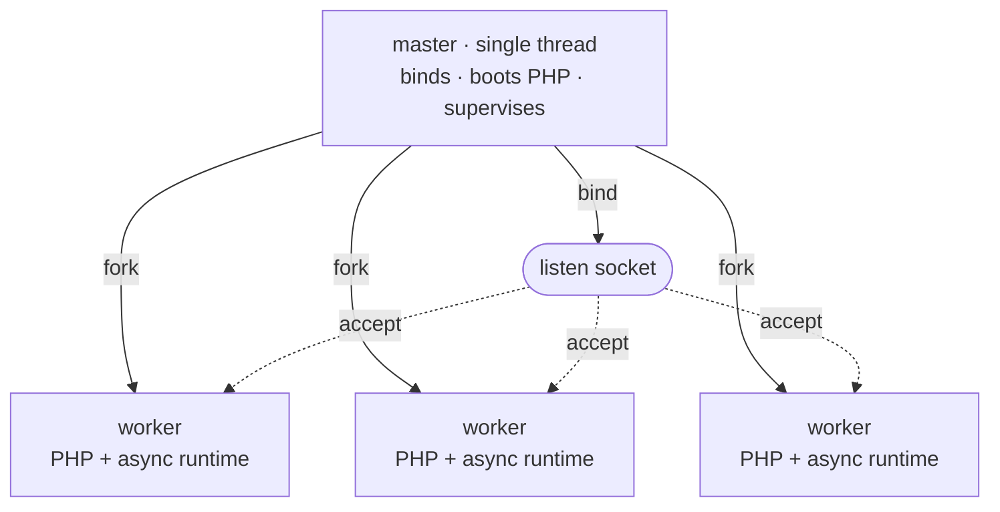

# 进程模型

Rapira 以一个 master 进程加一池 worker 的形式运行。凡是全局只能有一份的东西——监听套接字、PHP 引擎映像、pidfile——都归 master 持有，备齐之后它就 fork；请求则由 worker 处理。请求从来不需要在进程之间倒手：worker *就是* master 的副本，是在 PHP 已经起来之后 fork 出来的，各自直接从套接字上取走自己的连接。

无论运行 [Classic 模式](/zh/docs/classic)、[Worker 模式](/zh/docs/worker)还是 Dispatcher 模式，这套结构都一样。执行模式由 `pool.mode` 设定，它决定的是每个请求进了 worker 之后怎么走；至于进程池怎么搭起来、怎么被看管、怎么重载，跟它无关。更多内容见[执行模式](/zh/docs/execution-modes)。

## master 与 worker

启动按固定的顺序进行：

1. **先绑定监听套接字。** master 在做任何别的事之前先绑定，所以端口被占用会立刻让启动失败——那时候 PHP 还没来得及启动。
2. **PHP 只启动一次。** 引擎在还是单线程的 master 里走完 `MINIT`。OPcache 的共享内存就在这时创建，于是之后 fork 出来的每个 worker 都继承同一个 OPcache SHM 段——哪个 worker 先编译了某个文件，缓存就为所有 worker 填好了，不用每个进程各编译一份。
3. **fork 出 worker。** 每个子进程都继承绑好的套接字和初始化完毕的引擎。



每个 worker 在自己的异步 HTTP 栈背后跑一个 NTS PHP 解释器。这个栈就是 hyper，跑在一个私有的 tokio 运行时上，配两个运行时线程。worker 在继承来的套接字上 accept。没有任何进程负责把连接派给 worker：所有 worker 都停在同一个套接字的 `accept()` 上，进来的每条连接由内核交给其中恰好一个。

master 从不处理请求，它压根就没有 HTTP 栈——只是一个单线程，阻塞在 self-pipe 的 `poll(2)` 上，等信号、等子进程退出、等自己的定时器；在 `ondemand` 模式下还要等监听套接字变为可读。这个进程必须活下来，好把其他一切重新拉起，所以它自己要做的事越少越好。

::: info
master 还在整个生命周期里持有 PHP 模块，也只有它会去关闭这个模块。worker 退出时什么都不拆，所以某个 worker 崩溃或者被回收，都不会拆掉其他 worker 还在用的那份引擎映像。
:::

## 监管

进程池起来之后，master 大约每秒跑一次维护 tick，同时随时对子进程的退出做出反应。

- **清理并补位。** 干净退出的 worker（排空了请求，或者用满配额被回收）会立刻被换上新的（`ondemand` 下则干脆把槽位空着，等下一条连接来填）。而*崩溃*退出的 worker 要等一段退避时间才补：起步 100 ms，每连着快速崩溃一次就翻倍，上限约 25 秒——于是段错误循环会自己降下速来，而不是把 CPU 空转满。活够十秒就把这个连崩计数清零。
- **启动失败。** 如果进程池连一个成功的请求都还没服务过，第一代里就有 worker 报告自己不健康，master 会认定这是不可恢复的启动失败并退出，而不是没完没了地重启一个坏掉的入口脚本。等进程池服务过东西以后，同样的退出就只是一次带退避的补位——一次糟糕的重载绝不会把健康的进程池拖垮。
- **worker 回收。** 设了 `pool.max_requests`，worker 处理够这么多请求就退役，并马上被换掉。每个 worker 还会在配额之上拿到一个各自随机的增量（最多为配额的一半），这样一批同时起来的 worker 就不会齐刷刷一起回收，否则会有那么一瞬间连一个热 worker 都没有。
- **盯住单个请求的看门狗。** 设了 `pool.request_terminate_timeout_secs`，某个 worker 在同一个请求上耗过这个墙钟上限，就会收到 `SIGTERM`；如果下一个 tick 它还在，再补一发 `SIGKILL`。这次强制终止会以 `warn` 级别记进日志，它排队的连接随之关闭，槽位立刻补上新的 worker。停止或重载进行期间，这个看门狗是挂起的。
- **伸缩。** `dynamic` 下，同一个 tick 还负责决定是多 fork 几个 worker 还是退掉几个空闲的；`ondemand` 下它只退掉空闲超时的 worker——那里 fork 是由到来的连接触发的。详见下文。
- **反方向的一根管道。** 每个 worker 都握着一根管道的读端，而 master 永远不往里写。master 一死，管道就 EOF，每个 worker 随即自行排空退出——所以对 master 来一发 `kill -9`，也不会留下孤儿 worker 占着端口。

## 进程池伸缩

`pool.scaling` 决定进程池怎么给自己定规模。它和设定 worker 内部执行模式的 `pool.mode` 是两个不同的键。三种伸缩策略下真正说了算的都是 `pool.processes`：在 `static` 下它是准确的进程数，在另外两种下是上限，默认值为每个逻辑 CPU 一个 worker。

| 伸缩策略 | 有多少个 worker | 生效的键 |
| --- | --- | --- |
| `static`（默认） | 正好 `pool.processes` 个，启动时 fork 出来，之后一直维持这个数。 | `processes` |
| `dynamic` | 需求要多少就多少，上限是 `pool.processes`；master 把*空闲*数量控制在备用区间之内。 | `min_spare`, `max_spare` |
| `ondemand` | 启动时一个都不 fork；随流量到来而 fork，上限是 `pool.processes`。 | `process_idle_timeout_secs` |

**`static`** 适合大多数部署：内存占用是平的，worker 死了直接换一个。PHP 是同步的，一个 worker 同时只处理一个请求：如果请求的大部分时间都花在等数据库或上游 API 上，通常需要比核数更多的 worker；CPU 密集型的则很少需要。

**`dynamic`** 把*空闲* worker 的数量控制在一个区间里。每个 tick 上，空闲数少于 `min_spare` 就多 fork 几个（压力持续时每批 fork 的数量还会翻倍，于是流量突增能被很快接住，而不是一秒才补一个）；空闲数多于 `max_spare` 就退掉最老的那个空闲 worker。起步时它取区间的中点；撞到 `pool.processes` 上限却还想要更多时，会告警一次。

```toml
[pool]
scaling = "dynamic"
processes = 8
min_spare = 1
max_spare = 3
```

这几个边界必须满足 `1 <= min_spare <= max_spare <= processes`；它们在 `dynamic` 下是必填的，在另外两种策略下则会被拒绝。写错地方是配置错误，而不是一个被悄悄忽略的键。

**`ondemand`** 启动时什么都不 fork。这时改由 master 自己盯着监听套接字：连接来了却没有空闲 worker 接手，它就 fork 一个，让子进程去 accept。空闲时间超过 `pool.process_idle_timeout_secs` 的 worker 会被再次退掉。这样一来空闲的进程池不占用任何资源，但安静一阵之后的第一个请求要等一次 fork。预发布环境和访问稀少的站点用 `ondemand`，稳定流量下用另外两种策略之一。

完整的键参考在[配置](/zh/docs/configuration)那一页。

## 信号

信号用来停止正在运行的服务器、重载它，以及让它报告自己的状态。所有信号都发给 **master**。

| 信号 | master 的动作 |
| --- | --- |
| `SIGTERM`、`SIGINT` | 优雅停止：手上的请求跑完，然后整个进程池排空。再来一个 `SIGTERM` 或 `SIGINT` 就强制退出。 |
| `SIGQUIT` | 同样是优雅停止。重复发没有任何变化——既然停止是优雅地请求来的，就不会因为再来一个 `SIGQUIT` 而升级。 |
| `SIGUSR2`、`SIGHUP` | 滚动重载：进程池一次换一个 worker，全程不丢连接。 |
| `SIGUSR1` | 把进程池的状态快照写进日志。 |
| `SIGCHLD` | 内部使用——某个 worker 退出了，回收它，并决定要不要补上新的。 |

设上 `supervisor.pidfile`，你的脚本就有一个稳定的地方能读到 master 的 pid：

```bash
kill -USR2 $(cat /run/rapira.pid)   # rolling reload
kill -USR1 $(cat /run/rapira.pid)   # status dump
kill -TERM $(cat /run/rapira.pid)   # graceful stop
```

::: warning
信号只发给 master，永远别发给某一个 worker。worker 会直接无视 `SIGUSR1` 和 `SIGUSR2`，而且把 `SIGTERM` 当成立即终止——请求看门狗要让一个请求*马上*结束时，用的就是它。直接给 worker 发信号，会绕过本页所描述的监管。
:::

### 停止

不管由三个信号里的哪一个发起，停止都从优雅开始：master 给每个 worker 发 `SIGQUIT`，worker 随即不再接新活，把手上的做完。之后的升级按计时进行——`supervisor.process_control_timeout_secs`（默认 30 秒）就是这段宽限期，过了之后还剩下的 worker 会收到 `SIGTERM`，要是连这个都不管用，再补 `SIGKILL`。对优雅的 `SIGQUIT` 没有反应的 worker，会先收到 TERM 再收到 KILL，而不是被无休止地等下去。

第二个 `SIGTERM` 或 `SIGINT` 会跳过等待，立刻强制退出。

### 滚动重载

`SIGUSR2`（或者 `SIGHUP`）会把整个进程池换成一批全新的 worker——常驻 worker 里那个已经启动好的应用，就是这样被丢掉、再照着部署上去的代码重新搭起来的。

Classic 模式下，入口脚本每个请求都从头执行一遍，没有常驻的东西需要替换，所以新代码不重载也能生效。要是你设了 `opcache.validate_timestamps = 0`，master 里的那份 OPcache 段会一直返回旧的 opcode，直到完整重启。Worker 模式和 Dispatcher 模式下，应用只启动一次并一直待在内存里，所以部署上去的代码要等一次滚动重载才生效，把它写进部署流程的一步。更多内容见[部署](/zh/docs/deployment)。

重载期间服务能力一刻也不会掉下去，因为它是叠着来的，而不是先停后起：master 先起一个新 worker，等它真的开始 accept 了，才去排空一个旧 worker。旧的走掉之后，它的槽位交给下一个新 worker，就这样一路把这一代换完。每次排空走的都是和停止时一样的 `SIGQUIT` → `SIGTERM` → `SIGKILL` 升级流程，受同一个控制超时约束，只不过作用在那一个 worker 身上。

就算某个顶上来的 worker 迟迟不开始服务，重载也不会卡住：控制超时一到，master 记一条告警，照样接着换下一个。`ondemand` 下则根本不会预先 fork 顶替者——旧 worker 一个个排空，新的交给需求去 fork。

停止已经在进行时收到的重载会被忽略：停止永远优先。

::: info
重载换的是 worker，不是 master。新 worker 仍然由同一个 master 进程 fork 出来，带的也还是它启动时装好的那份引擎映像——所以 `rapira.toml`、`php.ini` 和二进制本身，只有完整重启才会换。
:::

### 状态快照

`SIGUSR1` 会让 master 把进程池的一份快照写进日志：先是一行汇总，给出运行中和空闲的 worker 数以及当前的代次，然后每个槽位一行，写明它的 pid、状态，以及 `handled`、`errors` 和 `recycles` 三个计数。

::: tip
这份快照写在 `master` 目标上，级别是 `info`，而默认日志级别是 `error`——所以在原装配置下，`kill -USR1` 看上去像是什么都没发生。把这一个目标的级别调高，快照就出来了：

```toml
[log.targets]
master = "info"
```

同一个目标上还跑着所有的监管事件：fork、子进程回收、补位、重载和进程池伸缩。其余内容见[日志](/zh/docs/logging)。
:::
