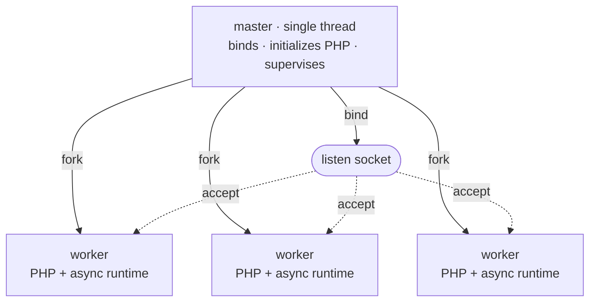

# 进程模型

Rapira 运行一个 master 进程，并为每种启用的协议运行一个 worker 进程池。master 持有监听套接字、已初始化的 PHP 引擎和 pidfile，然后创建 worker 进程。每个 worker 继承 PHP，并从所属进程池的共享套接字接受连接。Rapira 不在进程之间传递请求。

HTTP 和 [gRPC](./grpc) 有独立的监听器、入口脚本和进程池。`[http.pool]` 和 `[grpc.pool]` 分别配置它们。gRPC 进程池使用 Dispatcher 模式，每个 worker 同时处理一个活动调用。

当配置中有 `[observability]` 表时，master 还会为指标和健康检查启动一个进程。此进程不运行 PHP 代码。在 Linux 上，它的进程名为 `rapira-obs`，PHP worker 的进程名为 `rapira-worker`。master 与 PHP worker 一起监管、重载和停止此进程。更多内容见[指标和健康检查](/zh/docs/observability)。

在 [Classic](/zh/docs/classic)、[Worker](/zh/docs/worker) 和 [Dispatcher](/zh/docs/dispatcher) 模式下，进程模型都相同。`http.pool.mode` 控制 worker 内部的请求处理。此设置不改变进程池的创建、监管或重载。更多内容见[执行模式](/zh/docs/execution-modes)。

## master 与 worker

初始化按以下顺序进行：

1. **绑定一个或多个监听套接字。** 端口冲突会在 PHP 启动前停止初始化。
2. **只启动一次 PHP。** master 在它的单个线程中运行 `MINIT`。OPcache 此时创建它的共享内存，每个 worker 都继承这块内存。一个 worker 编译某个文件后，其他 worker 使用缓存的结果。
3. **fork 出 worker。** 每个子进程继承已绑定的套接字和已初始化的引擎。


```mermaid
flowchart TB
  M["master · single thread<br/>binds · initializes PHP · supervises"]
  S(["listen socket"])
  W1["worker<br/>PHP + async runtime"]
  W2["worker<br/>PHP + async runtime"]
  W3["worker<br/>PHP + async runtime"]
  M -- bind --> S
  M -- fork --> W1
  M -- fork --> W2
  M -- fork --> W3
  S -. accept .-> W1
  S -. accept .-> W2
  S -. accept .-> W3
```

图中展示一个进程池。每个 worker 运行一个 NTS PHP 解释器和一个异步 HTTP 或 gRPC 服务器。服务器使用 hyper，在具有两个线程的私有 tokio 运行时上运行。每个 worker 在继承的套接字上调用 `accept()`。操作系统将每个新连接分配给一个 worker。

master 不处理请求。它的单个线程等待信号、worker 退出和定时器。

::: info
master 在整个生命周期中持有 PHP 模块。只有 master 关闭此模块。worker 退出时不关闭这份共享的引擎状态。
:::

## 监管

master 每秒执行一次维护。worker 退出时，master 也会立即处理每次退出。

- **替换 worker。** worker 正常退出后，master 立即替换它。worker 崩溃或以不健康状态退出后，替换延迟从 100 ms 开始。每次连续故障后延迟翻倍，最大为 25.6 秒。worker 运行至少 10 秒会重置延迟。
- **启动失败。** 在 Worker 和 Dispatcher 模式下，如果入口脚本在收到请求前结束，则启动失败。worker 随后最多等待 5 秒，然后再次运行入口脚本。等待期间到达的请求会收到 HTTP `503` 或 gRPC `UNAVAILABLE`。连续五次启动失败后，worker 以不健康状态退出。
- **启动失败时 master 停止。** 如果不健康的第零代 worker 退出，master 以退出码 70 停止。仅当进程池没有成功的请求，也没有空闲或活动的 worker 时，此规则才适用。第零代指第一次重载前创建的 worker。在其他所有情况下，master 在替换延迟后替换 worker。worker 崩溃永远不会使 master 停止。
- **请求限制。** 使用 `http.pool.max_requests` 时，worker 在处理随机数量的请求后退出。此数量在 `max_requests + 1` 和大约 `1.5 × max_requests` 之间。master 立即替换它。随机范围可以避免同时替换 worker。
- **请求超时。** 使用 `http.pool.request_terminate_timeout_secs` 时，如果 worker 的当前请求超过限制，master 向它发送 `SIGTERM`。如果在下一次维护时 worker 仍处于活动状态，master 发送 `SIGKILL`。然后 master 立即替换该 worker。master 在重载期间应用此超时，但在停止期间不应用。
- **master 监控。** 每个 worker 从 master 保持打开的管道中读取。如果 master 退出，每个 worker 停止接受新工作，完成当前请求，然后退出。

## 进程池大小

以下设置使用 `[http.pool]`。相同的设置也适用于 `[grpc.pool]`。

`http.pool.processes` 设置 worker 数量。master 在初始化期间创建这些 worker，并替换每个退出的 worker。默认值为进程可以使用的每个 CPU 一个 worker。如果容器有 CPU 限制，默认值遵循该限制。

所有进程池的 worker 总数必须不超过 2048。启用可观测性时，它的进程计为一个 worker。总数更大时，Rapira 以退出码 70 停止。

PHP 是同步的，因此每个 worker 一次处理一个请求。I/O 密集型应用可能需要比 CPU 核心更多的 worker。CPU 密集型应用通常不需要。

服务器运行期间，worker 数量不会改变。要根据负载改变容量，请改变 Rapira 实例的数量，例如使用容器编排器。

完整的键参考见[配置](/zh/docs/configuration)。

## 信号

信号用来停止正在运行的服务器、重载它，以及让它报告自己的状态。所有信号都发给 **master**。

| 信号 | master 的动作 |
| --- | --- |
| `SIGTERM`、`SIGINT` | master 让当前请求完成，然后停止 worker。第二个信号强制 worker 停止。 |
| `SIGQUIT` | master 执行相同的受控停止。再发送 `SIGQUIT` 没有效果。 |
| `SIGUSR2`、`SIGHUP` | master 一次替换一个 worker。每个旧 worker 停止接受新工作，并完成当前请求。 |
| `SIGUSR1` | master 将进程池状态写入日志。 |

设置 `supervisor.pidfile`，脚本就可以从一个固定位置读取 master 的进程标识符：

```bash
kill -USR2 $(cat /run/rapira.pid)   # Replace workers one at a time.
kill -USR1 $(cat /run/rapira.pid)   # Write pool status to the log.
kill -TERM $(cat /run/rapira.pid)   # Stop after current requests finish.
```

::: warning
仅向 master 发送信号。worker 会忽略 `SIGUSR1` 和 `SIGUSR2`。`SIGTERM` 和 `SIGHUP` 会立即停止 worker，并中断它的当前请求。请求超时使用 `SIGTERM`。直接向 worker 发送信号会绕过 master 监管。

在终端中按 `Ctrl-C` 会向 master 和所有 worker 发送 `SIGINT`。然后每个 worker 还会收到 master 发送的 `SIGQUIT`。第二个停止信号使 worker 立即以退出码 131 退出，因此它的当前请求不会完成。要让当前请求完成，只向 master 发送 `SIGTERM`。
:::

### 停止

收到停止信号后，master 立即向每个 worker 发送 `SIGQUIT`。worker 停止接受新工作，并完成当前请求。经过 `supervisor.process_control_timeout_secs` 后，master 向剩余的 worker 发送 `SIGTERM`。默认限制为 30 秒。如果仍有 worker，master 在 `SIGTERM` 一秒后发送 `SIGKILL`。

连接排空时间等于控制超时减去五秒和超时一半中的较小值。使用默认设置时，连接有 25 秒来完成。超过此时间的响应可能被截断。重载期间也使用相同的时间限制。

第二个 `SIGTERM` 或 `SIGINT` 会跳过等待，立即强制退出。master 的退出码见[退出码](/zh/docs/cli#退出码)。

### Worker 替换允许当前请求完成

`SIGUSR2` 或 `SIGHUP` 会替换整个进程池。每个新 worker 使用部署的代码初始化应用。

在 Classic 模式下，每个请求都在新的 PHP 请求中运行入口脚本，因此新代码无需重载即可生效。Worker 和 Dispatcher 模式将应用保留在内存中。在这些模式下，每次部署后都要重载进程池。使用 `opcache.validate_timestamps = 0` 时，在任何模式下重载都不会加载新代码，因为新 worker 使用 master 的 OPcache 内存。在这种情况下，请重启 Rapira。更多内容见[部署](/zh/docs/deployment)。

master 启动一个新 worker，并等待它报告空闲或活动状态。然后 master 停止最旧的旧 worker。该 worker 退出后，master 在它的位置启动下一个新 worker。此过程持续到没有旧 worker 为止。所有进程池同时重载。

每次停止 worker 都使用 `SIGQUIT` → `SIGTERM` → `SIGKILL` 顺序。相同的控制超时适用于每个 worker。旧 worker 收到 `SIGQUIT` 后会关闭空闲的 keep-alive 连接。当前请求使用上述较短的连接排空时间。

如果新 worker 在控制超时前未报告这两种状态，master 会记录警告。然后，即使新 worker 尚未处理请求，master 也会停止下一个旧 worker。

在停止期间或重载进行中，master 会忽略重载信号。它不会记录被忽略的信号。重载完成后，请再次发送该信号。

::: info
重载会替换 worker，但不会替换 master。新 worker 继承相同的已初始化引擎。要应用对二进制文件或 master 读取的文件（例如 `rapira.toml` 和 `php.ini`）的更改，请重启 Rapira。
:::

### 将状态写入日志

`SIGUSR1` 使 master 将每个进程池的状态写入日志。进程池的第一行显示运行中和空闲的 worker 数量，以及重载代次。然后每个 worker 槽位一行，显示进程标识符、状态和三个计数器：

```text
status: http pool: 4 running, 3 idle, generation 0
  slot 0 pid 4242 state 2 handled 1500 errors 2 recycles 0
```

| 状态 | 含义 |
| --- | --- |
| `1` | 启动中。应用尚未启动，或者上一次启动失败。 |
| `2` | 空闲。worker 等待工作。 |
| `3` | 活动。worker 正在处理请求。 |
| `4` | 排空。worker 完成它的工作，然后退出。 |

master 替换槽位中的 worker 时，槽位保留它的计数器。`recycles` 统计 worker 内部入口脚本的重启次数。

::: tip
状态输出使用 `master` 目标上的 `info` 级别。默认日志级别为 `error`。将此目标设为 `info` 以显示输出：

```toml
[log.targets]
master = "info"
```

同一目标还包含 worker 创建错误、重载就绪警告和请求超时警告。更多内容见[日志](/zh/docs/logging)。
:::

::: question Rapira 使用透明大页吗？
不使用。在 Linux 上，master 在 PHP 启动前为它自己的进程关闭透明大页。worker 以及 PHP 用 `proc_open()` 或 `exec()` 启动的进程都继承此设置。因此，`USE_ZEND_ALLOC_HUGE_PAGES=1` 和 `opcache.huge_code_pages` 得不到透明大页。这些选项仍然可以使用主机通过 `vm.nr_hugepages` 预留的显式大页。没有设置可以改变此行为。
:::

::: question master 可以在容器中作为 PID 1 运行吗？
可以。作为 PID 1，master 处理停止信号，并回收所有已退出的子进程。你不需要单独的 init 进程。
:::
